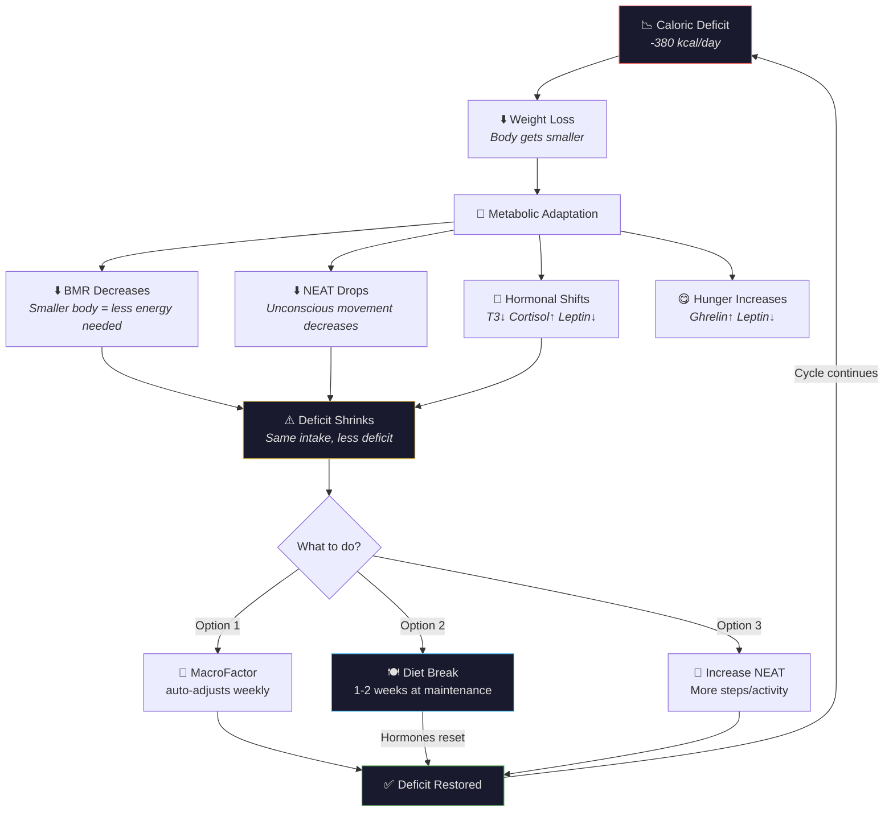
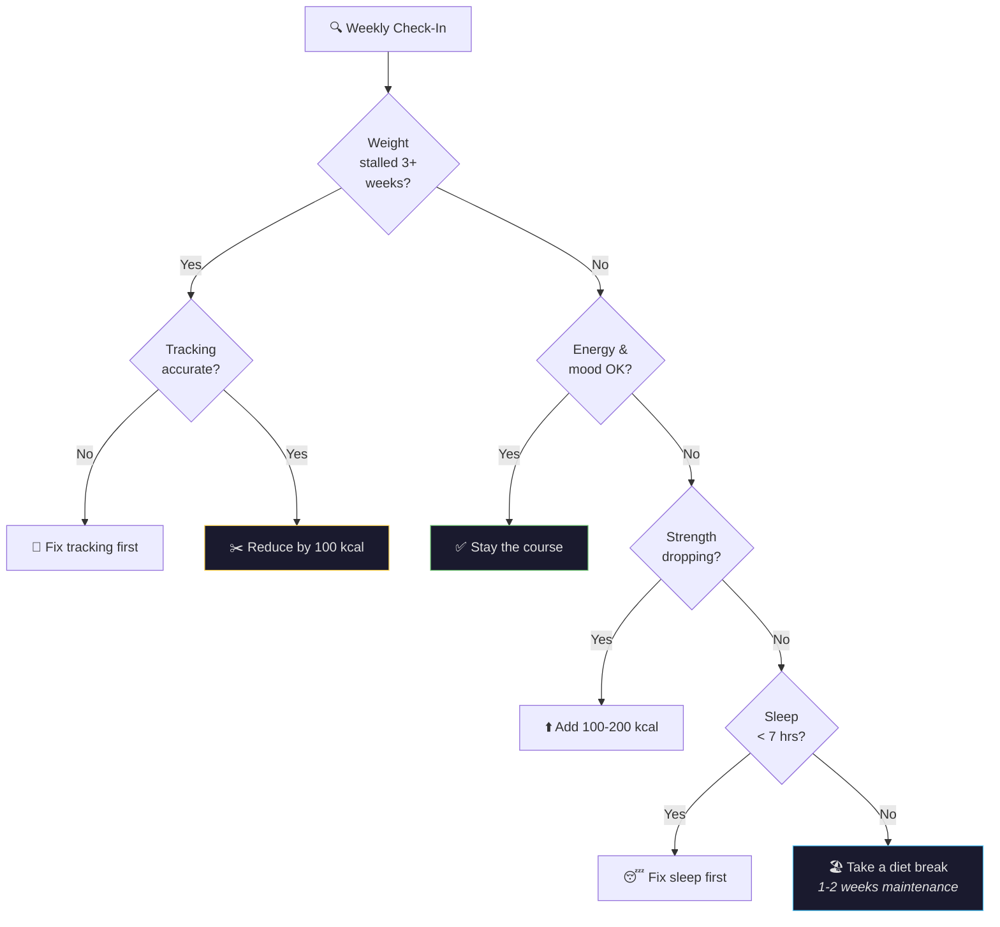

---
tags:
  - br
  - br/nutrition
  - br/strategy
confidence: plausible
up: "[[Body Recomp]]"
---
# Caloric Deficit Guide — Managing Your Cut

---

## What Is a Caloric Deficit?

A caloric deficit occurs when you consume fewer calories than your body expends. This forces your body to tap into stored energy (primarily body fat) to make up the difference. It is the **sole requirement** for fat loss — no food is inherently "fattening" and no food is magically "fat-burning." Energy balance determines the direction of weight change.

---

## Your Deficit Profile

| Metric | Value |
|--------|-------|
| Average daily intake | 1,903 kcal |
| Estimated TDEE | ~2,283 kcal |
| Daily deficit | ~380 kcal |
| Weekly deficit | ~2,660 kcal |
| Deficit as % of TDEE | ~17% |
| Expected fat loss rate | ~0.34 kg fat/week |

---

## Deficit Severity Scale

| Severity | % Below TDEE | Weekly Loss | Muscle Risk | Sustainability |
|----------|-------------|-------------|-------------|---------------|
| Mild | 5-10% | 0.1-0.2 kg | Very low | Very high |
| **Moderate** | **15-20%** | **0.3-0.5 kg** | **Low** | **High ← You** |
| Aggressive | 25-30% | 0.5-0.8 kg | Moderate | Moderate |
| Very aggressive | 30%+ | 0.8+ kg | High | Low |

Your 17% deficit is textbook moderate — the sweet spot for body recomposition.

---

## Adaptive Thermogenesis

Your body is not a static machine. As you lose weight and remain in a deficit, your body adapts:

1. **Reduced BMR** — smaller body burns fewer calories at rest
2. **NEAT reduction** — you unconsciously move less (fidgeting, walking, posture)
3. **TEF reduction** — less food means less energy spent digesting
4. **Hormonal shifts** — thyroid hormone (T3) decreases, cortisol increases
5. **Increased hunger** — ghrelin rises, leptin falls

### The Adaptive Thermogenesis Feedback Loop

This means your deficit naturally shrinks over time unless you adjust. MacroFactor handles this by recalculating your expenditure weekly based on actual weight and food data.

### MacroFactor's Role in the Spiral

MacroFactor is designed to account for adaptive thermogenesis by recalculating your expenditure weekly. In theory, this is helpful — it keeps your deficit calibrated to reality. In practice, after 9 months of continuous dieting, the algorithm has become **overly aggressive**, steadily cutting your budget as it chases a declining TDEE estimate.

The result: your calorie target dropped from ~2,000 to ~1,750, dragging protein from 211g to 144g. The algorithm can't distinguish between "TDEE dropped because the body adapted" and "TDEE dropped because muscle is being lost due to insufficient protein" — creating a potential self-fulfilling prophecy.

**The diet break solves both problems simultaneously**: it reverses real adaptive thermogenesis AND resets the algorithm's TDEE estimate upward.

---

## Minimum Calorie Thresholds

For your current size (~92 kg), avoid consistently going below:

| Context | Minimum |
|---------|---------|
| Training days | 1,800 kcal |
| Rest days | 1,600 kcal |
| Hard minimum (any day) | 1,500 kcal |

Going too low risks:
- Muscle loss acceleration
- Hormonal disruption
- Micronutrient deficiencies
- Binge-restrict cycles
- Training performance collapse

---

## Diet Breaks — Your Secret Weapon

After 9 months of continuous dieting, a structured diet break is strongly recommended:

**Protocol:**
1. Increase calories to maintenance (~2,283 kcal) for 1-2 weeks
2. Keep protein high (180g+)
3. Add calories primarily from carbs (not fat)
4. Continue training normally
5. Expect scale weight to jump 1-2 kg (glycogen + water — NOT fat)

**Benefits:**
- Partial reversal of adaptive thermogenesis
- Leptin restoration
- Psychological reset
- Improved training performance
- Often leads to a "whoosh" of weight loss when returning to deficit

---

## Signs You Need to Adjust

| Warning Sign | Action |
|-------------|--------|
| Weight stalled for 3+ weeks | Verify tracking accuracy, then reduce by 100 kcal |
| Persistent fatigue | Take a diet break |
| Strength dropping across all lifts | Increase calories by 100-200 kcal |
| Mood/irritability issues | Add a weekly refeed day |
| Binge episodes | Likely too aggressive — increase daily calories |
---

## References

[[Sources Index]] · [[Body Recomp]]

---

**Related:** [[Nutrition-Analysis]] · [[Fat-Loss-Muscle-Retention]] · [[Dashboard]] · [[Body-Recomp-Science]]
