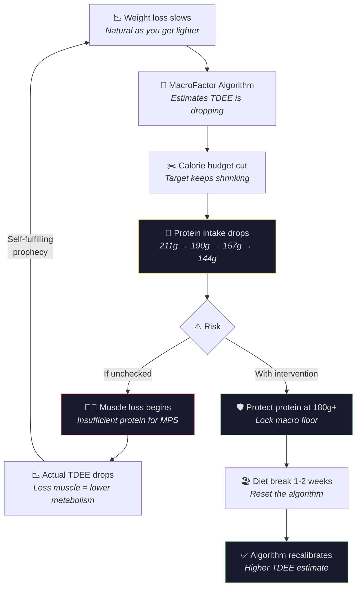

---
tags:
  - br
  - br/nutrition
confidence: verified
up: "[[Body Recomp]]"
---
# Nutrition Analysis — 260 Days of Data

**Data Source:** MacroFactor export (Jul 27, 2025 – Apr 12, 2026)

---

## Daily Averages

| Nutrient | Daily Average | Assessment |
|----------|--------------|------------|
| Calories | 1,903 kcal | Moderate deficit ✅ |
| Protein | 184 g (39%) | Excellent — 2.0 g/kg ✅ |
| Fat | 63 g (30%) | Adequate ✅ |
| Carbs | 150 g (31%) | Moderate ✅ |
| Fiber | 19 g | Below target ⚠️ (aim for 25-35g) |
| Sugars | 30 g | Low ✅ |
| Added Sugars | 4.5 g | Very low ✅ |

---

## Macro Ratio Analysis

Your macro split of **39% protein / 31% carbs / 30% fat** is heavily protein-biased — and that's exactly what you want during a body recomposition cut.

For comparison:
| Split | P / C / F | Use Case |
|-------|-----------|----------|
| **Yours** | **39 / 31 / 30** | **Aggressive recomp cut** ✅ |
| Standard cut | 30 / 40 / 30 | General fat loss |
| Bodybuilding cut | 35 / 40 / 25 | Contest prep |
| Maintenance | 25 / 45 / 30 | Weight maintenance |

Your protein percentage is higher than most bodybuilding cuts. This is excellent for muscle preservation during a deficit.

---

## Caloric Deficit Assessment

| Metric | Value |
|--------|-------|
| Average intake | 1,903 kcal/day |
| Estimated TDEE | ~2,283 kcal/day |
| Estimated deficit | ~380 kcal/day |
| Deficit severity | ~17% below TDEE |
| Classification | Moderate deficit |

A 15-20% deficit is the sweet spot for recomposition — aggressive enough to drive meaningful fat loss, conservative enough to preserve muscle. You're right in the middle.

---

## ⚠️ The MacroFactor Budget Spiral

MacroFactor's expenditure algorithm continuously recalculates your TDEE based on your weight change rate versus calorie intake. As you've gotten lighter and your rate of loss has naturally slowed, the algorithm has been interpreting this as declining TDEE — and progressively **slashing your calorie budget**.

### The Cascade

### Monthly Calorie & Protein Decline

| Month | Avg Calories | Avg Protein | Protein % |
|-------|-------------|-------------|-----------|
| Jul 2025 | 1,994 | 211g | 42% |
| Aug 2025 | 2,007 | 196g | 39% |
| Sep 2025 | 1,971 | 188g | 38% |
| Oct 2025 | 1,817 | 184g | 41% |
| Nov 2025 | 1,924 | 194g | 40% |
| Dec 2025 | 1,970 | 206g | 42% |
| Jan 2026 | 1,932 | 190g | 39% |
| Feb 2026 | 1,835 | 163g | 36% |
| Mar 2026 | 1,807 | 157g | 35% |
| Apr 2026 | 1,754 | 144g | 33% |

The calorie budget has dropped ~240 kcal/day from peak, and protein has fallen with it. Notice that protein's **share** of calories has also dropped (42% → 33%), meaning the decline isn't just proportional — you're eating less protein-dense foods as the budget shrinks.

### The Fix

1. **Lock protein at ≥180g** in MacroFactor's macro settings
2. **Let carbs and fat flex** — they absorb budget changes, protein stays fixed
3. **Take a diet break** — 1-2 weeks at maintenance resets the algorithm's TDEE estimate
4. **Don't go below 1,800 kcal** on any sustained basis at your size and activity level

---

## Protein Deep Dive

| Metric | Value | Target | Status |
|--------|-------|--------|--------|
| Daily protein | 184 g | ≥160 g | ✅ Exceeds |
| Protein per kg | 2.0 g/kg | 1.6–2.2 g/kg | ✅ Optimal range |
| % of calories | 39% | 25–40% | ✅ High end |

As you continue to lose weight, your g/kg ratio improves automatically:
- At 90 kg → 184g = 2.04 g/kg
- At 85 kg → 184g = 2.16 g/kg
- At 80 kg → 184g = 2.30 g/kg

→ See [[Protein-Optimization]] for more.

---

## Fiber Gap — Action Required

Your average fiber intake of **19g/day** falls short of the recommended 25-35g range. Low fiber can affect:
- Satiety (you feel less full)
- Gut health and microbiome diversity
- Cholesterol management
- Blood sugar stability

**Quick fiber additions:**
| Food | Fiber per serving |
|------|------------------|
| Psyllium husk (1 tbsp) | 5g |
| Black beans (½ cup) | 7.5g |
| Broccoli (1 cup) | 5g |
| Chia seeds (2 tbsp) | 10g |
| Oats (½ cup dry) | 4g |

Adding just one of these daily would bring you to target.

---

## Notable Food Patterns

From your food log, common entries include:
- **Boiled eggs** — excellent protein source, versatile
- **Protein bars** (Smart Brownie) — convenient supplementation
- **Rice** — primary carb source
- **Oats** — breakfast staple, good fiber source
- **Various soups and stews** — nutrient-dense, filling
- **Bananas** — quick carbs, potassium
---

## References

[[Sources Index]] · [[Body Recomp]]

---

**Related:** [[Dashboard]] · [[Protein-Optimization]] · [[Caloric-Deficit-Guide]] · [[Micronutrient-Profile]] · [[Weight-Journey]]
