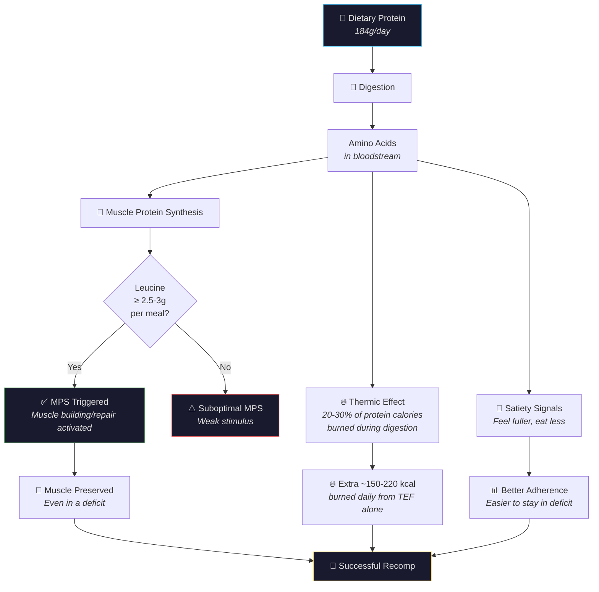

---
tags:
  - br
  - br/nutrition
confidence: plausible
up: "[[Body Recomp]]"
---
# Protein Optimization — Your Most Important Macro

---

## Your Current Intake

| Metric | Value | Target Range | Status |
|--------|-------|-------------|--------|
| Daily protein | 184 g | ≥160 g | ✅ Exceeds |
| Per kg body weight | 2.0 g/kg | 1.6–2.2 g/kg | ✅ Optimal |
| % of total calories | 39% | 25–40% | ✅ High end |
| Protein calories | 736 kcal | — | 39% of 1,903 |

You're nailing this. Protein is the single most important macronutrient for body recomposition, and you're in the optimal range.

---

## Why Protein Matters During a Cut

### 1. Muscle Protein Synthesis (MPS)
Dietary protein provides amino acids that trigger MPS — the process of building and repairing muscle tissue. During a caloric deficit, MPS rates naturally decline. High protein intake partially counteracts this decline.

### 2. Thermic Effect of Food (TEF)
Protein has the highest TEF of all macronutrients:
| Macro | TEF (% of calories burned during digestion) |
|-------|---------------------------------------------|
| Protein | 20-30% |
| Carbs | 5-10% |
| Fat | 0-3% |

At 184g protein, you're burning approximately 147-221 kcal/day just digesting protein. This effectively increases your deficit.

### 3. Satiety
Protein is the most satiating macronutrient. High protein intake reduces hunger, making it easier to sustain a deficit without white-knuckling it.

### 4. Body Composition
Even at the same body weight, higher protein intake leads to better body composition (more muscle, less fat).

---

## The Leucine Threshold

Not all protein meals are equal. To maximally stimulate MPS, each meal should contain approximately **2.5-3g of leucine** — an essential amino acid that acts as the primary "trigger" for muscle building.

| Protein Source | Amount for ~3g leucine |
|---------------|----------------------|
| Chicken breast | 120 g |
| Eggs | 5 whole eggs |
| Whey protein | 25 g scoop |
| Beef | 130 g |
| Greek yogurt | 350 g |
| Tofu | 350 g |

---

## Optimal Distribution

Rather than consuming all 184g in one or two meals, distribute it across 4-5 meals for maximum MPS stimulation:

| Meal | Timing | Protein Target |
|------|--------|---------------|
| Breakfast | Morning | 35-40 g |
| Lunch | Midday | 40-50 g |
| Pre/Post Workout | Around training | 30-40 g |
| Dinner | Evening | 40-50 g |
| Snack/Shake | As needed | 20-30 g |

Each meal hits the leucine threshold, giving you 4-5 MPS "pulses" per day instead of 1-2.

---

## As You Get Lighter

A beautiful property of maintaining high absolute protein as you lose weight:

| Weight | 184g Protein = | Status |
|--------|---------------|--------|
| 92.6 kg (now) | 2.0 g/kg | Optimal |
| 88 kg | 2.09 g/kg | Better |
| 85 kg | 2.16 g/kg | Even better |
| 82 kg | 2.24 g/kg | Top of range |

You don't need to increase protein as you lose weight — the ratio improves automatically.

---

## Your Top Protein Sources (From Food Log)

Based on your MacroFactor data:
- **Boiled eggs** — 13g per 2 eggs, excellent amino acid profile
- **Protein bars** (Smart Brownie) — convenient supplementation
- **Beef stew** — complete protein with iron and B12
- **Chicken** — lean, versatile
- **Unagi donburi** — fish protein with omega-3 bonus

---

## When to Increase

Consider bumping to 200g/day if:
- Strength consistently drops across multiple sessions
- Recovery noticeably worsens
- Body fat drops below 20% (higher protein becomes more important at lower BF%)
- You increase training volume significantly
---

## References

[[Sources Index]] · [[Body Recomp]]

---

**Related:** [[Nutrition-Analysis]] · [[Body-Recomp-Science]] · [[Fat-Loss-Muscle-Retention]] · [[Micronutrient-Profile]]
