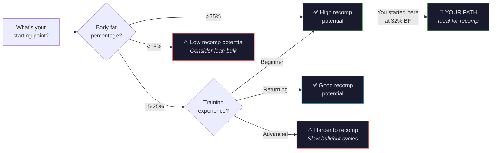
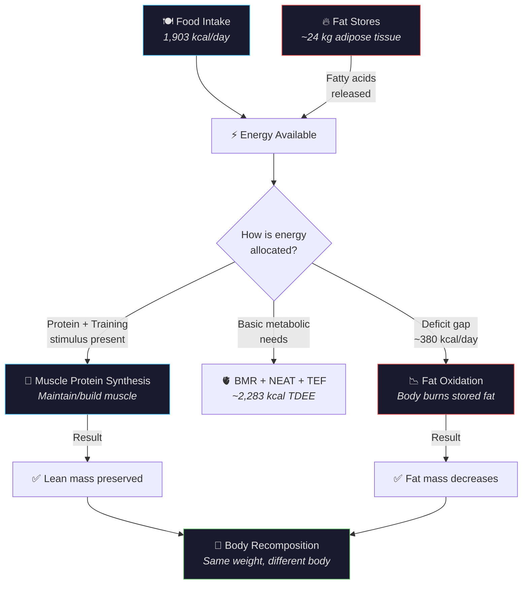
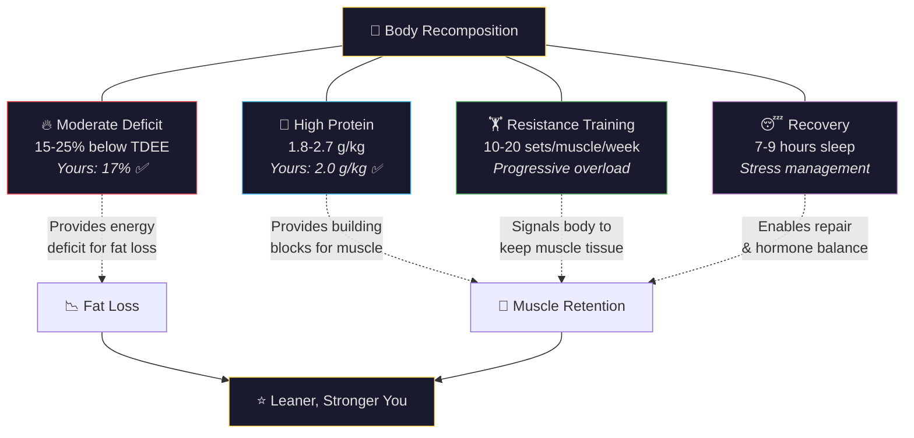

---
tags:
  - br
  - br/science
confidence: verified
up: "[[Body Recomp]]"
---
# Body Recomposition — The Science

---

## What Is Body Recomposition?

Body recomposition (recomp) is the process of **simultaneously losing fat and gaining — or at minimum preserving — muscle mass**. Unlike traditional "bulk then cut" cycles, recomp aims to change your body composition without dramatic swings in body weight.

For someone starting at a higher body fat percentage (like your 32%), recomp is not only possible — it's the expected outcome when the fundamentals are in place.

---

## Who Can Recomp Effectively?

Not everyone responds equally to body recomp. The best candidates are:

| Category | Recomp Potential | Why |
|----------|-----------------|-----|
| Beginners to resistance training | Very high | "Newbie gains" allow muscle growth even in a deficit |
| Higher body fat (>25%) | High | More stored energy available, body preferentially burns fat |
| Returning lifters (muscle memory) | High | Previously trained muscle regrows faster via myonuclei |
| Experienced lifters at low BF% | Low | Limited energy surplus available from fat stores |

**Your situation:** Starting at 32% body fat with a detrained 40 kg squat, you were in a *prime* position for recomp — high body fat (ample stored energy) AND a returning lifter (stored myonuclei from previous training). This is the highest recomp potential category. Your squat progression to 100 kg × 4×8 while losing 14.9 kg confirms that true recomposition occurred — you gained functional muscle while losing fat.

---

## The Energy Balance Paradox

Fat loss requires a **caloric deficit** — burning more than you consume. Muscle growth traditionally requires a **caloric surplus**. How can both happen simultaneously?

The answer: **your fat stores are the surplus.**

When you're carrying significant body fat, your adipose tissue releases fatty acids that can cover the energy gap. Your muscles receive adequate protein and training stimulus, while your fat cells fund the energy bill. The higher your body fat percentage, the more "internal surplus" your body can generate.

This is why the deficit matters less than the protein and training stimulus.

### How Recomp Works — The Energy Flow

---

## Key Research

### Protein Requirements During a Cut
**Helms et al. (2014)** — Systematic review concluded that during energy restriction, athletes should consume **1.8–2.7 g/kg of body weight** in protein to maximize lean mass retention. Your intake of 2.0 g/kg sits right in this range.

### High Protein and Recomposition
**Longland et al. (2016)** — Compared high protein (2.4 g/kg) vs. lower protein (1.2 g/kg) during a 40% caloric deficit with intense exercise. The high protein group **lost more fat AND gained lean mass**, while the lower protein group lost fat but also lost lean mass.

### Resistance Training Volume
**Schoenfeld et al. (2017)** — Meta-analysis found that higher training volumes (10+ sets per muscle group per week) produced greater hypertrophy. During a cut, maintaining training volume is the key signal that tells your body "keep the muscle."

### Rate of Weight Loss
**Garthe et al. (2011)** — Athletes losing weight slowly (0.7% BW/week) gained lean mass, while those losing fast (1.4% BW/week) did not. Your rate of 0.4% BW/week is conservative and muscle-sparing.

---

## The Four Pillars of Recomposition

### 1. Caloric Deficit (Moderate)
- 15-25% below TDEE
- Your deficit: ~17% ✅
- Too aggressive = muscle loss; too conservative = slow progress

### 2. High Protein Intake
- 1.8-2.7 g/kg body weight
- Your intake: 2.0 g/kg ✅  
- The single most important nutritional factor for muscle preservation

### 3. Resistance Training
- Progressive overload is non-negotiable
- 10-20 sets per muscle group per week
- Prioritize compound movements (squat, bench, deadlift, row, press)
- → See [[Progressive-Overload]]

### 4. Adequate Recovery
- 7-9 hours of sleep
- Manage stress (cortisol promotes muscle breakdown and fat storage)
- Deload every 4-6 weeks

---

## Rate of Weight Loss Matters

| Rate (%BW/week) | Fat Loss | Muscle Risk | Your Rate |
|-----------------|----------|-------------|-----------|
| < 0.5% | Slower | Very low | ← **You (0.4%)** |
| 0.5–0.7% | Moderate | Low | |
| 0.7–1.0% | Good | Moderate | |
| > 1.0% | Fast | High | |

Slower is better for body composition. Speed is the enemy of muscle preservation.
---

## References

[[Sources Index]] · [[Body Recomp]]

---

**Related:** [[Fat-Loss-Muscle-Retention]] · [[Protein-Optimization]] · [[Progressive-Overload]] · [[Caloric-Deficit-Guide]]
