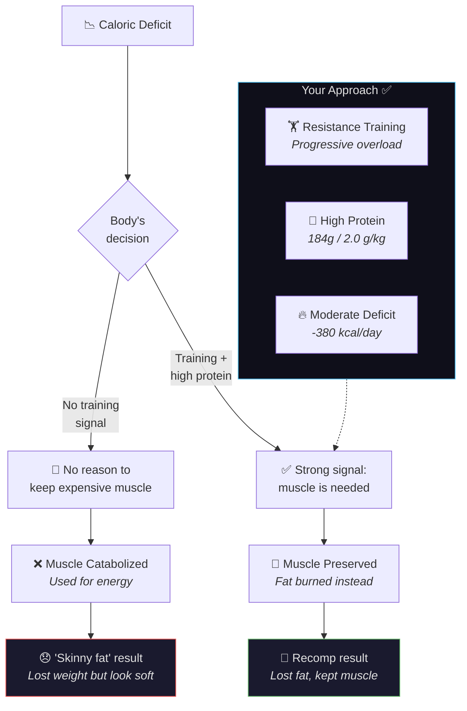

---
tags:
  - br
  - br/training
confidence: plausible
up: "[[Body Recomp]]"
---
# Progressive Overload — Training for Muscle Retention

---

## Why Training Is Non-Negotiable During a Cut

Your body is in a caloric deficit. From a survival perspective, muscle is expensive tissue — it burns calories even at rest. Without a strong signal to keep it, your body will happily catabolize muscle along with fat.

That signal is **resistance training with progressive overload.**

Protein provides the building materials. Training provides the blueprint. Without both, the building doesn't get built — or maintained.

---

## What Is Progressive Overload?

Progressive overload means systematically increasing the demands placed on your muscles over time. This can happen through:

| Variable | Example |
|----------|---------|
| Weight | Bench press 80 kg → 82.5 kg |
| Reps | Squat 100 kg × 6 → 100 kg × 8 |
| Sets | 3 sets → 4 sets |
| Frequency | Legs 1×/week → 2×/week |
| Tempo | 2-second eccentric → 3-second eccentric |
| Range of motion | Partial squat → full depth squat |

During a cut, the primary goal shifts from "add weight to the bar" to "maintain the weight on the bar." If you can lift the same loads at 92.6 kg that you lifted at 107.5 kg, you're effectively much stronger per unit of body weight.

---

## Volume Recommendations During a Cut

| Muscle Group | Sets/Week (Maintenance) | Sets/Week (Growth) |
|-------------|------------------------|-------------------|
| Chest | 8-12 | 12-20 |
| Back | 8-12 | 12-20 |
| Shoulders | 6-10 | 10-16 |
| Quads | 8-12 | 12-20 |
| Hamstrings | 6-10 | 10-16 |
| Biceps | 4-8 | 8-14 |
| Triceps | 4-8 | 8-14 |
| Calves | 6-8 | 8-12 |

During a cut, aim for the **maintenance** range. You don't need maximum volume — you need enough stimulus to tell your body "keep the muscle."

---

## Training Frequency

Each muscle group should be trained **at minimum 2× per week** for optimal protein synthesis. MPS elevation from a training session lasts approximately 24-72 hours — training a muscle once per week wastes potential growth/maintenance windows.

**Recommended splits for a cut:**
| Split | Days | Pros |
|-------|------|------|
| Upper/Lower | 4 days | Simple, good frequency |
| Push/Pull/Legs | 5-6 days | High frequency, more volume |
| Full Body | 3 days | Time-efficient, high frequency |

---

## Signs of Overtraining During a Deficit

Your recovery capacity is reduced in a deficit. Watch for:

| Warning Sign | Likely Cause | Action |
|-------------|-------------|--------|
| Strength down >10% for 2+ weeks | Insufficient recovery or calories | Reduce volume by 20%, add 100 kcal |
| Persistent joint pain | Accumulated fatigue | Deload week |
| Poor sleep despite being tired | Sympathetic nervous system overdrive | Reduce training frequency |
| Elevated resting heart rate | Systemic fatigue | Full rest day |
| Mood deterioration, irritability | Cortisol elevation | Diet break + deload |

---

## Deload Protocol

Every 4-6 weeks, take a deload week:
- **Reduce volume** by 40-50% (keep intensity/weight the same)
- **Maintain frequency** (still train same days)
- **Focus on form** and mind-muscle connection
- **Sleep and eat well** (good time for a refeed)

Think of deloads as "recovery investments" that pay dividends in the following training block.

---

## Cardio Considerations

| Type | Recommendation | Notes |
|------|---------------|-------|
| Walking/Steps | 8,000-10,000/day | Best cardio for a cut — burns calories without impacting recovery |
| Light cycling | 2-3×/week, 20-30 min | Low impact, good for active recovery |
| HIIT | 1-2×/week MAX | Very taxing on recovery — use sparingly |
| Running | Moderate | Can interfere with leg recovery |

Walking is king during a cut. It burns meaningful calories without creating recovery debt.

---

## Your Training Data

Your MacroFactor export includes training data sheets:
- Muscle Groups — Sets
- Muscle Groups — Volume
- Exercises — Total Sets
- Workouts
- Training Programs

This data will be analyzed and incorporated here with your specific training patterns, volume trends, and exercise selection.
---

## References

[[Sources Index]] · [[Body Recomp]]

---

**Related:** [[Body-Recomp-Science]] · [[Fat-Loss-Muscle-Retention]] · [[Dashboard]]
