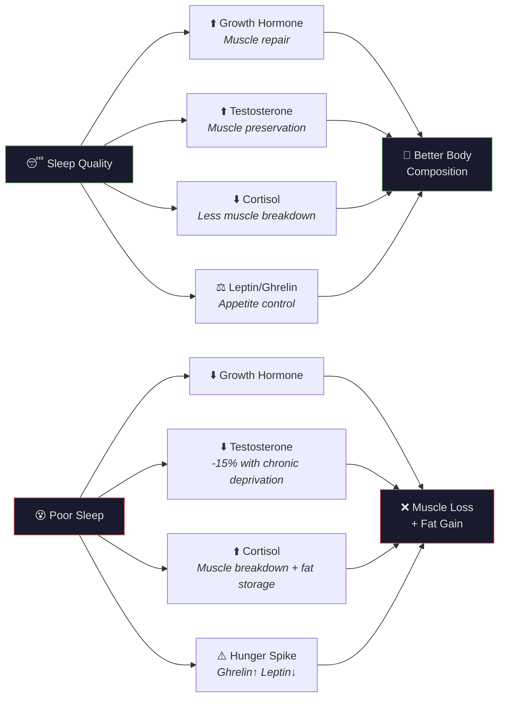
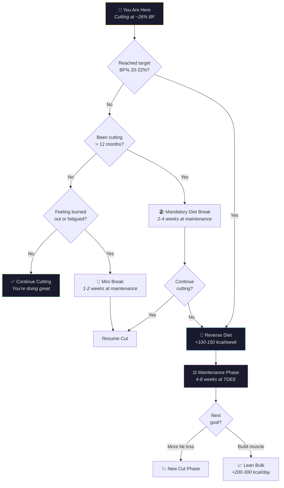

---
tags:
  - br
  - br/strategy
confidence: plausible
up: "[[Body Recomp]]"
---
# Fat Loss While Retaining Muscle — Your Playbook

---

## Your Situation

You're doing this remarkably well. After 9 months of consistent tracking, you've lost 14.9 kg while maintaining a protein intake of 2.0 g/kg — one of the strongest predictors of muscle preservation during a cut.

Here's what the data says about your approach:
- ✅ Moderate deficit (~17%) — not crashing
- ✅ High protein (184g/day, 2.0 g/kg) — muscle-sparing
- ✅ Conservative rate of loss (0.4% BW/week) — very safe for lean mass
- ⚠️ Fiber needs work (19g vs 25-35g target)
- ✅ Massive strength gains (squat 40→100 kg × 4×8) — muscle memory in action

---

## Strategy 1: Maintain Your Protein Fortress

Your 184g/day protein intake is your most powerful muscle-preservation tool. Do not let this drop.

As you get lighter, the math works even more in your favor:
| Weight | Protein | g/kg Ratio |
|--------|---------|------------|
| 92.6 kg (now) | 184 g | 2.0 g/kg |
| 88 kg | 184 g | 2.1 g/kg |
| 85 kg | 184 g | 2.16 g/kg |

**Action:** Keep protein at 180-190g minimum. If strength stalls, bump to 200g.

---

## Strategy 2: Progressive Overload in Training

You're already crushing this. Your squat went from 40 kg to 100 kg × 4×8 — a 2.5× increase while in a caloric deficit. This is the strongest possible evidence that you're retaining (and likely gaining) muscle mass.

Your muscles need a reason to stick around. That reason is **progressive overload** — systematically increasing the demand on your muscles over time.

During a cut, you may not set PRs every week. That's normal. The goal shifts from "get stronger" to "maintain strength and volume." If you can lift the same weights for the same reps at a lower body weight, you're effectively getting relatively stronger.

**Practical targets:**
- Maintain or increase weight on compound lifts
- Keep total weekly sets at 10-20 per muscle group
- If a lift drops more than 10%, assess recovery and calories

→ See [[Progressive-Overload]]

---

## Strategy 3: Manage Rate of Loss

Your rate of 0.38 kg/week (0.4% BW/week) is excellent — it sits at the conservative end of the muscle-sparing range. There's room to slightly accelerate (up to 0.5-0.7% BW/week) if you want faster results, but your current pace is working.

**When to slow down further:**
- If strength drops significantly
- If recovery worsens
- If body fat gets below 20% (higher risk of muscle loss at lower BF%)

---

## Strategy 4: Prioritize Sleep

Sleep is when your body does its repair and remodeling work. During a caloric deficit, sleep becomes even more critical because your recovery resources are limited.

| Sleep Duration | Effect on Body Composition |
|---------------|---------------------------|
| < 6 hours | Increased muscle loss, increased hunger hormones |
| 6-7 hours | Suboptimal but manageable |
| 7-9 hours | Optimal for hormone balance and recovery |
| > 9 hours | Diminishing returns |

**Key hormones affected by sleep:**
- **Growth hormone** — peaks during deep sleep; drives muscle repair
- **Testosterone** — reduced by up to 15% with chronic sleep deprivation
- **Cortisol** — elevated with poor sleep; promotes muscle breakdown
- **Leptin/Ghrelin** — imbalanced with poor sleep; increases hunger

---

## Strategy 5: Strategic Refeeds and Diet Breaks

You've been in a deficit for ~9 months. Your body has been adapting — metabolic rate decreases, hormones shift, and hunger signals intensify. This is called **adaptive thermogenesis**.

**Refeeds** (1-2 days at maintenance):
- Restore leptin levels temporarily
- Replenish muscle glycogen
- Psychological relief
- Recommended every 1-2 weeks

**Diet breaks** (1-2 weeks at maintenance):
- More complete hormonal restoration
- Reverse some adaptive thermogenesis
- Recommended every 8-12 weeks

**Your case:** At 9 months of continuous dieting, you would strongly benefit from a 1-2 week diet break at maintenance (~2,283 kcal) before continuing your cut. This is not quitting — it's a strategic reset that often leads to better results afterward.

---

## Strategy 6: Know When to Shift Phases

You won't cut forever. At some point, the right move is to transition to maintenance or a lean bulk to build muscle more efficiently.

**Signals to end the cut:**
| Signal | Your Status |
|--------|-------------|
| Reached target BF% (20-22%) | Not yet (~26%) |
| Persistent fatigue | Monitor |
| Strength declining despite good sleep/protein | Monitor |
| Diet duration > 12 months | Approaching (9 months) |
| Psychological burnout | Self-assess |

### Phase Transition Decision Tree

**Recommended transition plan:**
1. Reverse diet: increase calories by 100-150/week until at maintenance
2. Hold maintenance for 4-8 weeks (let hormones normalize)
3. Then decide: continue cutting or begin a lean bulk (+200-300 kcal)

---

## Strategy 7: Trust the Process

MacroFactor's algorithm adjusts your expenditure estimates based on your real data. The app is already doing the math for you — trust it, stay consistent, and let the results compound.

Your 14.9 kg of progress is proof the system works.
---

## References

[[Sources Index]] · [[Body Recomp]]

---

**Related:** [[Body-Recomp-Science]] · [[Caloric-Deficit-Guide]] · [[Nutrition-Analysis]] · [[Progressive-Overload]] · [[Protein-Optimization]]
