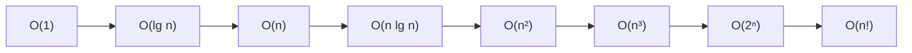

---
tags:
  - csa
  - csa/analysis
confidence: verified
up: "[[Foundations and Analysis Overview]]"
tier-coverage: [intuition, core, deep-dive, practice]
---
# Asymptotic Notation

> **One-line summary**: Asymptotic notation describes how a function's growth rate behaves as input size n → ∞, abstracting away constants and lower-order terms to enable algorithm comparison independent of hardware.

## 🎯 Intuition
**The Core Idea:** Asymptotic notation is a speed limit sign for algorithms — it tells you the growth rate, not the exact travel time.
**Analogy:** Imagine comparing two cars. One does 0–60 in 3.2 seconds; the other in 3.5 seconds. That difference is a "constant factor" — both are sports cars. But compare either to a bicycle and the *order of growth* in speed is fundamentally different. Big-O captures *car vs bicycle*, not *3.2 vs 3.5*.
**Why It Matters:** Without asymptotic notation, every algorithm comparison would depend on which machine, compiler, and programmer produced the code. Growth-rate analysis lets you make universal statements: merge sort beats insertion sort at scale, period.

---

## ⚙️ Core Mechanics
### Definition / Formal Statement

#### Θ (Theta) — Tight Bound
f(n) = $\Theta(g(n)$) if there exist positive constants c₁, c₂, n₀ such that:
```
c₁·g(n) ≤ f(n) ≤ c₂·g(n)   for all n ≥ n₀
```
Meaning: f grows **exactly like** g — upper *and* lower bounded.

#### O (Big-O) — Upper Bound
f(n) = $O(g(n)$) if there exist positive constants c, n₀ such that:
```
f(n) ≤ c·g(n)   for all n ≥ n₀
```
Meaning: f grows **at most** as fast as g.

#### Ω (Omega) — Lower Bound
f(n) = $\Omega(g(n)$) if there exist positive constants c, n₀ such that:
```
f(n) ≥ c·g(n)   for all n ≥ n₀
```
Meaning: f grows **at least** as fast as g.

### Key Properties

| Notation | Meaning | Analogy |
|----------|---------|---------|
| f = $O(g)$ | f ≤ g asymptotically | "at most" — ceiling |
| f = $\Omega(g)$ | f ≥ g asymptotically | "at least" — floor |
| f = $\Theta(g)$ | f = g asymptotically | "exactly" — tight fit |

**Relationship:** f(n) = $\Theta(g(n)$) if and only if f(n) = $O(g(n)$) *and* f(n) = $\Omega(g(n)$).

### Why Drop Constants?
Constants depend on machine, compiler, programmer skill — not on the algorithm. Two implementations of merge sort may differ by 2×, but both are $\Theta(n \lg n)$. Comparing algorithms across systems, only the order of growth is meaningful.

### Common Growth Orders

| Notation | Name | Example |
|----------|------|---------|
| $O(1)$ | Constant | Array index lookup |
| $O(\lg n)$ | Logarithmic | Binary search |
| $O(n)$ | Linear | Linear scan |
| $O(n \lg n)$ | Linearithmic | Merge sort, heap sort |
| $O(n²)$ | Quadratic | Insertion sort worst case |
| $O(n³)$ | Cubic | Floyd-Warshall |
| $O(2ⁿ)$ | Exponential | Naive subset enumeration |
| $O(n!)$ | Factorial | Brute-force permutation search |

### Worked Examples
**Concrete Example**: For f(n) = 50n + 125:
- 50n dominates for large n
- Drop the constant 125 (lower-order)
- Drop the coefficient 50 (machine-dependent)
- Result: f(n) = $\Theta(n)$

**Formal proof that 50n + 125 = $\Theta(n)$:**
- Upper bound: 50n + 125 ≤ 50n + 125n = 175n for n ≥ 1. So c₂ = 175, n₀ = 1.
- Lower bound: 50n + 125 ≥ 50n for all n ≥ 1. So c₁ = 50, n₀ = 1.
- Therefore 50n ≤ 50n + 125 ≤ 175n for all n ≥ 1. ✅ $\Theta(n)$.

### RAM Model Connection
Asymptotic analysis assumes the **RAM model** — each basic operation costs 1 unit, all memory accesses are uniform. Under this model, counting operations yields a function of n, and asymptotic notation then characterises its growth rate. See [[Algorithm Definition]] for context.

### Key Facts
- O gives an upper bound; Ω gives a lower bound; Θ gives both.
- Constants are dropped because they depend on implementation, not the algorithm.
- The hierarchy is: 1 < lg n < n < n lg n < n² < n³ < 2ⁿ < n!.

**Figure:** Common growth rate hierarchy




---

## 🔬 Deep Dive
### Formal Proof / Derivation
**Theorem (Θ = O ∩ Ω):** f(n) = $\Theta(g(n))$ ⟺ f(n) = $O(g(n))$ ∧ f(n) = $\Omega(g(n))$.

*Proof (⇒)*: If c₁·g(n) ≤ f(n) ≤ c₂·g(n) for n ≥ n₀, then f(n) ≤ c₂·g(n) (so O) and f(n) ≥ c₁·g(n) (so Ω).

*Proof (⇐)*: If f(n) ≤ c·g(n) for n ≥ n₁ and f(n) ≥ c'·g(n) for n ≥ n₂, set n₀ = max(n₁, n₂), c₂ = c, c₁ = c'. Then c₁·g(n) ≤ f(n) ≤ c₂·g(n) for n ≥ n₀. ∎

### Subtleties and Edge Cases
- **o (little-o) and ω (little-omega)**: o(g(n)) means "strictly less than" — for *every* c > 0, f(n) < c·g(n) eventually. Similarly ω is "strictly greater than." These are strict versions without the "or equal to" possibility.
- **Abuse of notation**: f(n) = $O(g(n)$) is not a true equation — the "=" means "is in the set." More precisely, f ∈ $O(g)$.
- **Best/worst/average case confusion**: $O(n²)$ describes a *function's* growth, not an algorithm's case. Saying "quicksort is $O(n²)$" is about its worst-case time function. Its average-case function is $\Theta(n \lg n)$.
- **Polynomial vs exponential cliff**: n¹⁰⁰ = $O(n¹⁰⁰)$ is polynomial; 1.001ⁿ is exponential. Despite the huge constant, the exponential *always* dominates eventually.

### Historical Context
Big-O notation was introduced by Paul Bachmann in 1894 and popularised by Edmund Landau. Knuth advocated for the full Θ/O/Ω system in 1976 to prevent the common abuse of Big-O as a tight bound. Cormen's *Algorithms Unlocked* (2013), Chapters 1–2, presents asymptotic notation as the essential tool for algorithm comparison. CLRS formalises the set-theoretic definitions.

---

## 🏋️ Practice
### Warm-Up (5 min)
1. Is 100n + 10⁶ = $O(n)$? Prove it by finding c and n₀.
2. If f(n) = $O(n²)$, can f(n) also be $O(n³)$? Why?
3. State the formal definition of Θ from memory.

### Core Problems
1. **Ranking**: Rank these functions by asymptotic growth: n², 2ⁿ, n lg n, lg(lg n), n!, $n^{1/2}$, n lg²n. Prove each adjacent pair's ordering.

2. **Proof exercise**: Prove formally that n³ + 1000n² = $\Theta(n³)$ by finding explicit constants c₁, c₂, n₀.

### Challenge
1. Find a function f(n) such that f(n) ≠ $O(g(n)$) and f(n) ≠ $\Omega(g(n)$) for g(n) = n. *(Hint: consider an oscillating function.)*

---

*See also:* [[Algorithm Definition]] | [[Recurrence Relations]] | [[Master Theorem]] | **CS Data Structures:** [[Asymptotic Analysis and Big-O Notation]], [[Amortized Analysis]]

## Supporting Chunks

- [[Analysis - Asymptotic notation drops constants to compare algorithm growth rates]]
- [[Analysis - The RAM model treats each basic operation as unit cost]]
- [[Analysis - Algorithm choice matters as much as hardware at large n]]

## See Also

- [[Merge Sort]] — $\Theta(n \lg n)$ canonical tight-bound example
- [[Binary Search]] — $O(\lg n)$ canonical upper-bound example
- [[Dijkstra's Algorithm]] — $O((n+m)$ lg n) illustrates multi-parameter graph complexity
- [[P vs NP]] — the polynomial/exponential growth divide defines the P vs NP boundary

## References

See [[CS Algorithms/Sources/Sources Index#Cormen 2013|Sources Index]]. Chapters 1–2.
