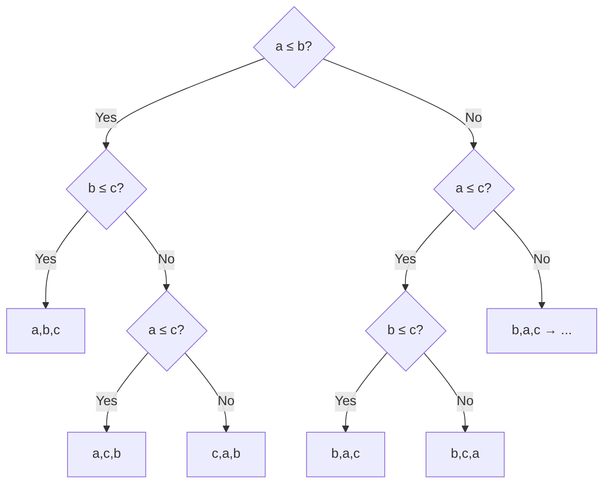

---
tags:
  - csa
  - csa/analysis
  - csa/sorting
confidence: verified
freshness: stable
up: "[[Foundations and Analysis Overview]]"
tier-coverage: [intuition, core, deep-dive, practice]
---
# Comparison Sort Lower Bound

> **One-line summary**: Any algorithm that determines sorted order exclusively by comparing pairs of elements must make at least $\Omega(n \lg n)$ comparisons in the worst case.

## 🎯 Intuition
**The Core Idea:** There are n! possible orderings of n elements; each comparison eliminates at most half of them, so you need at least lg(n!) ≈ n lg n comparisons to identify the right one.
**Analogy:** Imagine a game of 20 questions where you must identify one specific arrangement of n cards from n! possibilities. Each yes/no question (comparison) halves the remaining possibilities at best. With n! possibilities, you need at least lg(n!) ≈ n lg n questions — no matter how clever your strategy.
**Why It Matters:** This tells you when to stop optimising — merge sort's $\Theta(n \lg n)$ is *the best possible* for comparison-based sorting. To go faster, you must exploit key structure (counting sort, radix sort).

---

## ⚙️ Core Mechanics
### Definition / Formal Statement
**Theorem:** Any comparison sort algorithm requires $\Omega(n \lg n)$ comparisons in the worst case.

### Decision Tree Model
Represent a comparison sort as a binary decision tree:
- Each **internal node** represents a comparison: *is a[i] ≤ a[j]?*
- Each **branch** is the outcome (yes / no).
- Each **leaf** is a specific output permutation of the n elements.

A correct sort must handle *every* possible input — so the tree must have at least **n! leaves** (one per distinct permutation of n elements).

**Figure:** Decision tree for comparison sort (3 elements)




### Key Properties

| Component | Role | Count |
|-----------|------|-------|
| Internal nodes | Comparisons (a[i] ≤ a[j]?) | Variable |
| Branches | Outcomes (yes/no) | 2 per node |
| Leaves | Output permutations | ≥ n! |
| Tree height h | Worst-case comparisons | ≥ lg(n!) |

### The Lower Bound Argument
A binary tree of height h has at most 2ʰ leaves. Therefore:

```
2ʰ ≥ n!
h  ≥ lg(n!)
```

By Stirling's approximation:
```
lg(n!) ≥ n lg n − n/ln 2  =  Ω(n lg n)
```

So the tree height h (= worst-case number of comparisons) is $\Omega(n \lg n)$.

### Worked Examples
**Example — Sorting 3 elements {a, b, c}:**
- There are 3! = 6 possible orderings.
- A binary decision tree needs ≥ lg(6) ≈ 2.58 → at least 3 comparisons in the worst case.
- Optimal 3-element sort: compare a≤b?, then insert c with 1–2 more comparisons → 3 worst-case comparisons. Matches the bound.

**Unified Framework — Sorting and Searching:**

| Problem | Leaves required | Lower bound | Matching algorithm |
|---------|----------------|-------------|-------------------|
| Sort n elements | n! | $\Omega(n \lg n)$ | Merge sort |
| Search sorted array of n | n+1 | $\Omega(\lg n)$ | Binary search |

Both lower bounds follow from the same leaf-counting argument.

### Tightness
**Merge sort** achieves $\Theta(n \lg n)$ in all cases, confirming the bound is tight. Merge sort is an **optimal comparison sort**.

### Bypassing the Bound
The bound applies only to comparison sorts. Algorithms that exploit additional structure of the keys — such as [[Counting Sort]] and [[Radix Sort]] — can sort in sub-$\Theta(n \lg n)$ time under appropriate conditions.

### Key Facts
- The decision tree model applies to *any* comparison-based algorithm, not just sorting.
- n! leaves → height ≥ lg(n!) = $\Omega(n \lg n)$.
- Merge sort matches the bound; it is optimal among comparison sorts.
- Non-comparison sorts (counting, radix) bypass the bound by exploiting key structure.

---

## 🔬 Deep Dive
### Formal Proof / Derivation

**Sharpening: the Exact Leading Term**

The $\Omega(n \lg n)$ bound follows from Stirling's approximation, but the exact expansion is more informative:

```
lg(n!) = n lg n − O(n)
```

More precisely, via Stirling: lg(n!) = n lg n − n/ln 2 + $O(\lg n)$.

This means the minimum number of comparisons any comparison sort must make is **n lg n − $O(n)$**, not merely *some* function growing like n lg n. Merge sort achieves approximately n lg n − $O(n)$ comparisons in the worst case, making it **leading-coefficient optimal**.

**A simpler derivation without Stirling:**
```
lg(n!) ≥ lg(n) + lg(n−1) + … + lg(⌈n/2⌉)    (keep only the top half)
       ≥ (n/2) · lg(n/2)
       = (n/2)(lg n − 1) = Ω(n lg n)
```

### Subtleties and Edge Cases
- **Average-case lower bound**: The $\Omega(n \lg n)$ bound is for the *worst* case. The information-theoretic argument also gives $\Omega(n \lg n)$ for the *average* case (over uniformly random permutations), since most permutations require close to lg(n!) comparisons.
- **Repeated elements**: With many duplicates, fewer than n! distinct orderings exist, potentially lowering the bound. Algorithms like 3-way partition quicksort exploit this.
- **Adaptive sorts**: Timsort exploits pre-existing order (runs) and can sort nearly-sorted input in $O(n)$ — but its worst case is still $\Theta(n \lg n)$.
- **The bound says nothing about space**: Merge sort is optimal in comparisons but uses $O(n)$ extra space. In-place optimal comparison sorting (e.g., block merge sort) is more complex.

### Historical Context
The decision-tree lower bound appears in CLRS Chapter 4 and MIT OCW 6.006 Lecture 3. The argument is originally attributed to information theory reasoning from the 1950s–60s. The unified treatment covering both sorting and searching via decision trees is a hallmark of the CLRS presentation.

---

## 🏋️ Practice
### Warm-Up (5 min)
1. How many leaves must a decision tree for sorting 5 elements have? What is the minimum tree height?
2. Why can counting sort beat the $\Omega(n \lg n)$ bound — doesn't the theorem apply to it?
3. What does the decision-tree model assume about how the algorithm accesses data?

### Core Problems
1. **Decision tree construction**: Draw the complete decision tree for sorting 3 elements {a, b, c}. Verify it has ≥ 6 leaves and height ≥ 3.

2. **Searching lower bound**: Use the decision-tree argument to prove that any comparison-based search in a sorted array of n elements requires $\Omega(\lg n)$ comparisons. Why does binary search match this?

### Challenge
1. Prove that any comparison-based algorithm to find the median of n elements requires $\Omega(n)$ comparisons. *(Hint: any element not compared might be the median.)*

---

*See also:* [[Asymptotic Notation]] | [[Recurrence Relations]] | [[Merge Sort]] | **CS Data Structures:** [[Asymptotic Analysis and Big-O Notation]]

## Supporting Chunks

- [[Sorting - The Omega(n lg n) lower bound applies to all comparison sorts]]
- [[Analysis - Decision trees unify comparison lower bounds for sorting and for searching]]
- [[Analysis - The exact bound lg(n!) equals n lg n minus O(n) makes the comparison sort lower bound precise not just asymptotic]]

## See Also

- [[Foundations and Analysis - Review Drill]] — drill questions on the decision tree argument, lg(n!) exact bound, and unified sorting/searching lower bounds

## References

See [[CS Algorithms/Sources/Sources Index#Cormen 2013|Cormen 2013]]. Chapter 4. See [[CS Algorithms/Sources/Sources Index#MIT OpenCourseWare 6.006|MIT OCW 6.006]]. Lecture 3. See [[Binary Search]] for the searching lower bound. See [[Sorting Overview]] for the full algorithm comparison table.
