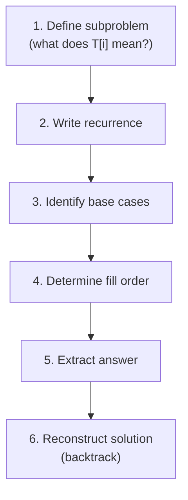

---
tags:
  - csa
  - csa/analysis
confidence: verified
freshness: stable
up: "[[Foundations and Analysis Overview]]"
tier-coverage: [intuition, core, deep-dive, practice]
---
# Dynamic Programming

> **One-line summary**: Dynamic programming (DP) solves optimisation and counting problems by breaking them into overlapping subproblems, solving each once, and storing the result for reuse.

## 🎯 Intuition
**The Core Idea:** Don't redo work you've already done — memo your answers and look them up instead.
**Analogy:** Imagine doing homework where each problem builds on previous ones. Without DP, you'd re-derive every earlier answer from scratch each time. With DP, you write each answer on a sticky note and just look it up — like memoizing your homework answers. The table *is* your collection of sticky notes.
**Why It Matters:** DP transforms exponential brute-force searches into polynomial-time algorithms. It's the backbone of string alignment (LCS, edit distance), shortest paths (Bellman-Ford, Floyd-Warshall), and countless interview and competition problems.

---

## ⚙️ Core Mechanics
### Definition / Formal Statement
**Dynamic programming** is an algorithm design paradigm that solves optimisation and counting problems by:
1. Identifying **overlapping subproblems** (the same subproblem appears multiple times).
2. Exploiting **optimal substructure** (an optimal solution contains optimal solutions to subproblems).
3. Building a **table** bottom-up (or memoising top-down) to avoid redundant computation.

### Key Properties

| Property | Requirement | What happens without it |
|----------|-------------|------------------------|
| **Optimal Substructure** | Optimal solution contains optimal sub-solutions | No correct recurrence exists |
| **Overlapping Subproblems** | Naive recursion re-solves the same subproblem many times | Divide-and-conquer already works; DP adds nothing |

> Without optimal substructure, no correct recurrence exists. Without overlapping subproblems, divide-and-conquer already achieves polynomial time; DP adds nothing.

### Bottom-Up Tabulation (Cormen's 6-Step Method)
1. **Define the subproblem** — what quantity does table entry T[i] (or T[i,j]) represent?
2. **Write the recurrence** — express T[i] in terms of earlier table entries.
3. **Identify base cases** — boundary entries with no smaller subproblems.
4. **Fill order** — ensure each entry is computed after all its dependencies.
5. **Extract the answer** — the final answer is one (or a small set of) table entries.
6. **Reconstruct the solution** — if the actual solution (not just its cost) is needed, record choices during fill and backtrack.

**Figure:** DP design steps (Cormen's 6-step method)




### Running Time
```
T(n) = (number of distinct subproblems) × (work per subproblem)
```
Once overlapping subproblems are eliminated, each is solved once. For 1D sequence DP: typically $\Theta(n²)$. For 2D prefix-pair problems (string DP): $\Theta(mn)$.

### DP vs Divide-and-Conquer

| Property | Divide-and-Conquer | Dynamic Programming |
|---|---|---|
| Optimal substructure | Yes | Yes |
| Subproblem overlap | No (disjoint) | Yes (shared) |
| Memoisation needed? | No | Yes |
| Examples | Merge sort, quicksort | LCS, edit distance, Floyd-Warshall |

### Worked Examples

**Example — Fibonacci with DP:**
- Naive recursion: T(n) = T(n−1) + T(n−2) → $O(2ⁿ)$ — exponential, because fib(k) is recomputed many times.
- DP table: F[0] = 0, F[1] = 1, F[i] = F[i−1] + F[i−2] for i ≥ 2. Fill left to right → $O(n)$ time, $O(n)$ space (or $O(1)$ with rolling variables).

**Canonical Examples in This Vault:**

| Problem | Subproblem | Table size | Recurrence |
|---|---|---|---|
| LCS | l[i,j] = LCS length of X[1..i], Y[1..j] | m×n | Match or skip last char |
| Edit distance | cost[i,j] = min cost X[1..i] → Y[1..j] | m×n | Copy/replace/delete/insert |
| DAG shortest paths | dist[v] = shortest path weight to v | n entries | Relax in topological order |
| Floyd-Warshall | d[i,j,k] = shortest i→j using only vertices 1..k | n×n×n | Include or skip vertex k |

### Key Facts
- DP = recursion + memoisation (top-down) or table-filling (bottom-up).
- Running time = (# subproblems) × (work per subproblem).
- The two prerequisites are optimal substructure and overlapping subproblems.
- Always define what the table entry *means* before writing the recurrence.

---

## 🔬 Deep Dive
### Formal Proof / Derivation
**Correctness argument for bottom-up DP:**
Suppose the recurrence T[i] = f(T[j₁], T[j₂], …) is correct (captures optimal substructure). If the fill order computes every T[jₖ] before T[i], then by induction on the fill order:
- *Base case*: Base entries are correct by definition.
- *Inductive step*: T[i] is computed from previously correct entries using a correct recurrence → T[i] is correct.
- *Conclusion*: The final entry T[n] (or T[m,n]) is correct. ∎

This is essentially a loop-invariant argument (see [[Loop Invariant]]) over the table-filling loop.

### Subtleties and Edge Cases
- **Greedy vs DP**: If the problem has the greedy-choice property (locally optimal → globally optimal), greedy is simpler and often faster. DP is needed when local choices depend on global information. Example: Huffman coding is greedy; LCS requires DP.
- **Top-down vs bottom-up**: Top-down memoisation solves only reachable subproblems (lazy), but incurs function-call overhead. Bottom-up tabulation is iterative (cache-friendly) but may compute unreachable entries. In practice, bottom-up is usually preferred.
- **Pseudo-polynomial time**: The knapsack DP is $O(nW)$ where W is the capacity. Since W is exponential in the *bit length* of the input, this is pseudo-polynomial — not truly polynomial. This is why knapsack remains NP-complete.
- **Solution reconstruction pitfall**: Forgetting to store backpointers during the fill phase means you cannot reconstruct the actual solution, only its cost.

### Historical Context
Richard Bellman coined "dynamic programming" in the 1950s — the name was chosen partly to sound impressive to politicians funding his research. The technique appears throughout CLRS (Chapters 2, 5, 6, 7) and underlies algorithms from string matching to shortest paths.

---

## 🏋️ Practice
### Warm-Up (5 min)
1. What are the two properties a problem must have for DP to apply?
2. Why is naive recursive Fibonacci exponential? What does DP reduce it to?
3. In the LCS table, what does entry T[i, j] represent?

### Core Problems
1. **Coin change**: Given coins of denominations d₁, d₂, …, dₖ and a target amount n, find the minimum number of coins needed. Define the DP table, write the recurrence, and analyse the time complexity.

2. **Longest increasing subsequence**: Given an array of n integers, find the length of the longest increasing subsequence. Write the $O(n²)$ DP solution, then describe how to optimise to $O(n \lg n)$ using binary search.

### Challenge
1. **Matrix chain multiplication**: Given matrices A₁(p₀×p₁), A₂(p₁×p₂), …, Aₙ(pₙ₋₁×pₙ), find the parenthesisation that minimises total scalar multiplications. Write the recurrence, analyse time/space, and reconstruct the optimal parenthesisation.

---

*See also:* [[Recurrence Relations]] | [[Loop Invariant]] | [[Comparison Sort Lower Bound]] | **CS Data Structures:** [[Amortized Analysis]]

## Supporting Chunks

- [[Analysis - Dynamic programming solves problems with overlapping subproblems by memoising a table]]
- [[Strings - LCS dynamic programming fills an m by n table in Theta(mn)]]
- [[Strings - Edit Distance recurrence computes minimum-cost alignment via DP over prefixes]]

## See Also

- [[Bellman-Ford Algorithm]] — shortest paths via iterative relaxation is DP over path lengths
- [[NP Completeness]] — DP gives exact or pseudo-polynomial solutions to some NP-complete problems
- [[Huffman Coding]] — greedy alternative when the greedy-choice property replaces overlapping subproblems

## References

See [[CS Algorithms/Sources/Sources Index#Cormen 2013|Sources Index]]. Chapters 2, 5, 6, 7. See [[LCS - Longest Common Subsequence]], [[Edit Distance]], [[Floyd-Warshall Algorithm]], [[DAG and Topological Sort]].
