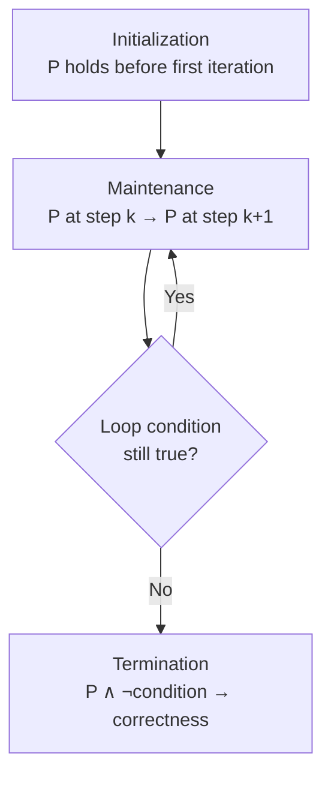

---
tags:
  - csa
  - csa/analysis
confidence: verified
up: "[[Foundations and Analysis Overview]]"
tier-coverage: [intuition, core, deep-dive, practice]
---
# Loop Invariant

> **One-line summary**: A loop invariant is a property that holds before the first iteration, is maintained by each iteration, and implies correctness when the loop terminates.

## 🎯 Intuition
**The Core Idea:** A loop invariant is a safety contract — a promise the loop keeps at every step, guaranteeing the right result when it finishes.
**Analogy:** Imagine building a brick wall. Your invariant is: "after laying row k, all rows 1..k are level and aligned." Before you start (row 0), the foundation is level — that's initialisation. After each row, you check with a spirit level — that's maintenance. When you finish, the wall is straight — that's termination. The invariant is your quality guarantee at every stage.
**Why It Matters:** Loop invariants are *the* standard tool for proving algorithm correctness. Without them, you're hoping your loop works; with them, you've *proved* it works.

---

## ⚙️ Core Mechanics
### Definition / Formal Statement
A **loop invariant** is a logical property P such that:
1. **Initialization**: P holds before the first iteration.
2. **Maintenance**: If P holds before iteration k, then P holds after iteration k.
3. **Termination**: P ∧ (loop exit condition) ⟹ desired postcondition.

### Key Properties

| Part | When | Obligation |
|------|------|------------|
| **Initialization** | Before the first iteration | Show the invariant holds at the start |
| **Maintenance** | After each iteration | Assuming it holds before an iteration, show it holds after |
| **Termination** | When the loop ends | Show that the invariant + loop exit condition imply the desired result |

### Analogy to Mathematical Induction

| Induction | Loop Invariant |
|-----------|---------------|
| Base case | Initialization |
| Inductive step | Maintenance |
| Conclusion | Termination |

The analogy is direct: if the invariant holds before step 0 (initialization) and its truth at step k implies its truth at step k+1 (maintenance), then it holds for all steps, so it holds at step n when the loop exits (termination).

**Figure:** Loop invariant three-part proof structure




### Worked Examples

**Example 1: Insertion Sort**

Invariant: *At the start of each iteration of the outer loop, the subarray A[1..j−1] contains the original elements of A[1..j−1] in sorted order.*

- **Initialization**: Before j = 2, A[1..1] is a single element — trivially sorted. ✅
- **Maintenance**: The inner loop inserts A[j] into the correct position in A[1..j−1], so A[1..j] is sorted. ✅
- **Termination**: When j = n+1, the invariant gives A[1..n] sorted — the entire array. ✅

**Example 2: Binary Search**

Invariant: *If the target is in the array, it lies within the current search window [low..high].*

- **Initialization**: The window is [1..n] — the full array. ✅
- **Maintenance**: Each comparison eliminates the half that cannot contain the target. ✅
- **Termination**: Either the target is found, or low > high (window empty, target absent). ✅

**Example 3: Linear Search for Maximum**

Invariant: *After processing the first i elements, max holds the largest value in A[1..i].*

- **Initialization**: After processing A[1], max = A[1] — largest of one element. ✅
- **Maintenance**: If A[i+1] > max, update max = A[i+1]; otherwise max is already ≥ A[i+1]. Either way, max = largest in A[1..i+1]. ✅
- **Termination**: After i = n, max = largest in A[1..n]. ✅

### Key Facts
- The three parts mirror mathematical induction: base case, inductive step, conclusion.
- A strong invariant couples the loop variable to a measurable quantity (e.g., "A[1..j−1] is sorted").
- The invariant must be true at the *start* of each iteration, not the end — a common source of off-by-one errors.

---

## 🔬 Deep Dive
### Formal Proof / Derivation
**Floyd-Hoare Logic Connection:** Loop invariants are formalised in Hoare logic as:

```
{P} while B do S {P ∧ ¬B}
```

If precondition P (the invariant) holds and B is true, executing S preserves P. When B becomes false, we have P ∧ ¬B as the postcondition. This is exactly the three-part structure: P is maintained (maintenance), starts true (initialization), and P ∧ ¬B gives the desired result (termination).

**Total Correctness:** The three-part proof gives *partial* correctness (if the loop terminates, the result is correct). For *total* correctness, you must also prove termination — typically by identifying a *variant function* (a non-negative integer quantity that strictly decreases each iteration).

### Subtleties and Edge Cases
- **Choosing the right invariant**: Too weak → can't derive the postcondition. Too strong → can't prove maintenance. The art is in finding the "Goldilocks" invariant.
- **Nested loops**: Each loop needs its own invariant. The outer invariant typically summarises the work of all completed inner-loop passes.
- **Off-by-one errors**: The invariant holds at the *start* of each iteration. If your invariant says "A[1..j] is sorted" but the loop starts at j = 1, you need A[1..1] sorted initially — which is trivially true but easy to mis-state.
- **Invariant ≠ assertion**: An invariant is not just any true statement at a point in the code. It must be *inductively maintained* by the loop body and *useful* for proving the postcondition.

### Historical Context
Loop invariants were formalised by Robert Floyd (1967) and C.A.R. Hoare (1969). The technique appears in CLRS Chapter 2 (insertion sort proof) and Erickson's *Algorithms* Chapter 1. Dijkstra's *A Discipline of Programming* (1976) builds entire program derivation around invariants.

---

## 🏋️ Practice
### Warm-Up (5 min)
1. State the three parts of a loop invariant proof.
2. Why is the invariant checked at the *start* of each iteration, not the end?
3. What is the loop invariant for a simple summation loop `sum = 0; for i = 1 to n: sum += A[i]`?

### Core Problems
1. **Prove selection sort correct**: Selection sort finds the minimum of A[i..n] and swaps it with A[i], for i = 1 to n−1. State the loop invariant and prove all three parts.

2. **Prove binary search correct**: Given the invariant "if target ∈ A, then target ∈ A[low..high]", prove initialization, maintenance, and termination. Also prove termination by identifying the variant function.

### Challenge
1. **Dutch national flag problem**: Given an array of elements each colored red, white, or blue, rearrange them so all reds precede all whites precede all blues, in a single pass. Define a loop invariant involving three pointers and prove correctness.

---

*See also:* [[Algorithm Definition]] | [[Dynamic Programming]] | **CS Data Structures:** [[Asymptotic Analysis and Big-O Notation]]

## Supporting Chunks

- [[Analysis - Loop invariants provide a three-part correctness proof structure]]
- [[Analysis - Strong loop invariants couple the loop variable to a measurable quantity]]

## References

See [[CS Algorithms/Sources/Sources Index#Cormen 2013|Sources Index]], Chapter 2. See [[CS Algorithms/Sources/Sources Index#Erickson 2019|Sources Index]], Chapter 1.
