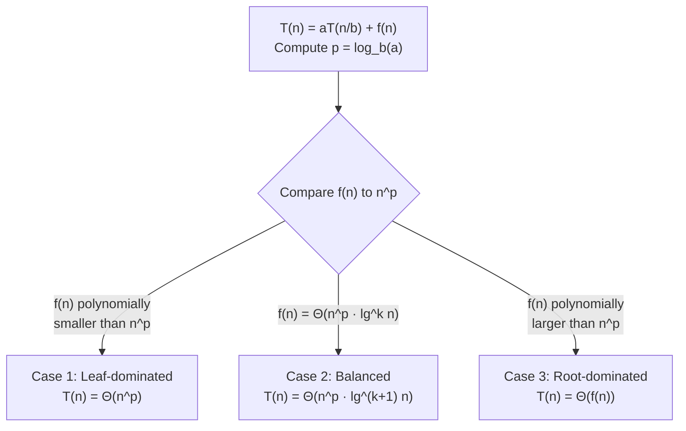

---
tags:
  - csa
  - csa/analysis
confidence: verified
up: "[[Foundations and Analysis Overview]]"
tier-coverage: [intuition, core, deep-dive, practice]
---
# Master Theorem

> **One-line summary**: The Master Theorem is a closed-form solution technique for divide-and-conquer recurrences of the form T(n) = aT(n/b) + f(n), determining T(n) by comparing the combine cost f(n) to the leaf cost $n^{log_b a}$.

## 🎯 Intuition
**The Core Idea:** The Master Theorem is a calculator for divide-and-conquer — plug in a, b, and f(n), and it tells you the running time.
**Analogy:** Picture a recursion tree: the root does f(n) work, it spawns a children each doing f(n/b) work, and so on down to the leaves. The total cost is a tug-of-war between the root level (combine cost) and the leaf level ($n^{log_b a}$ leaves). The Master Theorem just tells you who wins: leaves (Case 1), tie (Case 2), or root (Case 3).
**Why It Matters:** Nearly every divide-and-conquer algorithm (merge sort, binary search, Strassen's) has a recurrence of this form. The Master Theorem gives you instant Θ-notation without manual recursion-tree analysis.

---

## ⚙️ Core Mechanics
### Definition / Formal Statement
A divide-and-conquer algorithm splits a problem of size n into **a ≥ 1** subproblems of size **n/b** (b > 1) and combines the results in **f(n)** time:

```
T(n) = aT(n/b) + f(n),  T(1) = Θ(1)
```

The critical quantity is the **watershed exponent**: log_b a — the exponent in the leaf count $n^{log_b a}$.

### Key Properties — Three Cases

**Case 1 — Leaf-dominated:** f(n) = $O(n^(log_b a − ε)$) for some ε > 0.

| | |
|---|---|
| Meaning | Combine cost grows slower than leaf cost |
| Solution | T(n) = $\Theta(n^(log_b a)$) |
| Example | Strassen: a=7, b=2, f(n)=$\Theta(n²)$ → T(n) = $\Theta(n^(\lg 7)$) ≈ $\Theta(n^2.81)$ |

**Case 2 — Balanced:** f(n) = $\Theta(n^(log_b a)$ · $\$\$\lg^{k} n$$$) for some k ≥ 0.

| | |
|---|---|
| Meaning | Combine cost and leaf cost are the same order |
| Solution | T(n) = $\Theta(n^(log_b a)$ · $\$\lg^{k+1} n$$) |
| Most common (k=0) | f(n) = $\Theta(n^(log_b a)$) → T(n) = $\Theta(n^(log_b a)$ · lg n) |

**Case 3 — Root-dominated:** f(n) = $\Omega(n^(log_b a + ε)$) for some ε > 0, AND the regularity condition af(n/b) ≤ cf(n) for some c < 1.

| | |
|---|---|
| Meaning | Combine cost dominates leaf cost |
| Solution | T(n) = $\Theta(f(n))$ |
| Regularity | Ensures combine cost dominates *all* levels, not just leaves |

### Worked Examples

**Merge sort** — T(n) = 2T(n/2) + $\Theta(n)$:
- a = 2, b = 2, log_b a = 1.
- f(n) = $\Theta(n)$ = $\Theta(n^{1})$ → matches $n^{log_b a}$. Case 2, k = 0.
- **T(n) = $\Theta(n \lg n)$.** ✅

**Binary search** — T(n) = T(n/2) + $\Theta(1)$:
- a = 1, b = 2, log_b a = 0.
- f(n) = $\Theta(1)$ = $\Theta(n⁰)$ → matches $n^{log_b a}$. Case 2, k = 0.
- **T(n) = $\Theta(\lg n)$.** ✅

**Strassen** — T(n) = 7T(n/2) + $\Theta(n²)$:
- a = 7, b = 2, log_b a = lg 7 ≈ 2.81.
- f(n) = $\Theta(n²)$ = $O(n^{2.81 − 0.81})$. Case 1.
- **T(n) = $\Theta(n^{\lg 7})$ ≈ $\Theta(n^{2}.81)$.** ✅

**Case 3 example** — T(n) = 3T(n/4) + n lg n:
- log₄ 3 ≈ 0.79. f(n) = n lg n = $\Omega(n^{0.79 + 0.21})$.
- Regularity: af(n/b) = 3(n/4)lg(n/4) ≤ (3/4)n lg n. c = 3/4 < 1. ✅
- **T(n) = $\Theta(n \lg n)$.** ✅

### Quick Reference Card

| Case | Condition | T(n) |
|------|----------|-------|
| 1 | f(n) = $O(n^{log_b a − ε})$ | $\Theta(n^{log_b a})$ |
| 2 (k=0) | f(n) = $\Theta(n^{log_b a})$ | $\Theta(n^{log_b a} \lg n)$ |
| 2 (k≥1) | f(n) = $\Theta(n^{log_b a} \lg^{k} n)$ | $\Theta(n^{log_b a} \lg^{k+1} n)$ |
| 3 | f(n) = $\Omega(n^{log_b a + ε})$ + regularity | $\Theta(f(n))$ |

### Key Facts
- The watershed exponent log_b a determines the leaf cost.
- Case 2 (balanced) is the most common in practice (merge sort, binary search).
- Case 3 requires the regularity condition — don't forget to check it.

**Figure:** Master Theorem case decision tree



- The theorem does NOT apply when f(n) falls in the "gap" between cases.

---

## 🔬 Deep Dive
### Formal Proof / Derivation
**Recursion tree sketch:** The recursion tree has logb n levels. At level i:
- Number of subproblems: aⁱ
- Size of each subproblem: n/bⁱ
- Work at level i: aⁱ · f(n/bⁱ)

Total work = Σᵢ₌$₀^{logb n}$ aⁱ · f(n/bⁱ).

The three cases correspond to whether this geometric sum is dominated by:
- The last term (leaves): Case 1 — the number of leaves $n^{log_b a}$ dominates.
- All terms are comparable: Case 2 — each of the logb n levels contributes equally, giving an extra lg n factor.
- The first term (root): Case 3 — f(n) at the root dominates.

### When the Master Theorem Does Not Apply
- **Gap between cases**: T(n) = 2T(n/2) + n lg n. Here log_b a = 1, f(n) = n lg n. This is faster than $n^{1}$ but not by a polynomial factor — Case 3 requires $\Omega(n^{1+ε})$ and n lg n doesn't satisfy this. Use Akra-Bazzi or manual recursion tree analysis.
- **Non-uniform subproblem sizes**: a₁T(n/b₁) + a₂T(n/b₂) + … → use Akra-Bazzi.
- **Floors/ceilings**: T(⌊n/2⌋) vs T(n/2) — usually handled with minor adjustments; see CLRS.

### Subtleties and Edge Cases
- **The regularity condition in Case 3**: Without it, a pathological f(n) could satisfy the polynomial growth condition but have combine costs that grow at intermediate levels. The condition af(n/b) ≤ cf(n) ensures the geometric series converges.
- **k > 0 in Case 2**: The polylogarithmic factor matters. T(n) = 2T(n/2) + n lg²n gives $\Theta(n lg³n)$, not $\Theta(n \lg n)$.
- **Approximate splits**: Many real algorithms don't split exactly in half (quicksort partitions vary). The theorem applies to *exact* splits; for random splits, use expected-case analysis.

### Historical Context
The Master Theorem appears in CLRS Chapter 4 and MIT OCW 6.006 Lecture 2. The extended form (with k ≥ 0 in Case 2) is sometimes called the "Master Method." The Akra-Bazzi theorem (1998) generalises to non-uniform splits.

---

## 🏋️ Practice
### Warm-Up (5 min)
1. What are a, b, and f(n) for merge sort's recurrence?
2. What is the watershed exponent for T(n) = 4T(n/2) + n?
3. Which case of the Master Theorem does binary search fall into?

### Core Problems
1. **Classify these recurrences**: For each, identify a, b, log_b a, the applicable case, and the solution:
   - T(n) = 9T(n/3) + n
   - T(n) = T(n/2) + n
   - T(n) = 4T(n/2) + n²

2. **Regularity check**: For T(n) = 2T(n/2) + n², verify the regularity condition and solve using Case 3.

### Challenge
1. Show that T(n) = 2T(n/2) + n/lg n cannot be solved by the Master Theorem. Solve it using the recursion tree method. *(Hint: the sum involves a harmonic series.)*

---

*See also:* [[Recurrence Relations]] | [[Asymptotic Notation]] | [[Merge Sort]] | **CS Data Structures:** [[Asymptotic Analysis and Big-O Notation]]

## Supporting Chunks

- [[Analysis - Divide-and-conquer running time is expressed as a recurrence relation]]
- [[Analysis - Master Theorem partitions recurrences into three cases by comparing f(n) to n raised to log-b-a]]

## See Also

- [[Merge Sort]] — Case 2: T(n) = 2T(n/2) + $\Theta(n)$ → $\Theta(n \lg n)$
- [[Quicksort]] — expected-case balanced-partition recurrence
- [[Binary Search]] — Case 2: T(n) = T(n/2) + $\Theta(1)$ → $O(\lg n)$

## References

See [[CS Algorithms/Sources/Sources Index#MIT OpenCourseWare 6.006|MIT OCW 6.006]], Lecture 2. See [[CS Algorithms/Sources/Sources Index#CLRS 2022|CLRS 2022]], Chapter 4. See [[Recurrence Relations]] for context and motivating examples. See [[Asymptotic Notation]] for Θ/O/Ω definitions.
