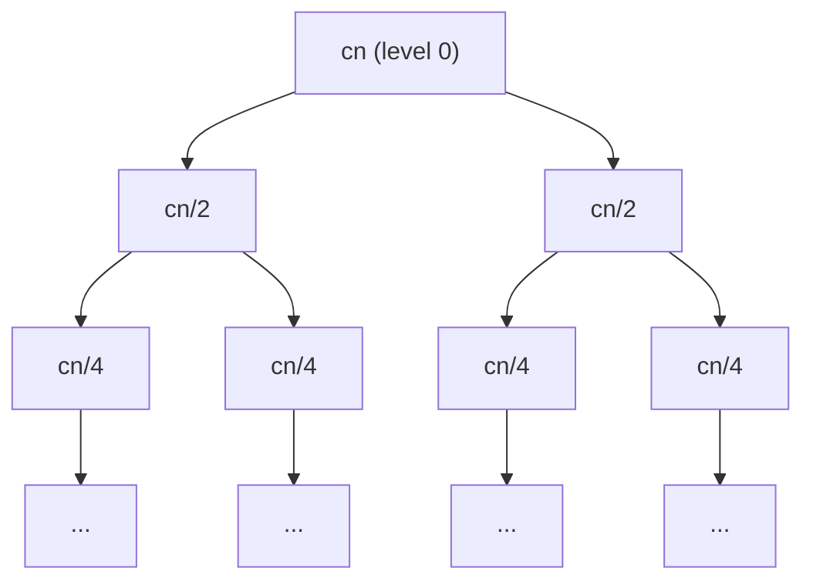

---
tags:
  - csa
  - csa/analysis
confidence: verified
freshness: stable
up: "[[Foundations and Analysis Overview]]"
tier-coverage: [intuition, core, deep-dive, practice]
---
# Recurrence Relations

> **One-line summary**: A recurrence relation expresses the running time of a recursive algorithm in terms of the running time on smaller inputs.

## 🎯 Intuition
**The Core Idea:** A recurrence is a self-referential equation — it defines a function in terms of itself on smaller inputs, like Russian nesting dolls where each doll's size is defined by the one inside it.
**Analogy:** Imagine Russian nesting dolls (matryoshka). Each doll contains a smaller version of itself. To know the total "doll cost," you sum up the size of each doll from the outermost to the innermost. A recurrence works the same way: T(n) tells you the cost at the current level, and T(n/b) tells you the cost of the smaller dolls inside. "Solving" the recurrence means calculating the total cost without opening every doll.
**Why It Matters:** Recurrences are *the* language for expressing divide-and-conquer running times. Without them, you'd have to trace every recursive call by hand. With them, a single formula captures the full cost, and standard techniques (Master Theorem, substitution, recursion trees) yield closed-form answers.

---

## ⚙️ Core Mechanics
### Definition / Formal Statement
For a divide-and-conquer algorithm that splits an input of size n into **a** subproblems each of size **n/b** and combines the results in **f(n)** time:

```
T(n) = aT(n/b) + f(n),  T(1) = Θ(1)
```

Solving the recurrence yields the closed-form running time.

### Key Properties

| Component | Meaning |
|-----------|---------|
| a | Number of recursive subproblems |
| n/b | Size of each subproblem |
| f(n) | Cost of dividing + combining (non-recursive work) |
| T(1) = $\Theta(1)$ | Base case — constant work for trivial input |

### Standard Algorithm Recurrences

| Algorithm | Recurrence | Solution |
|-----------|------------|----------|
| Merge Sort | T(n) = 2T(n/2) + $\Theta(n)$ | $\Theta(n \lg n)$ |
| Binary Search | T(n) = T(n/2) + $\Theta(1)$ | $O(\lg n)$ |
| Strassen | T(n) = 7T(n/2) + $\Theta(n²)$ | $\Theta(n^(\lg 7)$) |
| Quicksort (worst) | T(n) = T(n−1) + $\Theta(n)$ | $O(n²)$ |
| Quicksort (expected) | T(n) = 2T(n/2) + $\Theta(n)$ | $\Theta(n \lg n)$ |

### Solving Recurrences — Three Methods

**1. Master Theorem** — Direct formula for T(n) = aT(n/b) + f(n). Compare f(n) to $n^{log_b a}$:
- f(n) polynomially smaller → T(n) = $\Theta(n^(log_b a)$)
- f(n) same order → T(n) = $\Theta(n^(log_b a)$ · lg n)
- f(n) polynomially larger + regularity → T(n) = $\Theta(f(n)$)

See [[Master Theorem]] for the full three-case treatment.

**2. Recursion tree** — Draw the tree, compute work at each level, sum over all levels. Useful when the Master Theorem doesn't apply.

**3. Substitution / induction** — Guess the closed-form solution, verify the base case, and confirm the inductive step by substituting back into the recurrence. Cormen uses this to verify the merge sort result.

### Worked Examples

**Example — Merge sort recurrence, step by step:**
```
T(n) = 2T(n/2) + cn         (c is the merge cost constant)

Level 0: cn                  (1 problem of size n)
Level 1: 2 · c(n/2) = cn    (2 problems of size n/2)
Level 2: 4 · c(n/4) = cn    (4 problems of size n/4)
...
Level k: 2^k · c(n/2^k) = cn

Total levels: lg n
Total work: cn · lg n = Θ(n lg n)
```

Each level contributes exactly cn work. There are lg n levels. Total: $\Theta(n \lg n)$. ✅

**Figure:** Recursion tree for Merge Sort: T(n) = 2T(n/2) + cn




**Example — Quicksort worst-case recurrence:**
```
T(n) = T(n−1) + cn

T(n) = cn + c(n−1) + c(n−2) + … + c(1) = c · n(n+1)/2 = Θ(n²)
```

This telescopes into an arithmetic sum — no Master Theorem needed (it doesn't apply since it's not T(n/b)).

### Key Facts
- The standard divide-and-conquer recurrence is T(n) = aT(n/b) + f(n).
- Three solving methods: Master Theorem, recursion tree, substitution.
- The recurrence framework applies to any recursive algorithm.
- Recurrences are a prerequisite for understanding any divide-and-conquer analysis.

---

## 🔬 Deep Dive
### Formal Proof / Derivation
**Substitution proof for merge sort:**

*Claim*: T(n) = 2T(n/2) + cn implies T(n) ≤ dn lg n for some constant d, for all n ≥ 2.

*Proof by strong induction*:
- **Base**: T(2) = 2T(1) + 2c = 2$\Theta(1)$ + 2c = $\Theta(1)$. Choose d large enough that T(2) ≤ d · 2 · lg 2 = 2d. ✅
- **Inductive step**: Assume T(k) ≤ dk lg k for all k < n.
  ```
  T(n) = 2T(n/2) + cn
       ≤ 2 · d(n/2)lg(n/2) + cn
       = dn(lg n − 1) + cn
       = dn lg n − dn + cn
       ≤ dn lg n           (when d ≥ c)
  ```
  ✅ The induction holds.

### Subtleties and Edge Cases
- **Floors and ceilings**: Real recurrences use T(⌊n/2⌋) and T(⌈n/2⌉), not T(n/2). This rarely changes the asymptotic answer but requires care in formal proofs. CLRS shows how to handle this.
- **Non-standard base cases**: Some recurrences have T(n) = 1 for n ≤ c where c > 1. Absorbing the base cases into Θ-notation is standard practice.
- **Quicksort's non-uniform split**: Worst case gives T(n) = T(n−1) + $\Theta(n)$ = $\Theta(n²)$. Expected case (random pivot) gives balanced splits on average, yielding $\Theta(n \lg n)$. The recurrence form changes depending on the case being analysed.
- **When all three methods fail**: For exotic recurrences like T(n) = T(n/2) + T(n/3) + n, use the Akra-Bazzi theorem or generating functions.

### Historical Context
Recurrences for algorithm analysis appear in CLRS Chapter 2 and MIT OCW 6.006 Lecture 2. The substitution method traces back to classical mathematics (difference equations). The recursion-tree method was popularised by Bentley, Haken, and Saxe (1980) and later refined in CLRS.

---

## 🏋️ Practice
### Warm-Up (5 min)
1. Write the recurrence for an algorithm that splits input into 3 equal parts and does $O(n)$ combine work.
2. What is the base case for most divide-and-conquer recurrences?
3. Which solving method is best when the Master Theorem doesn't apply?

### Core Problems
1. **Recursion tree**: Draw the recursion tree for T(n) = 3T(n/4) + cn². Compute the work at each level, find the geometric sum, and determine T(n).

2. **Substitution proof**: Prove by substitution that T(n) = T(n/2) + $\Theta(1)$ implies T(n) = $O(\lg n)$. State your guess, verify the base case, and complete the inductive step.

### Challenge
1. Solve T(n) = T(n/3) + T(2n/3) + cn. *(Hint: draw the recursion tree and find the longest root-to-leaf path. What does each level contribute? How many levels are there?)*

---

*See also:* [[Master Theorem]] | [[Asymptotic Notation]] | [[Comparison Sort Lower Bound]] | **CS Data Structures:** [[Asymptotic Analysis and Big-O Notation]]

## Supporting Chunks

- [[Analysis - Divide-and-conquer running time is expressed as a recurrence relation]]
- [[Analysis - Master Theorem partitions recurrences into three cases by comparing f(n) to n raised to log-b-a]]

## See Also

- [[Quicksort]] — worst-case T(n) = T(n−1) + $\Theta(n)$ contrasts with the balanced merge sort recurrence
- [[Binary Search]] — T(n) = T(n/2) + $\Theta(1)$, the simplest divide-and-conquer recurrence
- [[Comparison Sort Lower Bound]] — recurrence depth connects to decision-tree height arguments

## References

See [[CS Algorithms/Sources/Sources Index#Cormen 2013|Sources Index]], Chapter 2. See [[CS Algorithms/Sources/Sources Index#MIT OpenCourseWare 6.006|Sources Index]], Lecture 2. See [[Merge Sort]] for the canonical recurrence example. See [[Asymptotic Notation]] for the Θ/O/Ω notation used in recurrences. See [[Master Theorem]] for the full three-case treatment.
