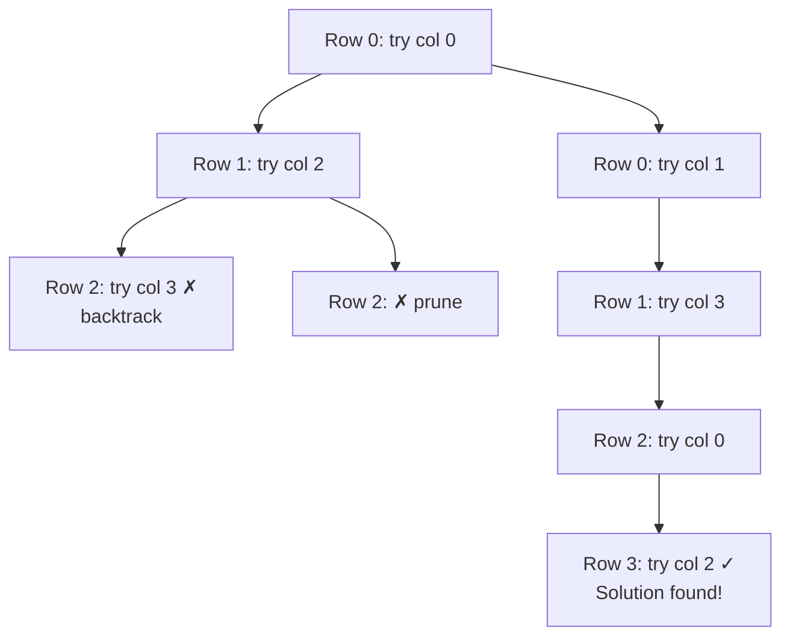

# N-Queens Problem

> **One-line summary**: Place N queens on an N×N chessboard so that no two queens threaten each other — solved elegantly via backtracking with column, diagonal, and anti-diagonal constraint tracking.

## 🎯 Intuition
**The Core Idea:** Place queens one row at a time; for each row, try each column; skip columns and diagonals already under attack; backtrack when stuck.
**Analogy:** Seating guests at a dinner table where certain pairs can't sit in the same row, column, or diagonal — you assign seats row by row, and if you get stuck, you bump the last guest and try a different seat.
**Why It Matters:** N-Queens is the canonical backtracking problem — simple to state, non-trivial to solve, and beautifully illustrates pruning, constraint propagation, and symmetry breaking.

---

## ⚙️ Core Mechanics
### Algorithm Steps
1. Maintain three sets: `cols` (occupied columns), `diags` (occupied main diagonals, identified by row − col), `anti_diags` (occupied anti-diagonals, identified by row + col).
2. For each row (0 to N−1):
   a. For each column (0 to N−1):
      - If the column, diagonal, and anti-diagonal are all free:
        - Place the queen: add col to `cols`, (row−col) to `diags`, (row+col) to `anti_diags`.
        - Recurse to the next row.
        - Remove the queen (backtrack): remove from all three sets.
3. If row == N, a valid configuration is found.

**Figure:** N-Queens backtracking search tree (N=4, partial)




### Pseudocode
```
function solveNQueens(n):
    solutions = []
    backtrack(0, [], set(), set(), set(), n, solutions)
    return solutions

function backtrack(row, queens, cols, diags, antidiags, n, solutions):
    if row == n:
        solutions.append(copy(queens))
        return
    for col in 0..n-1:
        if col in cols or (row-col) in diags or (row+col) in antidiags:
            continue
        queens.append(col)
        cols.add(col)
        diags.add(row - col)
        antidiags.add(row + col)
        backtrack(row+1, queens, cols, diags, antidiags, n, solutions)
        queens.pop()
        cols.remove(col)
        diags.remove(row - col)
        antidiags.remove(row + col)
```

### Complexity

| Case | Time | Space |
|------|------|-------|
| Best | $O(N!)$ | $O(N)$ |
| Average | ~$O(N!)$ | $O(N)$ |
| Worst | $O(N!)$ | $O(N)$ |

The branching factor decreases as queens are placed. Actual count of nodes explored is much less than $N^{N}$ due to pruning, but the upper bound is $O(N!)$.

### Key Facts
- For N=1, there is 1 solution. For N=2 and N=3, there are 0 solutions. For N=4, there are 2 solutions. For N=8, there are 92 solutions.
- The problem is solvable in polynomial time for the decision version ("does a solution exist?") since explicit constructions are known for N ≥ 4.
- Counting all solutions is #P-hard — no known polynomial algorithm.
- Using bitmask operations for cols, diags, and anti_diags gives a constant-factor speedup.

---

## 🔬 Deep Dive
### Pruning Analysis
Without pruning, the search space is $N^{N}$ (try any column in any row). Row-based placement reduces it to N! (each column used at most once). Diagonal constraints prune further — for N=8, only about 15,720 nodes are explored (out of 8! = 40,320 permutations).

### Symmetry Breaking
- Fix the first queen to columns 0..⌊N/2⌋ and mirror solutions for columns > ⌊N/2⌋. This roughly halves the search space.
- For N=8, this reduces from exploring 92 solutions to finding 46 and deriving the rest.

### Edge Cases and Pitfalls
- **N = 0 or N = 1:** Edge cases; N=0 has one trivial solution (empty board), N=1 has one solution.
- **Forgetting anti-diagonals:** A common bug — checking only rows and columns misses diagonal attacks.
- **Off-by-one in diagonal indexing:** `row - col` can be negative; use a set (not array indexed from 0) or offset by N−1.
- **Returning all solutions vs. one solution:** Returning after the first solution speeds things up dramatically for large N.

### Comparison with Alternatives
- **Constraint programming solvers** (e.g., Google OR-Tools, MiniZinc): Handle N-Queens natively with arc consistency propagation. Faster for very large N.
- **Bit manipulation approach:** Same algorithm but represents columns and diagonals as bitmasks for ~2-3× speedup.
- **Constructive solutions:** For N ≥ 4, explicit $O(N)$ constructions exist (but they produce only one solution, not all).

### Real-World Usage
- **Constraint satisfaction benchmark** — N-Queens is a standard test case for CSP solvers.
- **Parallel computing benchmark** — easily parallelized by distributing first-row placements across threads.
- **VLSI testing** — the constraint structure mirrors non-attacking placement problems in chip design.
- **Educational tool** — universally used to teach backtracking in CS curricula.

---

## 🏋️ Practice
### Warm-Up (5 min)
1. For N=4, find both valid solutions by hand.
2. Why are there no solutions for N=2 and N=3?
3. How many nodes does a naive backtracker explore for N=8, approximately?

### Core Problems
1. **LeetCode 51 — N-Queens:** Return all distinct solutions as board configurations. *Approach:* row-by-row backtracking with set-based constraint tracking.
2. **LeetCode 52 — N-Queens II:** Return just the count of solutions. *Approach:* Same backtracking, but only count (no board construction needed — faster).

### Challenge
- **N-Queens with obstacles:** Given a board with some cells blocked, find all valid placements. Modify the backtracker to skip blocked cells. Analyze how obstacles affect pruning efficiency.

---

*See also:* [[Backtracking Overview]] · [[Greedy Algorithms Overview]] · [[Dynamic Programming Overview]] | **CS Data Structures:** [[Arrays]] · [[Hash Sets]]

## References
-> [[Sources Index]]
