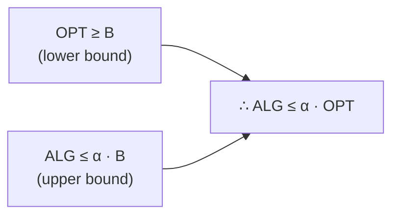

---
tags:
  - csa
  - csa/complexity
confidence: verified
up: '[[Complexity Theory Overview]]'
tier-coverage: [intuition, core, deep-dive, practice]
---
# Approximation Algorithms

> **One-line summary**: An approximation algorithm runs in polynomial time and returns a solution guaranteed to be within a constant factor of optimal — a principled response to NP-complete problems.

## 🎯 Intuition
**The Core Idea:** When finding the perfect answer is too expensive, find one that is provably "close enough."
**Analogy:** Getting "close enough" when perfect is impossible — like estimating your grocery bill to within 10% instead of pricing every item exactly. You sacrifice precision for speed, but you know exactly how far off you can be.
**Why It Matters:** NP-complete problems appear everywhere in industry (scheduling, routing, resource allocation). Approximation algorithms give polynomial-time solutions with formal quality guarantees — the practical sweet spot between slow exact methods and unreliable heuristics.

---

## ⚙️ Core Mechanics
### How It Works / Formal Definition

For a **minimisation** problem, algorithm A is an **α-approximation** if for every instance:

```
cost(A(I)) ≤ α · OPT(I)       α ≥ 1
```

For a **maximisation** problem:

```
cost(A(I)) ≥ (1/α) · OPT(I)   α ≥ 1
```

A smaller α is better. α = 1 would be an exact algorithm. The ratio is a *worst-case* guarantee.

### Key Properties

| Property | Detail |
|----------|--------|
| **Running time** | Polynomial (by definition) |
| **Quality guarantee** | Within factor α of OPT (worst case) |
| **Comparison to exact** | Trades optimality for tractability |
| **Comparison to heuristic** | Has provable bound; heuristics do not |

### Key Facts

| Approach | Guarantee | Notes |
|---|---|---|
| Exact (branch-and-bound, ILP) | Optimal | Exponential worst case; works for small n |
| **Approximation** | Within α of optimal | Polynomial; provable bound |
| Heuristic | No formal guarantee | Fast; good empirical results; may be arbitrarily bad |

---

## 🔬 Deep Dive
### Proofs / Formal Arguments

**Proof Template** (Erickson): Most approximation ratio proofs follow a shared structure:

1. **Identify an intermediate bound B** — a structural property that can be computed or bounded (e.g., a matching, a fractional relaxation).
2. **Show OPT ≥ B** — the optimal solution cannot beat this bound.
3. **Show ALG ≤ α · B** — the algorithm’s output is at most α times the bound.
4. **Conclude ALG ≤ α · OPT** — by transitivity through B.


**Figure:** Approximation proof template




**Key insight**: you never need to know OPT directly. Bound OPT from below and ALG from above, both through B.

**Example 1 — Vertex Cover (2-approximation):**
- **Problem**: find smallest vertex set C covering all edges.
- **Algorithm**: while uncovered edges exist, pick edge (u,v), add both endpoints to C.
- **Proof**: edges chosen form a matching M. OPT ≥ |M| (any cover hits every matching edge). ALG = 2|M|. Therefore ALG ≤ 2·OPT. □

**Example 2 — Load Balancing (List Scheduling, (2𢄡/m)-approximation):**
- **Problem**: schedule n jobs on m machines to minimise makespan.
- **Algorithm**: assign each job to the currently least-loaded machine.
- **Proof**: let W = Σpₖ, j = last-finishing job. Two bounds: W/m ≤ OPT and pⱼ ≤ OPT. Then T ≤ (W−pⱼ)/m + pⱼ = W/m + (1𢄡/m)pⱼ ≤ OPT + (1𢄡/m)·OPT = (2𢄡/m)·OPT. □

### Edge Cases and Pitfalls
- **Ratio direction**: for minimisation α ≥ 1; confusing min/max conventions is a common error
- **Worst-case vs typical**: the ratio bounds the worst case — algorithms often perform much better in practice
- **Not all NP-hard problems have constant-factor approximations**: some (e.g., TSP with arbitrary distances) are inapproximable unless P=NP
- **Approximation ≠ solving P vs NP**: these are engineering tools, not proofs about complexity classes

### Real-World Implications
- **Cloud scheduling**: list scheduling variants allocate VMs and containers
- **Network design**: Steiner tree and facility location approximations
- **Logistics**: vehicle routing with bounded sub-optimality
- If P = NP were proved, exact polynomial algorithms would exist and approximation ratios would become irrelevant

---

## 🏋️ Practice
### Warm-Up (5 min)
1. What is the difference between an approximation algorithm and a heuristic?
2. For a minimisation problem, what does an α-approximation ratio of 2 guarantee?
3. Why do approximation proofs use an intermediate bound B rather than computing OPT directly?

### Core Problems
1. Prove that the greedy vertex-cover algorithm achieves a 2-approximation. Identify the intermediate bound B and show both OPT ≥ B and ALG ≤ 2B.
2. In the load-balancing proof, explain why W/m ≤ OPT and pⱼ ≤ OPT. What happens to the ratio as m → ∞?

### Challenge
1. The **set cover** problem: given a universe U of n elements and a collection of subsets, find the minimum number of subsets covering U. The greedy algorithm (always pick the subset covering the most uncovered elements) achieves an $O(ln n)$-approximation. Sketch the proof using the proof template.

---

*See also:* [[NP Completeness]], [[P vs NP]], [[Complexity Theory Overview]], [[Complexity Theory - Review Drill]]

## Supporting Chunks

- [[Complexity - Approximation algorithms trade optimality for polynomial running time with a provable ratio]]
- [[Complexity - Approximation proof template bounds algorithm output and OPT through a shared intermediate quantity]]
- [[Complexity - List scheduling approximation for load balancing achieves a (2 - 1 over m) factor guarantee]]

## References

See [[CS Algorithms/Sources/Sources Index#Cormen 2013|Cormen 2013]]. Chapter 10. See [[CS Algorithms/Sources/Sources Index#Erickson 2019|Erickson 2019]]. Chapter 13. See [[NP Completeness]] for the complexity-theoretic context. See [[P vs NP]] for the open question.
