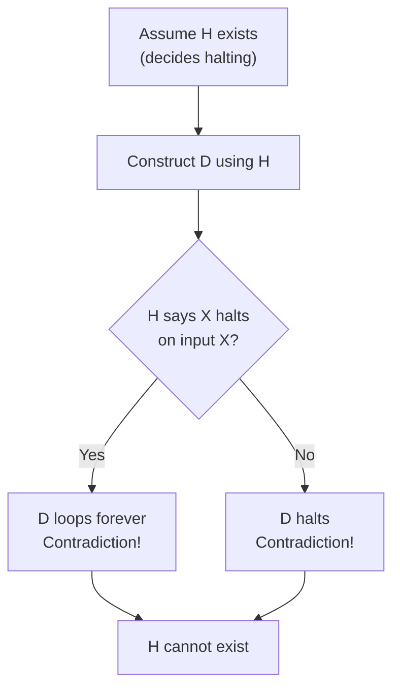

---
tags:
  - csa
  - csa/complexity
confidence: verified
up: '[[Complexity Theory Overview]]'
tier-coverage: [intuition, core, deep-dive, practice]
---
# Halting Problem

> **One-line summary**: The Halting Problem asks whether an arbitrary program halts on a given input — Turing (1936) proved no algorithm can decide this for all programs.

## 🎯 Intuition
**The Core Idea:** There exist questions about programs that no program can answer.
**Analogy:** The undecidable question — imagine a "universal debugger" that predicts whether any program finishes or loops forever. Such a tool cannot exist, because you can always construct a program that does the opposite of what the debugger predicts, creating an unavoidable paradox.
**Why It Matters:** The Halting Problem draws the fundamental boundary of computation — it proves that general-purpose bug detectors, complete program verifiers, and many other "would be nice" tools are mathematically impossible.

---

## ⚙️ Core Mechanics
### How It Works / Formal Definition

**Problem statement**: Given an arbitrary program P and input I, does P halt (terminate) on I, or run forever?

**Answer**: **Undecidable** — no algorithm can correctly answer this for all (P, I) pairs.

### Key Properties

| Property | Detail |
|----------|--------|
| **Decidability** | Undecidable (no algorithm exists) |
| **Proof technique** | Diagonalisation (self-referential contradiction) |
| **Proved by** | Alan Turing, 1936 |
| **Extends to** | Rice’s Theorem — all non-trivial semantic program properties are undecidable |

### Key Facts

| Property | NP-Complete | Undecidable |
|---|---|---|
| Algorithm exists? | Yes (exponential) | **No** |
| Example | 3-SAT, TSP | Halting Problem |
| Solvable with enough time? | Yes | No |

Undecidability is strictly beyond NP-completeness: an NP-complete problem at least has a correct (if slow) algorithm; the Halting Problem has no correct algorithm at all.

---

## 🔬 Deep Dive
### Proofs / Formal Arguments
**Turing’s Diagonalisation Proof:**

Assume for contradiction that a program H(P, I) exists returning "halts" or "loops" correctly for every (P, I).

Construct program D using H as a subroutine:

```
D(X):
  if H(X, X) = "halts":
    loop forever
  else:
    halt
```

Run D on itself — call D(D):

| H(D, D) says | D actually does | Contradiction? |
|---|---|---|
| "halts" | loops forever | ✅ H was wrong |
| "loops" | halts | ✅ H was wrong |

H cannot be correct in either case, so H does not exist. □


**Figure:** Turing's diagonalisation — the paradox of D(D)




**Connection to Rice’s Theorem**: Rice’s Theorem generalises — *any* non-trivial semantic property of programs (e.g., "does this program sort?", "does this program produce output X?") is undecidable. The Halting Problem is just one instance.

### Edge Cases and Pitfalls
- **Specific programs can be analysed**: the Halting Problem says no *universal* decider exists — you can still prove termination for specific programs (e.g., via loop variants)
- **Partial solutions exist**: tools like model checkers and static analysers handle restricted cases — they are sound but incomplete (may say "don’t know")
- **Undecidable ≠ unsolvable for all inputs**: many programs obviously halt or obviously loop — the impossibility is about *all* programs

### Real-World Implications
- **General bug-detectors are impossible**: any tool detecting infinite loops in full generality must miss cases or produce false positives — by mathematical necessity, not engineering limitation
- **Formal verification limits**: many properties of programs are undecidable by reduction from the Halting Problem
- **Compiler optimisation limits**: a compiler cannot always determine if dead code is truly unreachable
- **Security analysis**: fully automated vulnerability detection for all programs is impossible in the general case

---

## 🏋️ Practice
### Warm-Up (5 min)
1. In Turing’s proof, why is it essential that D is run on *itself* (D(D)) rather than some other input?
2. Can you prove that a specific simple program (e.g., a for-loop counting to n) halts? How does this not contradict undecidability?
3. What is the relationship between the Halting Problem and Rice’s Theorem?

### Core Problems
1. Prove by reduction from the Halting Problem that the following problem is undecidable: "Given program P, does P print ‘hello’?"
2. Explain why a static analyser that warns about *some* infinite loops but not all does not contradict the Halting Problem.

### Challenge
1. **Busy Beaver problem**: The Busy Beaver function BB(n) gives the maximum number of 1s a halting n-state Turing machine can write. Prove that BB is not computable. (Hint: if BB were computable, you could decide the Halting Problem.)

---

*See also:* [[NP Completeness]], [[P vs NP]], [[Complexity Theory Overview]]

## Supporting Chunks

- [[CS Algorithms/_chunks/Complexity - The Halting Problem is undecidable via Turing's diagonalisation argument]]
- [[CS Algorithms/_chunks/Complexity - Rice's Theorem shows all non-trivial semantic program properties are undecidable]]

## References

See [[CS Algorithms/Sources/Sources Index#Cormen 2013|Sources Index]], Chapter 10. See [[CS Algorithms/Sources/Sources Index#Erickson 2019|Sources Index]], Chapter 12. See [[NP Completeness]] for NP-hard and NP-complete problems. See [[P vs NP]] for the P = NP? question.
