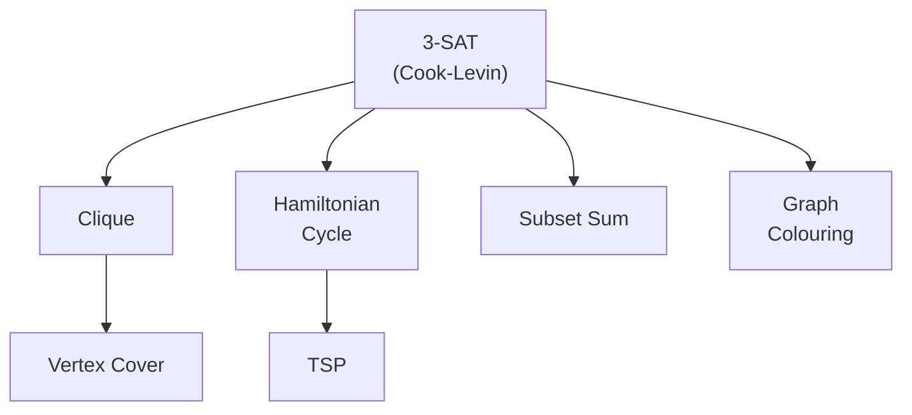

---
tags:
  - csa
  - csa/complexity
confidence: verified
freshness: stable
up: '[[Complexity Theory Overview]]'
tier-coverage: [intuition, core, deep-dive, practice]
---
# NP Completeness

> **One-line summary**: NP-complete problems are the hardest problems in NP — every NP problem reduces to them, yet no polynomial-time algorithm is known for any of them.

## 🎯 Intuition
**The Core Idea:** NP-complete problems are the "hardest" in NP — if you solve any one of them efficiently, you solve them all.
**Analogy:** Imagine thousands of locked doors where every key is interchangeable — picking any single lock opens every door. NP-complete problems are those locks: a polynomial-time solution for one gives polynomial-time solutions for all of NP.
**Why It Matters:** Recognising NP-completeness tells you to stop searching for an efficient exact algorithm and instead use approximation, heuristics, or exploit special structure — saving potentially months of wasted effort.

---

## ⚙️ Core Mechanics
### How It Works / Formal Definition

**NP-Hard**: Problem Q is NP-hard if every problem A in NP can be polynomially reduced to Q:

```
𢀊 ∈ NP:  A ≤ₚ Q
```

**NP-Complete**: Problem Q is NP-complete if:
1. Q ∈ NP (solutions verifiable in polynomial time), **AND**
2. Q is NP-hard (every NP problem reduces to Q)

NP-complete = NP ∩ NP-hard.

**Polynomial Reduction**: A ≤ₚ B converts any instance of A to an instance of B in polynomial time such that: A-instance is YES ⟺ B-instance is YES. Reductions transfer hardness.

### Key Properties

| Property | Detail |
|----------|--------|
| **In NP?** | Yes — solutions are verifiable in polynomial time |
| **Known poly-time solution?** | No (none known for any NP-complete problem) |
| **First NP-complete problem** | 3-SAT (Cook-Levin Theorem, 1971) |
| **Reduction direction** | To prove B is NP-hard: reduce a known NP-hard A to B (A ≤ₚ B) |

### Key Facts

**Classic NP-Complete Problems:**

| Problem | Description | Reduction from |
|---------|-------------|---------------|
| **3-SAT** | Satisfiability of 3-CNF formula | (First; Cook-Levin) |
| Hamiltonian Cycle | Cycle visiting every vertex exactly once | 3-SAT |
| TSP (decision) | Tour of cost ≤ k? | Hamiltonian Cycle |
| Clique | Graph contains clique of size k? | 3-SAT |
| Vertex Cover | Can k vertices cover all edges? | Clique |
| Graph Colouring | Colour graph with k colours? | 3-SAT |
| Subset Sum | Does a subset sum to target T? | 3-SAT |

**Euler Circuit vs Hamiltonian Cycle**: Euler circuit (every *edge* once) is polynomial; Hamiltonian cycle (every *vertex* once) is NP-complete. Superficially similar problems can have radically different tractability.

---

## 🔬 Deep Dive
### Proofs / Formal Arguments

**Cook-Levin Theorem (1971)**: 3-SAT is NP-complete. This was the first NP-completeness proof (Cook and Levin independently). All subsequent proofs reduce from 3-SAT or another known NP-complete problem.

**Reduction chain**: The standard chain builds a web of NP-completeness:

```
3-SAT → Clique → Vertex Cover
3-SAT → Hamiltonian Cycle → TSP
3-SAT → Subset Sum
3-SAT → Graph Colouring
```

**Figure:** NP-completeness reduction chain from 3-SAT



**How to prove a new problem Q is NP-complete**:
1. Show Q ∈ NP (give a polynomial-time verifier)
2. Pick a known NP-complete problem A
3. Construct a polynomial-time reduction A ≤ₚ Q
4. Prove the reduction is correct (YES ⟺ YES)

### Edge Cases and Pitfalls
- **Reduction direction matters**: to prove Q is hard, reduce *from* a known hard problem *to* Q (not the reverse)
- **NP-hard ≠ NP-complete**: NP-hard problems need not be in NP (e.g., Halting Problem is NP-hard but undecidable)
- **Optimisation vs decision**: NP-completeness applies to decision problems; the optimisation version is NP-hard
- **Special cases may be easy**: 2-SAT is polynomial; 3-SAT is NP-complete. Small parameter changes can shift tractability

### Real-World Implications

| Strategy | Description |
|----------|-------------|
| **Exact exponential** | Branch-and-bound, integer programming — good for small n |
| **Approximation algorithms** | Polynomial time; solution within factor α of optimal |
| **Heuristics** | Fast; no formal guarantee; good in practice |
| **Exploit structure** | Real instances often have special structure that makes them easier |

---

## 🏋️ Practice
### Warm-Up (5 min)
1. What are the two conditions for a problem to be NP-complete?
2. Why does a polynomial reduction A ≤ₚ B transfer hardness from A to B (not from B to A)?
3. Is the Halting Problem NP-complete? Why or why not?

### Core Problems
1. Prove that Vertex Cover is NP-complete by reducing from Clique. (Hint: complement graph.)
2. Show that the optimisation version of TSP ("find the shortest tour") is NP-hard but not NP-complete. Why can’t it be in NP?

### Challenge
1. Prove that 3-Colouring (can a graph be coloured with 3 colours?) is NP-complete by reduction from 3-SAT. Construct the gadget graph for a single clause and prove correctness.

---

*See also:* [[P vs NP]], [[Halting Problem]], [[Approximation Algorithms]], [[Complexity Theory Overview]], [[CS Algorithms/Graphs/Dijkstra's Algorithm|Dijkstra’s Algorithm]], [[RSA Algorithm]], [[Dynamic Programming]]

## Supporting Chunks

- [[Complexity - NP-complete problems are in NP and NP-hard with no known poly-time solution]]
- [[CS Algorithms/_chunks/Complexity - The Halting Problem is undecidable via Turing's diagonalisation argument|Halting Problem diagonalisation chunk]]
- [[Complexity - Approximation algorithms trade optimality for polynomial running time with a provable ratio]]
- [[Complexity - NP-hardness is established by polynomial reduction from a known NP-hard problem]]

## References

See [[CS Algorithms/Sources/Sources Index#Cormen 2013|Sources Index]], Chapter 10. See [[CS Algorithms/Sources/Sources Index#Erickson 2019|Sources Index]], Chapter 12. See [[P vs NP]] for the P = NP? question. See [[Halting Problem]] for undecidability. See [[Approximation Algorithms]] for polynomial-time approximation strategies.
