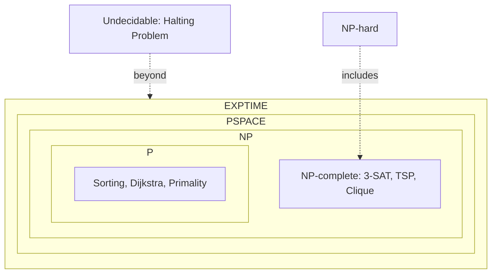

---
tags:
  - csa
  - csa/complexity
confidence: verified
up: '[[Complexity Theory Overview]]'
tier-coverage: [intuition, core, deep-dive, practice]
---
# P vs NP

> **One-line summary**: The P vs NP problem asks whether every problem whose solution can be verified quickly can also be solved quickly — the central unsolved question in theoretical computer science.

## 🎯 Intuition
**The Core Idea:** Is checking an answer always easier than finding it?
**Analogy:** Solving vs verifying a jigsaw puzzle — given a completed puzzle, you can instantly verify it is correct (NP); but assembling it from scratch might take much longer (P?). P vs NP asks whether every puzzle that is easy to check is also easy to solve.
**Why It Matters:** If P = NP, cryptography breaks, optimisation becomes trivial, and automated theorem proving becomes practical. The answer shapes what we believe computers can and cannot do efficiently.

---

## ⚙️ Core Mechanics
### How It Works / Formal Definition

**Class P** — Polynomial Time: all decision problems solvable by a deterministic algorithm in $O(nᵏ)$ for some constant k.

**Class NP** — Nondeterministic Polynomial Time: all decision problems where a proposed YES certificate can be *verified* in polynomial time. Every P problem is in NP (solve and verify).

**The Open Question**: Is P = NP?
- **Status**: Open. No proof in either direction. Clay Mathematics Institute offers ,000,000.
- **Consensus**: Most experts believe P ≠ NP.

### Key Properties

| Property | Detail |
|----------|--------|
| **P ⊆ NP** | Trivially true — solving is verifying |
| **NP-complete** | Hardest problems in NP; if any is in P, then P = NP |
| **Millennium Prize** | One of seven  Clay problems |
| **Implication if P=NP** | All NP problems solvable in polynomial time |

### Key Facts

**Examples in P:**

| Problem | Time |
|---------|------|
| Sorting n numbers | $O(n \lg n)$ |
| Shortest path (Dijkstra) | $O((n+m)$ lg n) |
| Primality testing (AKS, 2002) | $O(n⁶)$ |
| Linear programming | Polynomial |

**Examples in NP (not known to be in P):**
- **3-SAT**: satisfying assignment for a 3-CNF formula
- **Hamiltonian Cycle**: cycle visiting every vertex
- **Subset Sum**: subset summing to target T

**Complexity Hierarchy:**

```
P  ⊆  NP  ⊆  PSPACE  ⊆  EXPTIME

NP-complete ← hardest problems in NP
NP-hard     ← at least as hard as NP-complete (may not be in NP)
Undecidable ← no algorithm exists (e.g., Halting Problem)
```

**Figure:** Complexity class hierarchy




---

## 🔬 Deep Dive
### Proofs / Formal Arguments

**Implications if P = NP:**

| Domain | Impact |
|--------|--------|
| Cryptography | Public-key schemes like RSA (relying on hardness assumptions) would be undermined |
| Optimisation | TSP, scheduling, protein folding solvable in polynomial time |
| Mathematics | Automated theorem proving becomes practical |
| AI | Many planning and search problems become tractable |

**Why P ⊆ NP**: For any problem in P, a deterministic polynomial-time algorithm exists. Given a candidate solution, you can verify it by re-solving — so verification is also polynomial. □

**Why the question is hard**: Proving P ≠ NP requires showing that *no* polynomial-time algorithm exists for some NP problem — a statement about all possible algorithms, not just known ones. Current proof techniques (diagonalisation, relativisation) are known to be insufficient (Baker-Gill-Solovay, 1975).

> *Coverage note: This page accurately captures what the textbooks present. The confidence: verified tag reflects page completeness; the underlying P=NP question itself remains genuinely open.*

### Edge Cases and Pitfalls
- **NP ≠ "non-polynomial"**: NP means nondeterministic polynomial — it does NOT mean exponential
- **NP-hard vs NP-complete**: NP-hard problems need not be in NP (e.g., Halting Problem)
- **Average-case vs worst-case**: P vs NP is about worst-case complexity — a problem in NP might be easy on average
- **Cryptographic security**: RSA relies on *conjectured* hardness of factoring, not a proven P ≠ NP result

### Real-World Implications
- **Cryptography**: all public-key cryptography assumes certain problems are not in P
- **Algorithm design**: when you prove a problem is NP-complete, you know to reach for approximation or heuristics
- **Complexity-theoretic thinking**: understanding P vs NP gives a framework for classifying problem difficulty

---

## 🏋️ Practice
### Warm-Up (5 min)
1. Does NP stand for "non-polynomial"? What does it actually mean?
2. Why is P ⊆ NP trivially true?
3. If someone finds a polynomial-time algorithm for 3-SAT, what does that imply about P vs NP?

### Core Problems
1. Prove that if any NP-complete problem is in P, then P = NP. (Use the definition of NP-completeness and transitivity of polynomial reductions.)
2. Explain why integer factoring is believed to be in NP but is not known to be NP-complete. What would it mean if factoring were shown to be NP-complete?

### Challenge
1. The class co-NP contains problems whose NO instances have polynomial-time certificates. Prove that if P = NP, then NP = co-NP. Is the converse known to be true?

---

*See also:* [[NP Completeness]], [[Halting Problem]], [[Approximation Algorithms]], [[Complexity Theory Overview]], [[Dijkstra’s Algorithm]], [[RSA Algorithm]], [[Asymptotic Notation]]

## Supporting Chunks

- [[Complexity - NP-complete problems are in NP and NP-hard with no known poly-time solution]]
- [[Complexity - The Halting Problem is undecidable via Turing’s diagonalisation argument]]
- [[Complexity - NP-hardness is established by polynomial reduction from a known NP-hard problem]]

## References

See [[CS Algorithms/Sources/Sources Index#Cormen 2013|Sources Index]], Chapter 10. See [[CS Algorithms/Sources/Sources Index#Erickson 2019|Sources Index]], Chapter 12.
