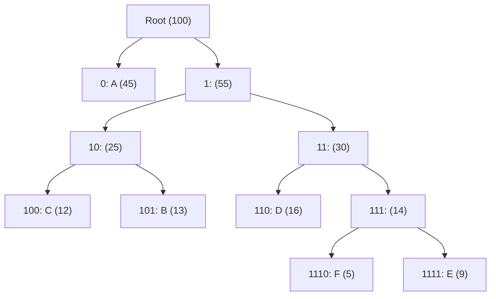

---
tags:
  - csa
  - csa/compression
confidence: verified
up: "[[Data Compression Overview]]"
tier-coverage: [intuition, core, deep-dive, practice]
---
# Huffman Coding

> **Greedy construction of the optimal prefix-free binary code for a given symbol frequency distribution in $\Theta(n \lg n)$.**

## 🎯 Intuition
**The Core Idea:** Repeatedly merge the two least-frequent symbols into a single node; the resulting binary tree assigns short codes to frequent symbols and long codes to rare ones.
**Analogy:** Huffman coding is like variable-length Morse code — common letters like 'E' get short codes (·), rare letters like 'Q' get long codes (— — · —). Huffman does the same thing optimally for any alphabet.
**Why It Matters:** Huffman coding is the entropy-coding stage in DEFLATE (gzip, ZIP, PNG), JPEG, and fax standards. It is the most widely used lossless compression building block.

---

## ⚙️ Core Mechanics
### Algorithm Steps
1. Create a leaf node for each symbol with its frequency as the weight.
2. Insert all leaves into a min-priority queue Q.
3. Repeat n−1 times: extract the two minimum-weight nodes, create a new internal node with their combined weight, make them its children, and insert the new node back into Q.
4. The last node in Q is the root of the Huffman tree.
5. Read codewords from the tree: 0 for left branch, 1 for right.

**Figure:** Huffman tree construction — merge two least-frequent nodes




### Pseudocode
```
HUFFMAN(f[1..n]):
  Create n leaf nodes, each with weight f[i]
  Insert all into min-priority queue Q

  repeat (n-1) times:
    x = EXTRACT-MIN(Q)
    y = EXTRACT-MIN(Q)
    z = new internal node
    z.left = x,  z.right = y
    z.weight = x.weight + y.weight
    INSERT(Q, z)

  return EXTRACT-MIN(Q)   // root of Huffman tree
```

### Example
Frequencies: A=45, B=13, C=12, D=16, E=9, F=5

After Huffman construction (one possible result):
```
A: 0          (1 bit  — most frequent)
C: 100        (3 bits)
B: 101        (3 bits)
D: 110        (3 bits)
F: 1110       (4 bits)
E: 1111       (4 bits — least frequent)
```

Average code length ≈ 2.24 bits/symbol vs 3 bits/symbol for a fixed-length code.

### Complexity

| Measure | Value |
|---------|-------|
| Time | $\Theta(n \lg n)$ — n−1 iterations, each $O(\lg n)$ heap operation |
| Space | $O(n)$ for the tree and priority queue |

### Key Facts
- Produces the **optimal** prefix-free code for the given frequencies
- Prefix-free: no codeword is a prefix of another — enables unambiguous decoding
- High-frequency symbols get short codes; rare symbols get long codes
- Requires knowing frequencies before encoding (two-pass over data)
- **Adaptive Huffman** updates frequencies dynamically for single-pass encoding

---

## 🔬 Deep Dive
### Correctness / Proof (Exchange Argument)
Huffman coding produces the optimal prefix-free code for the given frequencies. **Proof sketch**: In any optimal code, the two least-frequent symbols must be siblings at the deepest level of the tree (if not, swapping a deeper node with the least-frequent symbol cannot increase cost). Huffman's greedy merge always places the two minimum-weight nodes as siblings — matching the structure that optimality requires.

### Edge Cases and Pitfalls
- Single symbol: the tree has one node; assign it code "0" (a prefix-free code needs at least one bit)
- Two symbols with equal frequencies: either merging order yields an optimal tree
- Adaptive Huffman: updates frequencies dynamically, enabling single-pass encoding at the cost of more complex implementation
- Optimal only for symbol-by-symbol encoding; block Huffman or arithmetic coding can do better for correlated symbols

### Real-World Usage
- **DEFLATE** (gzip, ZIP, PNG) — Huffman is the final entropy-coding stage
- **JPEG** — Huffman for entropy coding of DCT coefficients
- **ITU fax standard** — Huffman codes tuned to typical document run-length distributions

---

## 🏋️ Practice
### Warm-Up (5 min)
1. Given frequencies {A:5, B:9, C:12, D:13, E:16, F:45}, build the Huffman tree by hand.
2. Why must a prefix-free code always be representable as a binary tree?

### Core Problems
1. **Huffman tree construction**: Implement Huffman coding — build the tree, generate codes, encode and decode a message.
2. **Minimum cost to merge stones** (LeetCode 1000 variant): Greedy merging of elements using a priority queue — same structure as Huffman.
3. **Optimal prefix-free code verification**: Given a set of codewords, verify that they form a valid prefix-free code and compute the expected code length.

### Challenge
**Adaptive Huffman coding**: Implement a single-pass Huffman encoder that updates the tree dynamically as it processes input. Compare compression ratio with static Huffman on a sample text file.

---

*See also:* [[Asymptotic Notation]], [[Dijkstra's Algorithm]], [[Comparison Sort Lower Bound]], [[LZW Compression]], [[Run-Length Encoding]], [[Data Compression Overview]], [[Priority Queue]], [[Binary Tree]], [[CS Data Structures]]

## Supporting Chunks / References

### Supporting Chunks

- [[Compression - Huffman coding builds the optimal prefix-free code with a greedy merge]]
- [[Compression - Adaptive Huffman coding enables single-pass encoding at the cost of implementation complexity]]

### References

See [[CS Algorithms/Sources/Sources Index#Cormen 2013|Sources Index]], Chapter 9. See [[CS Algorithms/Sources/Sources Index#MIT OpenCourseWare 6.006|Sources Index]], Lecture 12. See [[Data Compression Overview]] for context and comparison with LZW.
