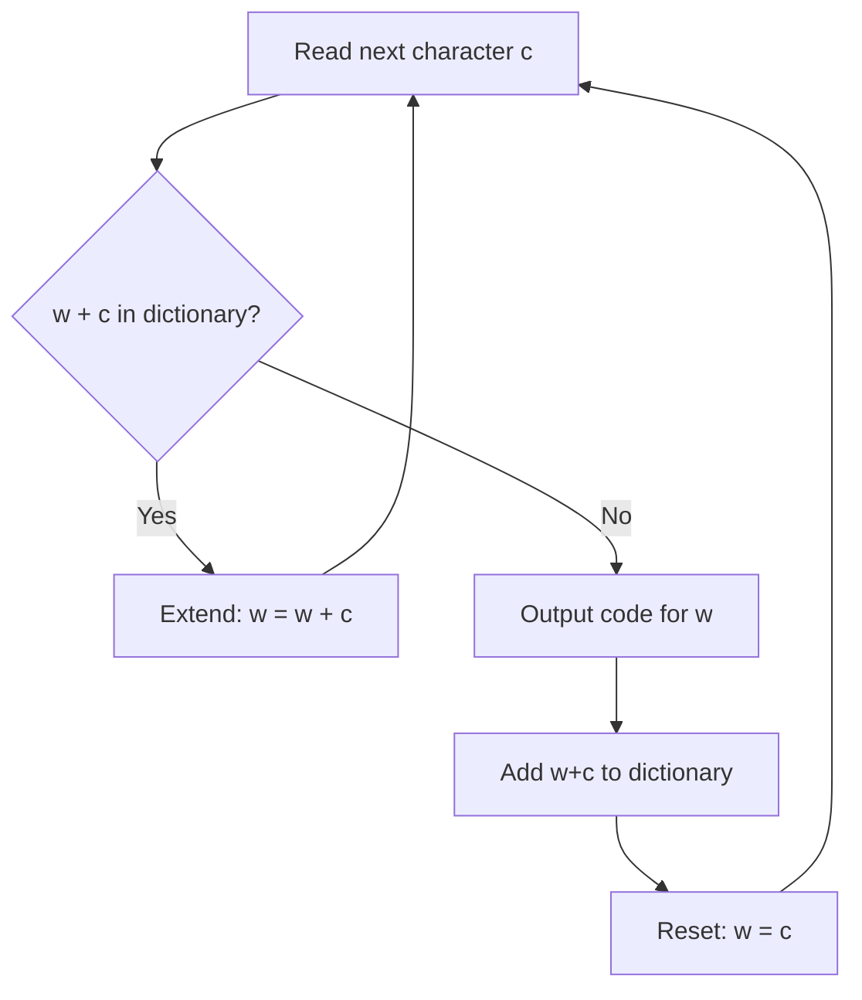

---
tags:
  - csa
  - csa/compression
confidence: verified
up: "[[Data Compression Overview]]"
tier-coverage: [intuition, core, deep-dive, practice]
---
# LZW Compression

> **Lossless dictionary-based compression that builds a shared codebook on the fly — no dictionary transmission needed, single-pass encoding.**

## 🎯 Intuition
**The Core Idea:** Both encoder and decoder start with the same initial dictionary and extend it identically as data is processed, so the dictionary never needs to be transmitted.
**Analogy:** LZW is like dictionary-based shorthand — like a stenographer who builds abbreviations on the fly. The first time you say "United States of America" it's written in full, but every subsequent mention becomes "USA", and both writer and reader agree on the abbreviation without needing a separate key.
**Why It Matters:** LZW powers GIF image compression and was used in Unix `compress`. It demonstrates how adaptive dictionary methods can achieve strong compression without any pre-scan of the data.

---

## ⚙️ Core Mechanics
### Algorithm Steps (Encoding)
1. Initialise the dictionary with all single-character entries.
2. Find the **longest string** w in the dictionary that matches the next portion of input.
3. Output the dictionary code for w.
4. Add a new dictionary entry: w + next character (extending the match by one).
5. Repeat from step 2 until all input is consumed.

### Decoding
The decoder starts with the same initial dictionary. For each received code:
1. Look up the code in the dictionary to get string w.
2. Output w.
3. Add a new entry: previous output string + first character of w.

The decoder reconstructs the identical dictionary without receiving it explicitly.

**Figure:** LZW encoding — extend dictionary with longest match + next char




### Pseudocode
```
LZW-ENCODE(input):
  dict = {all single characters → codes 0..255}
  next_code = 256
  w = ""

  for each character c in input:
    if w + c is in dict:
      w = w + c
    else:
      output dict[w]
      dict[w + c] = next_code
      next_code = next_code + 1
      w = c

  output dict[w]    // flush last match
```

### Complexity

| Measure | Value |
|---------|-------|
| Time | $O(n)$ single-pass (with hash table dictionary) |
| Space | $O(dictionary size)$ — grows with input |

### Key Facts
- **Single-pass**: no frequency pre-scan needed (unlike Huffman)
- **No transmitted dictionary**: encoder and decoder build codebook in sync
- **Effective on repetitive data**: source code, genomic sequences, run-heavy files
- **Historical use**: GIF images, Unix `compress`
- **Patent history**: Unisys LZW patent (expired 2004) influenced PNG's choice of DEFLATE over LZW

---

## 🔬 Deep Dive
### Correctness / Proof
The decoder can always reconstruct the dictionary because it processes codes in the same order the encoder produced them. The only tricky case is when the encoder outputs a code that the decoder hasn't added yet (the "cScSc" edge case) — handled by recognising that the new entry is the previous string + its own first character.

### Comparison with Huffman Coding

| | Huffman | LZW |
|---|---------|-----|
| Approach | Fixed code tree from frequency scan | Dynamic dictionary from data |
| Passes | Two (scan + encode) | One |
| Dictionary sent? | Yes (or derived from known frequencies) | No — reconstructed by decoder |
| Best for | Data with skewed symbol frequencies | Repetitive / structured data |

### Edge Cases and Pitfalls
- **cScSc edge case**: decoder receives a code not yet in its dictionary — must be handled as a special case
- Dictionary growth: unbounded growth requires a reset or fixed-size strategy (GIF uses a clear code)
- Compression ratio depends heavily on data repetitiveness — random data may expand
- Short inputs: dictionary hasn't built up enough entries for effective compression

### Real-World Usage
- **GIF images**: LZW is the core compression algorithm
- **Unix `compress`**: historical LZW implementation (`.Z` files)
- **TIFF**: supports LZW as an optional compression method
- **PDF**: some streams use LZW compression

LZW is presented alongside [[Huffman Coding]] and [[Run-Length Encoding]] as the third lossless method in Chapter 9. All three illustrate different strategies for exploiting data redundancy.

---

## 🏋️ Practice
### Warm-Up (5 min)
1. What is the initial dictionary for ASCII text in LZW? How many entries does it start with?
2. Why doesn't the decoder need to receive the dictionary separately?

### Core Problems
1. **LZW encoding by hand**: Encode the string "ABABABA" using LZW. Show the dictionary after each step.
2. **LZW decoding**: Given a sequence of LZW codes and the initial dictionary, decode the original string.
3. **Compression ratio comparison**: Encode a 100-character string with both Huffman and LZW. Compare the output sizes and explain which works better for different input patterns.

### Challenge
**Handle the cScSc edge case**: Implement an LZW decoder that correctly handles the case where the encoder outputs a code the decoder hasn't yet added. Write test cases that trigger this edge case.

---

*See also:* [[String Matching - KMP]], [[Asymptotic Notation]], [[Binary Search]], [[Huffman Coding]], [[Run-Length Encoding]], [[Data Compression Overview]], [[Hash Table]], [[CS Data Structures]]

## Supporting Chunks / References

### Supporting Chunks

- [[Compression - LZW builds a shared codebook dynamically requiring no transmitted dictionary]]
- [[Compression - LZW patent history and PNG DEFLATE choice illustrate how IP affects algorithm adoption]]

### References

See [[CS Algorithms/Sources/Sources Index#Cormen 2013|Sources Index]], Chapter 9. See [[CS Algorithms/Sources/Sources Index#Erickson 2019|Sources Index]], Chapter 11. See [[Data Compression Overview]] for the full compression context. See [[Huffman Coding]] for the alternative greedy approach.
