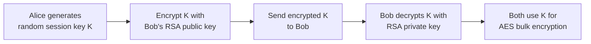

---
tags:
  - csa
  - csa/cryptography
confidence: verified
up: "[[Cryptography Overview]]"
tier-coverage: [intuition, core, deep-dive, practice]
---
# Cryptography Foundations

> **From substitution ciphers to hybrid encryption — the evolution of secret communication and why modern systems combine public-key exchange with symmetric bulk encryption.**

## 🎯 Intuition
**The Core Idea:** Modern cryptography solves two problems: making data unreadable (encryption) and sharing keys securely (key distribution); the hybrid model addresses both.
**Analogy:** Cryptography foundations trace the evolution of secret messages — from simple letter-shifting (Caesar cipher) to the modern lockbox system (hybrid encryption) that secures every web page you visit.
**Why It Matters:** Every HTTPS connection, encrypted email, and secure file transfer relies on these layered concepts. Understanding the progression from substitution ciphers to hybrid encryption reveals why modern systems are designed the way they are.

---

## ⚙️ Core Mechanics
### The Cryptographic Progression
1. **Substitution Ciphers** (broken): shift letters by a fixed offset (Caesar cipher). Defeated by frequency analysis.
2. **One-Time Pad** (perfect but impractical): XOR with a truly random key as long as the message. Information-theoretically secure, but key distribution is infeasible at scale.
3. **Symmetric Encryption** (fast, key problem): both parties share a secret key (e.g., AES). Fast for bulk data, but requires a secure channel to exchange the key.
4. **Public-Key Cryptography** (solves key distribution): each party has a public key (freely shared) and a private key (secret). Messages encrypted with the public key can only be decrypted with the private key. Primary implementation: [[RSA Algorithm]].
5. **Hybrid Encryption** (real-world solution): use public-key crypto to exchange a random session key, then encrypt bulk data with a symmetric cipher using that session key.

**Figure:** Hybrid encryption — RSA key exchange + AES bulk encryption

### Core Vocabulary

| Term | Definition |
|------|------------|
| **Plaintext** | The original, readable message |
| **Ciphertext** | The encrypted form of the message |
| **Encryption** | Plaintext → ciphertext using a key |
| **Decryption** | Ciphertext → plaintext using a key |
| **Key** | Secret parameter controlling the transformation |

Security depends on the key remaining secret, not on keeping the algorithm secret (Kerckhoffs's principle).

### Pseudocode
N/A — conceptual overview page; see [[RSA Algorithm]] for implementation.

### Complexity

| Approach | Speed | Key Distribution |
|----------|-------|-----------------|
| Symmetric (AES) | Fast | Requires secure channel |
| Asymmetric (RSA) | Slow (modular exponentiation) | Public key freely shared |
| Hybrid | Bulk data at symmetric speed | Key exchanged via asymmetric |

### Key Facts
- Kerckhoffs's principle: security depends on key secrecy, not algorithm secrecy
- Caesar cipher is broken by frequency analysis in seconds
- One-time pad is theoretically perfect but requires a key as long as the message
- Hybrid encryption combines the best of both worlds: RSA for key exchange, AES for bulk data
- Each HTTPS session uses a fresh randomly generated session key

---

## 🔬 Deep Dive
### Kerckhoffs's Principle
Security depends on the key remaining secret, not on keeping the algorithm secret. This is why AES and RSA are public algorithms — their security is analysed openly by the cryptographic community, and any weakness would be discovered faster than in a secret algorithm.

### Information-Theoretic vs Computational Security
- **One-time pad**: information-theoretically secure — even unlimited compute cannot break it
- **AES/RSA**: computationally secure — breaking them requires solving problems believed to be intractable (e.g., integer factorisation for RSA)
- The gap matters: a quantum computer could break RSA but not a one-time pad

### Edge Cases and Pitfalls
- Reusing a one-time pad key: two ciphertexts XOR'd together expose both plaintexts
- Weak random number generation undermines any cryptosystem (see [[Random Number Generation]])
- Symmetric key exchange over an insecure channel is the fundamental bootstrapping problem
- RSA alone is too slow for bulk data — always use hybrid encryption in practice

### Real-World Usage
- **HTTPS/TLS**: hybrid encryption secures every web connection
- **SSH**: public-key authentication + symmetric session encryption
- **Email encryption (PGP/GPG)**: hybrid model with RSA/ECC key exchange + AES bulk encryption
- **VPNs**: key exchange via Diffie-Hellman or RSA, bulk traffic via AES

---

## 🏋️ Practice
### Warm-Up (5 min)
1. Why is the Caesar cipher insecure? What attack breaks it?
2. Why can't we just use RSA to encrypt all data directly?

### Core Problems
1. **Frequency analysis**: Given a Caesar-cipher encrypted text, decrypt it by analysing letter frequencies.
2. **Hybrid encryption walkthrough**: Describe step-by-step how Alice sends an encrypted message to Bob using hybrid encryption.
3. **Key distribution problem**: Explain why symmetric encryption alone cannot bootstrap a secure connection between strangers over the internet.

### Challenge
Design a simplified key exchange protocol: two parties who have never met must agree on a shared secret key over an insecure channel. Describe the approach (hint: Diffie-Hellman) and identify what attacks it is vulnerable to (man-in-the-middle).

---

*See also:* [[RSA Algorithm]], [[Random Number Generation]], [[NP Completeness]], [[P vs NP]], [[CS Data Structures]]

## Supporting Chunks / References

### Supporting Chunks

- [[Cryptography - Substitution ciphers are vulnerable to frequency analysis motivating stronger cryptography]]
- [[Cryptography - RSA security rests on the hardness of integer factorisation]]
- [[Cryptography - Hybrid encryption combines public-key exchange with symmetric bulk encryption]]
- [[Cryptography - The one-time pad achieves perfect secrecy but requires a key as long as the message]]
- [[Cryptography - Pseudorandom bit generation from a short seed approximates the security of a one-time pad]]

### References

See [[CS Algorithms/Sources/Sources Index#Cormen 2013|Sources Index]]. Chapter 8. See [[RSA Algorithm]] for the full RSA description. See [[Random Number Generation]] for how practical cryptographic key material is generated from a short random seed.
