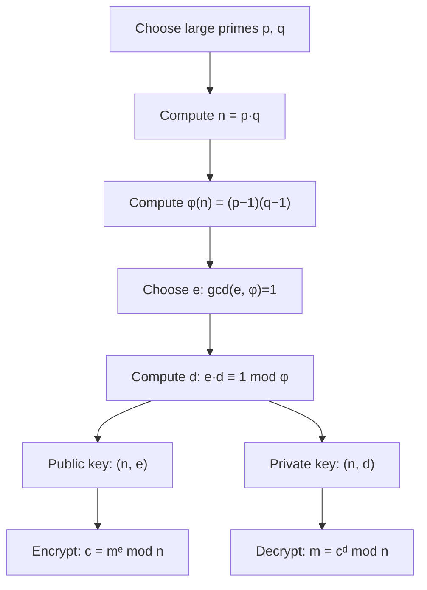

---
tags:
  - csa
  - csa/cryptography
confidence: verified
freshness: stable
up: "[[Cryptography Overview]]"
tier-coverage: [intuition, core, deep-dive, practice]
---
# RSA Algorithm

> **Public-key cryptosystem where security rests on the hardness of integer factorisation — encrypt with a public key, decrypt with the matching private key.**

## 🎯 Intuition
**The Core Idea:** Multiplying two large primes is fast; factoring their product is computationally infeasible — this asymmetry enables secure public-key encryption.
**Analogy:** RSA is like a lockbox with two keys — anyone can lock the box with your public key, but only you can open it with the private key. Cracking it requires factoring a number so large the sun would burn out first.
**Why It Matters:** RSA is the foundation of secure internet communication. Every HTTPS connection, digital signature, and certificate authority relies on RSA or similar public-key cryptography for key exchange.

---

## ⚙️ Core Mechanics
### Algorithm Steps (Key Generation)
1. Choose two distinct large primes **p** and **q** (hundreds of digits).
2. Compute **n = pq** — the modulus (public).
3. Compute **φ(n) = (p−1)(q−1)** — Euler's totient (kept secret).
4. Choose public exponent **e**: 1 < e < φ(n), gcd(e, φ(n)) = 1. Common choice: e = 65537 = 2¹⁶ + 1.
5. Compute private exponent **d**: ed ≡ 1 (mod φ(n)). Use the Extended Euclidean Algorithm.
6. **Public key**: (n, e) — **Private key**: (n, d).

**Figure:** RSA key generation and encrypt/decrypt flow




### Encryption and Decryption
```
Encrypt:  c = mᵉ mod n        (m = plaintext as integer, 0 ≤ m < n)
Decrypt:  m = cᵈ mod n
```

**Correctness**: Euler's theorem guarantees $m^{ed}$ ≡ m (mod n) when gcd(m, n) = 1.

### Modular Exponentiation (Repeated Squaring)
```
MODEXP(base, exp, mod):
  result = 1
  base = base mod mod
  while exp > 0:
    if exp is odd: result = (result × base) mod mod
    exp = exp >> 1
    base = (base × base) mod mod
  return result
```

For e = 65537, this takes at most 17 multiplications (binary representation has 17 bits).

### Complexity

| Operation | Cost |
|-----------|------|
| Key generation | Dominated by primality testing: $O(k⁴)$ for k-bit primes (Miller-Rabin) |
| Encryption (mᵉ mod n) | $O(\lg e)$ multiplications of k-bit numbers |
| Decryption (cᵈ mod n) | $O(k)$ multiplications of k-bit numbers |

### Key Facts
- Security rests on the **integer factorisation problem** — no known polynomial-time classical algorithm
- Common public exponent: e = 65537 (fast encryption, only 17 squarings)
- RSA is used only for **key exchange**, not bulk encryption — too slow for large data
- Modern recommendation: ≥ 2048-bit (≈ 617-digit) moduli
- **Quantum threat**: Shor's algorithm factors n in polynomial time on a quantum computer

---

## 🔬 Deep Dive
### Correctness / Proof
Euler's theorem: if gcd(m, n) = 1, then $m^{\varphi(n)} \equiv 1 \pmod{n}$. Since ed ≡ 1 (mod φ(n)), we have ed = 1 + kφ(n) for some integer k. Therefore $m^{ed} = m \cdot (m^{\varphi(n)})^k \equiv m \cdot 1^{k} \equiv m \pmod{n}$.

### Primality Testing
Finding large primes p, q requires efficient primality testing:

| Method | Type | Notes |
|--------|------|-------|
| **Miller-Rabin** | Probabilistic | Fast; error < 4⁻ᵏ for k rounds |
| **AKS** (2002) | Deterministic | Polynomial time; slower in practice |

### Security Estimate
Cormen's example: even testing 2500 candidate divisors per second, the sun would exhaust its fuel before factoring a 500-digit number by trial division. Modern recommendation: ≥ 2048-bit (≈ 617-digit) moduli.

**Quantum threat**: Shor's algorithm (1994) factors n in polynomial time on a quantum computer — motivation for post-quantum cryptography (lattice-based, hash-based schemes).

### Edge Cases and Pitfalls
- Message m must satisfy 0 ≤ m < n — messages longer than n must be chunked or (better) use hybrid encryption
- Small message + small e: without padding, $m^{e}$ might not wrap around mod n, making decryption trivial
- **Padding is essential**: raw textbook RSA is insecure — use OAEP (Optimal Asymmetric Encryption Padding)
- Choosing p = q: n = p² makes factoring trivial (just take the square root)
- Weak random number generation for p, q undermines everything (see [[Random Number Generation]])

### Real-World Usage
RSA is used only for **key exchange**, not bulk encryption. See [[Cryptography Foundations#Hybrid Encryption (Real-World Practice)]] for the hybrid model used in HTTPS.

- **TLS/HTTPS**: RSA key exchange (being replaced by ECDHE in TLS 1.3)
- **Digital signatures**: RSA signatures verify document authenticity
- **Code signing**: software publishers sign binaries with RSA
- **Certificate authorities**: X.509 certificates use RSA for the PKI trust chain

---

## 🏋️ Practice
### Warm-Up (5 min)
1. Why is e = 65537 a popular choice for the public exponent? How many multiplications does encryption require?
2. If you know n and φ(n), how do you factor n? (Hint: p + q = n − φ(n) + 1)

### Core Problems
1. **Small RSA by hand**: Given p = 61, q = 53, e = 17 — compute n, φ(n), d, then encrypt and decrypt m = 65.
2. **Modular exponentiation**: Implement the repeated squaring algorithm and compute $7^{256}$ mod 13.
3. **Extended Euclidean Algorithm**: Given e and φ(n), compute d = e⁻¹ mod φ(n).

### Challenge
**RSA security analysis**: Given n = pq where p and q are k-bit primes, estimate the number of trial divisions needed to factor n. At 10⁹ divisions per second, how long would it take for k = 512, 1024, 2048?

---

*See also:* [[NP Completeness]], [[P vs NP]], [[Asymptotic Notation]], [[Cryptography Foundations]], [[Random Number Generation]], [[CS Data Structures]]

## Supporting Chunks

### Supporting Chunks

- [[Cryptography - RSA security rests on the hardness of integer factorisation]]
- [[Cryptography - Hybrid encryption combines public-key exchange with symmetric bulk encryption]]

## References

See [[CS Algorithms/Sources/Sources Index#Cormen 2013|Sources Index]]. Chapter 8.

## References

- [[CS Algorithms/Sources/Sources Index]]
- [[CS Algorithms/CS Algorithms Book Reading Spine]]
