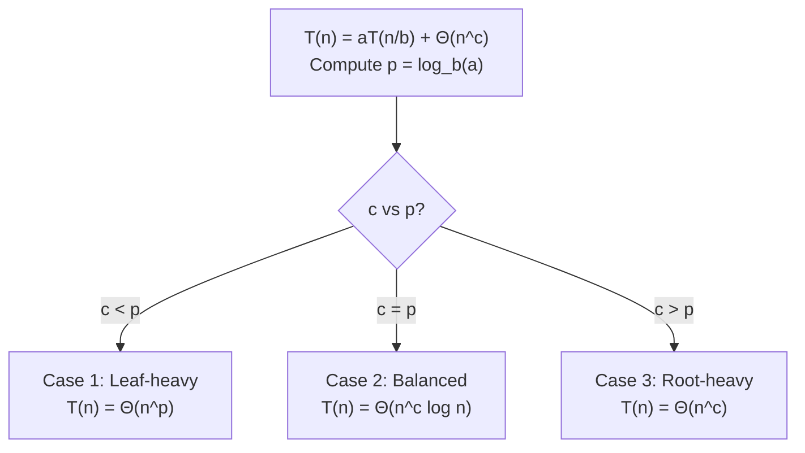

# Master Theorem Applications

> **One-line summary**: The Master Theorem provides a cookbook for solving recurrences of the form T(n) = aT(n/b) + $\Theta(n^c \log^k n)$, covering most divide-and-conquer running times.

## 🎯 Intuition
**The Core Idea:** Compare the work done at each recursion level (f(n)) to the number of leaves in the recursion tree ($n^{log_b a}$) — whichever dominates determines the total complexity.
**Analogy:** Imagine a company org chart. If the CEO (combine work) is the bottleneck, total cost is dominated by the top. If the interns (base cases / leaves) outnumber the managers, the leaves dominate. If they're balanced, you get an extra log factor.
**Why It Matters:** Instead of drawing a full recursion tree every time, the Master Theorem gives an instant answer for the most common D&C recurrences.

---

## ⚙️ Core Mechanics
### The Standard Form
For **T(n) = a·T(n/b) + $\Theta(n^c)$** where a ≥ 1, b > 1, c ≥ 0:

Let p = log_b(a):

- **Case 1 (Leaf-heavy):** If c < p → T(n) = $\Theta(n^{p})$
- **Case 2 (Balanced):** If c = p → T(n) = $\Theta(n^{c} · \log n)$
- **Case 3 (Root-heavy):** If c > p, and a·f(n/b) ≤ k·f(n) for some k < 1 (regularity) → T(n) = $\Theta(n^{c})$

**Figure:** Master Theorem — which case applies?

### Extended Form (with log factors)
For **T(n) = a·T(n/b) + $\Theta(n^{c} · \log^{k} n)$**:
- Case 2 generalizes: if c = p, T(n) = $\Theta(n^{c} · \log^{k+1} n)$.

### Worked Examples

**Example 1: Merge Sort** — T(n) = 2T(n/2) + $\Theta(n)$
- a=2, b=2, c=1, p=log₂2=1. c = p → Case 2 → **T(n) = $\Theta(n \log n)$** ✓

**Example 2: Binary Search** — T(n) = T(n/2) + $\Theta(1)$
- a=1, b=2, c=0, p=log₂1=0. c = p → Case 2 → **T(n) = $\Theta(\log n)$** ✓

**Example 3: Strassen** — T(n) = 7T(n/2) + $\Theta(n²)$
- a=7, b=2, c=2, p=log₂7≈2.81. c < p → Case 1 → **T(n) = $\Theta(n^{2.81})$** ✓

**Example 4: Karatsuba Multiplication** — T(n) = 3T(n/2) + $\Theta(n)$
- a=3, b=2, c=1, p=log₂3≈1.585. c < p → Case 1 → **T(n) = $\Theta(n^{1.585})$** ✓

**Example 5: Stooge Sort** — T(n) = 3T(2n/3) + $\Theta(1)$
- a=3, b=3/2, c=0, p=log_{3/2}(3)≈2.71. c < p → Case 1 → **T(n) = $\Theta(n^{2.71})$** ✓

### Complexity

| Case | When | Result |
|------|------|--------|
| 1 (Leaf-heavy) | c < log_b(a) | $\Theta(n^{log_b a})$ |
| 2 (Balanced) | c = log_b(a) | $\Theta(n^{c} \log n)$ |
| 3 (Root-heavy) | c > log_b(a) | $\Theta(n^c)$ |

### Key Facts
- The Master Theorem does NOT apply when sub-problems have unequal sizes (e.g., T(n) = T(n/3) + T(2n/3) + n).
- It does NOT apply when a < 1 or b ≤ 1.
- For recurrences it cannot handle, use the **Akra–Bazzi method** or the **recursion tree method**.
- The regularity condition in Case 3 almost always holds in practice for polynomial f(n).

---

## 🔬 Deep Dive
### Recursion Tree Intuition
The Master Theorem formalizes what a recursion tree reveals:
- **Level 0 (root):** cost = f(n)
- **Level 1:** a sub-problems, each costs f(n/b). Total = a · f(n/b).
- **Level i:** aⁱ sub-problems, each costs f(n/bⁱ). Total = aⁱ · f(n/bⁱ).
- **Leaves (level log_b n):** $a^{log_b n}$ = $n^{log_b a}$ sub-problems, each $O(1)$.

Summing all levels: if the leaf level dominates → Case 1; if all levels contribute equally → Case 2; if the root level dominates → Case 3.

### When Master Theorem Fails
- **Unequal splits:** T(n) = T(n/3) + T(2n/3) + $O(n)$ — use Akra–Bazzi or recursion tree (answer is $\Theta(n \log n)$).
- **Non-polynomial f(n):** T(n) = 2T(n/2) + n/log n — the extended version handles some log factors, but not all.
- **Floor/ceiling issues:** The theorem holds even with ⌊n/b⌋ and ⌈n/b⌉ (by asymptotic arguments), so don't worry about exact divisions.

### Comparison with Alternatives
- **Recursion tree method** — more general, works for any recurrence, but requires careful summation.
- **Substitution method** — guess and verify by induction; works universally but requires a good guess.
- **Akra–Bazzi theorem** — handles unequal splits: T(n) = Σ aᵢ T(bᵢ n) + g(n).
- For exams and interviews, **Master Theorem is the fastest** when it applies.

### Real-World Usage
- **Algorithm analysis** — every D&C algorithm in textbooks states its complexity via the Master Theorem.
- **Interview prep** — knowing which case applies lets you instantly answer "what's the time complexity of X?" questions.
- **Systems design** — estimating scaling behavior of recursive parallel algorithms (MapReduce, parallel mergesort).

---

## 🏋️ Practice
### Warm-Up (5 min)
1. Apply the Master Theorem to T(n) = 4T(n/2) + n. Which case? What's T(n)?
2. Apply to T(n) = 4T(n/2) + n². Which case?
3. Apply to T(n) = 4T(n/2) + n³. Which case?

### Core Problems
1. **Mixed bag**: Determine the complexity of each: (a) T(n)=9T(n/3)+n, (b) T(n)=T(2n/3)+1, (c) T(n)=3T(n/4)+n log n, (d) T(n)=2T(n/2)+n log n (careful — standard form doesn't directly cover this; use the extended version).
2. **Recursion tree fallback**: For T(n) = T(n/3) + T(2n/3) + n, draw the recursion tree and prove T(n) = $\Theta(n \log n)$. Explain why the Master Theorem can't be applied.

### Challenge
- **Akra–Bazzi application**: Learn and apply the Akra–Bazzi method to T(n) = T(n/3) + T(2n/3) + $O(n)$. Derive the answer and compare to what the recursion tree gives. When would you prefer Akra–Bazzi over the recursion tree?

---

*See also:* [[Divide and Conquer Overview]] · [[Merge Sort]] · [[Quicksort|Quick Sort]] · [[Greedy Algorithms Overview]] | **CS Data Structures:** Recursion and Call Stack

## References
-> [[Sources Index]]
