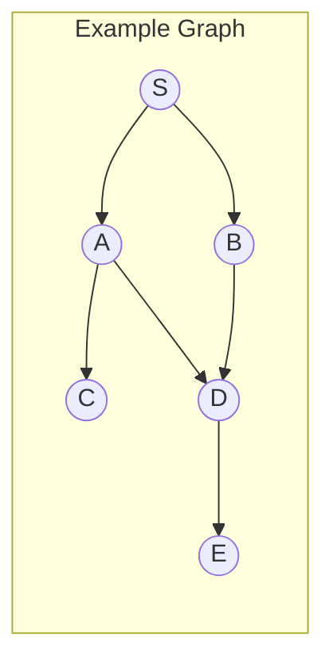
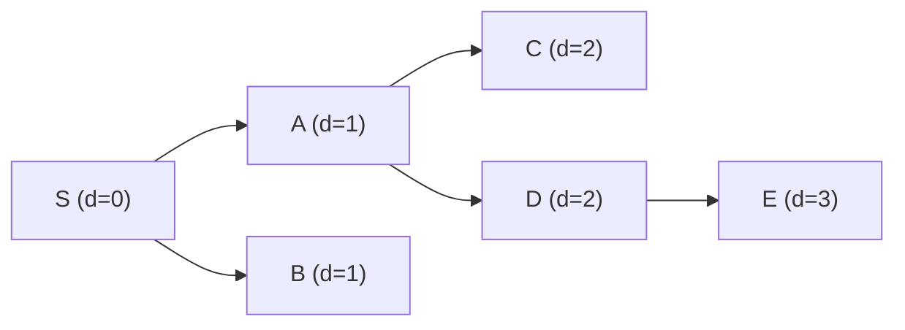

# BFS and DFS

> **One-line summary**: Breadth-First Search explores a graph level by level using a queue, while Depth-First Search dives as deep as possible along each branch using a stack, together forming the foundation of nearly all graph algorithms.

## 🎯 Intuition
**The Core Idea:** BFS radiates outward like ripples on a pond; DFS plunges down a single path like exploring a maze by always turning left until you hit a dead end.
**Analogy:** BFS is like searching for a friend at a party by checking everyone in the same room first, then moving to adjacent rooms. DFS is like wandering down every hallway to its end before backtracking.
**Why It Matters:** BFS finds shortest paths in unweighted graphs and drives algorithms like Edmonds-Karp. DFS powers topological sort, cycle detection, strongly connected components, and articulation-point detection.

---

## ⚙️ Core Mechanics
### BFS Algorithm Steps
1. Enqueue the source vertex; mark it visited.
2. While the queue is not empty:
   a. Dequeue vertex u.
   b. For each neighbor v of u:
      - If v is not visited, mark it visited, record distance/parent, enqueue v.

### BFS Pseudocode
```
function BFS(graph, source):
    visited = {source}
    queue = [source]
    dist[source] = 0
    while queue is not empty:
        u = queue.dequeue()
        for each neighbor v of u:
            if v not in visited:
                visited.add(v)
                dist[v] = dist[u] + 1
                parent[v] = u
                queue.enqueue(v)
```

### DFS Algorithm Steps
1. Push the source onto the stack (or call recursively); mark it visited.
2. While the stack is not empty:
   a. Pop vertex u.
   b. For each neighbor v of u:
      - If v is not visited, mark it visited, record discovery/finish times, push v.

### DFS Pseudocode (Recursive)
```
function DFS(graph):
    time = 0
    for each vertex u in graph:
        if u not visited:
            DFS_Visit(u)

function DFS_Visit(u):
    time += 1
    u.discovery = time
    u.visited = true
    for each neighbor v of u:
        if v not visited:
            parent[v] = u
            DFS_Visit(v)
    time += 1
    u.finish = time
```

### Complexity

| Algorithm | Time | Space |
|-----------|------|-------|
| BFS | $O(V + E)$ | $O(V)$ |
| DFS | $O(V + E)$ | $O(V)$ |

Both visit every vertex and edge exactly once (in directed graphs, each directed edge once; in undirected, each edge twice).

### Key Facts

**Figure:** BFS explores level-by-level; DFS dives depth-first



**Figure:** BFS traversal order from S (level-by-level)



- BFS yields the **shortest path in unweighted graphs** (minimum number of edges).
- DFS classifies edges as tree, back, forward, or cross edges — this classification drives many algorithms.
- A **back edge in DFS** indicates a cycle in a directed graph.
- BFS uses $O(V)$ space for the queue (worst case: all vertices at one level); DFS uses $O(V)$ for the recursion stack.

---

## 🔬 Deep Dive
### Correctness of BFS Shortest Paths
**Invariant:** At the time vertex v is enqueued, dist[v] = δ(s, v) (the true shortest distance).
**Proof sketch:** By induction on the distance. The source has dist = 0. Each level i is fully explored before level i+1 begins, so when v is first discovered from some vertex u at distance i, we have dist[v] = i + 1 = δ(s, v).

### DFS Edge Classification
When DFS explores edge (u, v):
- **Tree edge:** v is undiscovered → main traversal edge.
- **Back edge:** v is an ancestor of u (discovered but not finished) → indicates a cycle.
- **Forward edge:** v is a descendant of u (already finished, u.discovery < v.discovery).
- **Cross edge:** v is in a different branch (already finished, u.discovery > v.discovery).

### Edge Cases and Pitfalls
- **Disconnected graphs:** Must loop over all vertices to start BFS/DFS from unvisited nodes.
- **Implicit graphs** (e.g., grid, state space): Represent neighbors via a function rather than adjacency lists.
- **Iterative DFS vs recursive DFS:** Iterative DFS using an explicit stack processes neighbors in reverse order compared to recursive DFS — this can affect the order of traversal (though both are valid DFS orderings).
- **BFS on weighted graphs:** BFS does NOT find shortest paths when edge weights differ — use Dijkstra's or Bellman-Ford instead.

### Comparison with Alternatives
- **Dijkstra's algorithm** — BFS for weighted graphs with non-negative weights; uses a priority queue instead of a plain queue.
- **Iterative deepening DFS (IDDFS)** — combines BFS's shortest-path guarantee with DFS's space efficiency for tree-like structures.
- **Bidirectional BFS** — searches from both source and target simultaneously; reduces exploration from $O(b^d)$ to $O(b^{d/2})$.

### Real-World Usage
- **BFS:** Social network "degrees of separation," web crawlers (level-limited), GPS shortest route in unweighted road networks, puzzle solvers (Rubik's cube state space).
- **DFS:** Topological sorting for build systems (Make, Gradle), cycle detection in dependency graphs, maze generation, finding connected components.

---

## 🏋️ Practice
### Warm-Up (5 min)
1. In BFS, why does using a queue guarantee shortest paths in unweighted graphs?
2. What type of DFS edge indicates a cycle in a directed graph?
3. What is the space complexity advantage of DFS over BFS in a tree with branching factor b and depth d?

### Core Problems
1. **LeetCode 200 — Number of Islands**: Given a 2D grid of '1's (land) and '0's (water), count the number of islands using BFS or DFS. *Approach:* For each unvisited '1', run BFS/DFS to mark all connected land, increment count.
2. **LeetCode 207 — Course Schedule**: Determine if you can finish all courses given prerequisites. *Approach:* Model as a directed graph, use DFS to detect cycles (back edges).

### Challenge
- **Word Ladder (LeetCode 127):** Given a start word and end word, find the shortest transformation sequence where each step changes exactly one letter and the intermediate word must be in a dictionary. Implement using BFS. Optimize with bidirectional BFS and compare performance on large dictionaries.

---

*See also:* [[Minimum Spanning Trees]] · [[Kruskal's Algorithm]] · [[Prim's Algorithm]] · [[Network Flow — Ford-Fulkerson]] · [[CS Algorithms/Graphs/DAG and Topological Sort|Topological Sort]] | **CS Data Structures:** [[CS Data Structures/Linear Structures/Queues and Deques|Queues]] · [[Stacks]] · [[CS Data Structures/Graphs/Adjacency List and Adjacency Matrix|Adjacency List vs Matrix]]

## References
-> [[CS Algorithms/Sources/Sources Index|Sources Index]]
