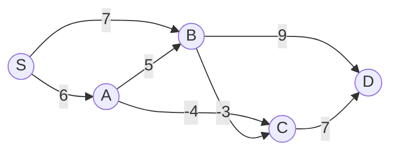

---
tags:
  - csa
  - csa/graphs
confidence: verified
up: "[[Shortest Path Overview]]"
tier-coverage: [intuition, core, deep-dive, practice]
---
# Bellman-Ford Algorithm

> **Single-source shortest paths with negative edge weights and negative-cycle detection in $O(nm)$.**

## 🎯 Intuition
**The Core Idea:** Relax every edge n−1 times; after k passes, shortest paths using at most k edges are correct.
**Analogy:** Bellman-Ford is like checking all roads for shortcuts — you make multiple rounds through every road in the network, and each round guarantees you've found the cheapest routes using one more hop, even on roads with tolls that pay you (negative weights).
**Why It Matters:** It handles negative edge weights (Dijkstra cannot) and detects negative-weight cycles, making it essential for currency arbitrage detection and network routing with variable costs.

---

## ⚙️ Core Mechanics
### Algorithm Steps
1. Initialise all distances to ∞ except the source (d[s] = 0).
2. Perform n−1 passes. In each pass, relax every edge (u, v): if d[u] + w(u,v) < d[v], update d[v].
3. Perform one additional pass (pass n). If any distance still improves, a negative-weight cycle is reachable.

### Pseudocode
```
BELLMAN-FORD(G, s):
  for each vertex v:
    d[v] = ∞
    pred[v] = NIL
  d[s] = 0

  // n-1 relaxation passes
  for i = 1 to n-1:
    for each edge (u, v) with weight w(u,v):
      RELAX(u, v, w):
        if d[u] + w(u,v) < d[v]:
          d[v] = d[u] + w(u,v)
          pred[v] = u

  // Negative-cycle detection: pass n
  for each edge (u, v):
    if d[u] + w(u,v) < d[v]:
      report NEGATIVE-WEIGHT CYCLE EXISTS
```

### Complexity

| Measure | Value |
|---------|-------|
| Time | $O(nm)$ |
| Space | $O(n)$ |

Slower than Dijkstra, but correct for negative weights.

### Key Facts

**Figure:** Bellman-Ford edge relaxation on a graph with negative weights



- Handles negative edge weights (Dijkstra cannot)
- Detects negative-weight cycles via the extra pass
- After pass k, d[v] holds the shortest-path distance using at most k edges
- Any shortest path uses at most n−1 edges (no repeated vertices in a shortest path without negative cycles)
- n−1 relaxation passes form a DP over increasing path lengths

---

## 🔬 Deep Dive
### Correctness / Proof
After pass k, d[v] is the shortest-path distance using at most k edges. Any shortest path in a graph with n vertices uses at most n−1 edges (otherwise a vertex repeats, implying a cycle). So n−1 passes suffice. If a distance still improves on pass n, a negative-weight cycle is reachable — shortest paths are undefined because the cycle can be traversed repeatedly to reduce cost without bound.

### Edge Cases and Pitfalls
- If the graph has no negative-weight cycle, all shortest paths are well-defined and the algorithm terminates correctly
- Unreachable vertices retain d[v] = ∞
- A negative-weight cycle reachable from s makes shortest-path distances undefined for all vertices reachable from that cycle
- Early termination optimisation: if no distance changes in a pass, stop (all distances are final)

### Real-World Usage
**Currency Arbitrage Detection**: Represent currencies as vertices; each exchange rate r(u→v) becomes an edge with weight −lg(r(u,v)). A negative-weight cycle in this graph corresponds to a sequence of currency exchanges with a multiplicative gain > 1 — an arbitrage opportunity. Bellman-Ford detects it in $O(nm)$.

---

## 🏋️ Practice
### Warm-Up (5 min)
1. Why does Bellman-Ford need exactly n−1 passes (not n or n−2)?
2. What happens if you run Bellman-Ford on a graph with only non-negative weights? How does it compare to Dijkstra?

### Core Problems
1. **Negative cycle detection**: Given a weighted directed graph, determine if it contains a negative-weight cycle reachable from vertex s.
2. **Shortest path with at most k edges**: Modify Bellman-Ford to find the shortest path from s to t using at most k edges.
3. **Path reconstruction**: After running Bellman-Ford, reconstruct the actual shortest path from s to a target vertex t using the pred[] array.

### Challenge
**Cheapest Flights Within K Stops** (LeetCode 787): Find the cheapest flight from source to destination with at most K stops. Use a modified Bellman-Ford with exactly K+1 passes.

---

*See also:* [[Dynamic Programming]], [[Asymptotic Notation]], [[NP Completeness]], [[Dijkstra's Algorithm]], [[Floyd-Warshall Algorithm]], [[Shortest Path Overview]], [[CS Data Structures]]

## Supporting Chunks / References

### Supporting Chunks

- [[Graphs - Bellman-Ford handles negative weights and detects negative cycles]]
- [[Graphs - Dijkstra's greedy approach requires non-negative edge weights]]

### References

See [[CS Algorithms/Sources/Sources Index#Cormen 2013|Sources Index]]. Chapter 6. See [[Dijkstra's Algorithm]] for the non-negative case and [[Floyd-Warshall Algorithm]] for all-pairs.
