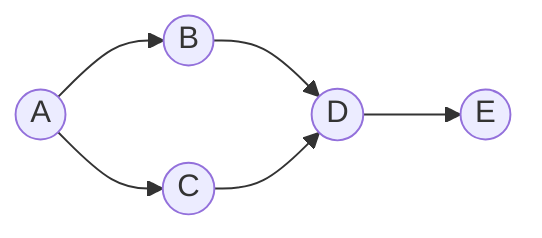

---
tags:
  - csa
  - csa/graphs
confidence: verified
up: "[[Graphs Overview]]"
tier-coverage: [intuition, core, deep-dive, practice]
---
# DAG and Topological Sort

> **Linear ordering of DAG vertices respecting all edge directions, computed in $\Theta(n+m)$ via Kahn's algorithm.**

## 🎯 Intuition
**The Core Idea:** Repeatedly remove vertices with no incoming edges; the removal order is a valid topological sort.
**Analogy:** Topological sort is like course prerequisite ordering — you must take Calculus I before Calculus II, and the sort gives you a valid semester-by-semester plan that respects all prerequisites.
**Why It Matters:** Build systems, task schedulers, and compilers all need to process items in dependency order. Topological sort also enables efficient shortest/longest path algorithms on DAGs.

---

## ⚙️ Core Mechanics
### Algorithm Steps (Kahn's Algorithm)
1. Compute the in-degree of every vertex.
2. Enqueue all vertices with in-degree 0.
3. While the queue is non-empty: dequeue u, append to result, decrement in-degree of all u's neighbours; enqueue any neighbour whose in-degree reaches 0.
4. If result has fewer than n vertices, a cycle exists (no valid topological order).

### Pseudocode
```
TOPOLOGICAL-SORT(G):
  Compute in-degree of each vertex
  Enqueue all vertices with in-degree 0
  result = []

  while queue is not empty:
    u = dequeue
    append u to result
    for each neighbour v of u:
      in-degree[v] -= 1
      if in-degree[v] == 0:
        enqueue v

  if |result| < n:
    CYCLE DETECTED — no topological order exists
  return result
```

### Complexity

| Measure | Value |
|---------|-------|
| Time | $\Theta(n+m)$ |
| Space | $O(n)$ |

Each vertex and edge is processed exactly once.

### Key Facts

**Figure:** DAG with one valid topological order: A → B → C → D → E



- Only works on DAGs (directed acyclic graphs) — a cycle makes topological ordering impossible
- Multiple valid orderings may exist for the same DAG
- Kahn's algorithm also doubles as a cycle detector
- DFS-based topological sort (reverse post-order) is an alternative approach
- Enables $\Theta(n+m)$ shortest/longest path algorithms on DAGs

---

## 🔬 Deep Dive
### Correctness / Proof
When u is appended to result, all its predecessors (vertices with edges into u) have already been appended — because u's in-degree reached 0 only after all such predecessors were removed. Therefore every edge (u,v) has u before v in the output — a valid topological ordering.

### Cycle Detection
If the result has fewer than n vertices when the queue empties, some vertices were never enqueued (their in-degree never reached 0). This indicates a directed cycle — the cycle's vertices all wait for each other indefinitely.

### Edge Cases and Pitfalls
- A graph with a single vertex and no edges has a trivial topological sort
- Disconnected DAGs still have valid topological orderings
- The choice of which zero-in-degree vertex to dequeue first affects the output ordering but all are valid
- Using a min-heap instead of a plain queue gives the lexicographically smallest topological order

### Real-World Usage
**PERT Critical Path**: vertices = tasks, edge weights = task durations. The critical path is the longest path from start to finish — it determines the minimum project completion time. No task on the critical path can be delayed without delaying the whole project. Algorithm: process vertices in topological order, relax all outgoing edges: if dist[u] + w(u,v) > dist[v], update dist[v]. Time: $\Theta(n+m)$.

**DAG Shortest Paths**: Process vertices in topological order; relax all outgoing edges. Since there are no back edges in a DAG, each vertex is finalised before its successors are processed. Handles **negative edge weights** correctly (no cycles means no negative-weight cycles). Time: $\Theta(n+m)$.

---

## 🏋️ Practice
### Warm-Up (5 min)
1. Can an undirected graph have a topological sort? Why or why not?
2. How many valid topological orderings does a linear chain of n vertices have?

### Core Problems
1. **Course Schedule** (LeetCode 207): Given prerequisites, determine if all courses can be finished — direct topological sort / cycle detection.
2. **Course Schedule II** (LeetCode 210): Return a valid ordering of courses — output the topological sort itself.
3. **DAG shortest path**: Given a weighted DAG, find the shortest path from source to all vertices in $\Theta(n+m)$.

### Challenge
**Parallel Job Scheduling** (LeetCode 2050 or variant): Given a DAG of tasks with durations, find the minimum completion time (PERT critical path).

---

*See also:* [[Dynamic Programming]], [[Asymptotic Notation]], [[NP Completeness]], [[Graph Fundamentals]], [[Bellman-Ford Algorithm]], [[Queues and Deques|Queue]], [[CS Data Structures]]

## Supporting Chunks

### Supporting Chunks

- [[Graphs - DAG topological sort processes vertices in precedence order in Theta(n+m)]]
- [[Graphs - PERT critical path is the longest path in a task-duration DAG]]
- [[Graphs - DAG shortest paths use topological-order relaxation handling negative weights]]

## References

See [[CS Algorithms/Sources/Sources Index#Cormen 2013|Sources Index]]. Chapter 5. See [[Graph Fundamentals]] for prerequisite vocabulary.
