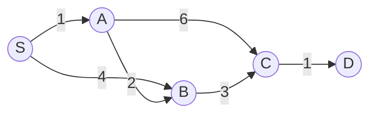

---
tags:
  - csa
  - csa/graphs
confidence: verified
freshness: stable
up: "[[Shortest Path Overview]]"
tier-coverage: [intuition, core, deep-dive, practice]
---
# Dijkstra's Algorithm

> **Single-source shortest paths in graphs with non-negative edge weights, driven by a min-priority queue.**

## 🎯 Intuition
**The Core Idea:** Greedily extract the closest unvisited vertex and finalise its distance; non-negative weights guarantee no future path can improve it.
**Analogy:** Dijkstra is like a GPS finding the shortest route — it greedily expands the closest unvisited city, like a GPS recalculating from the nearest point, confident that no cheaper detour exists because all road costs are non-negative.
**Why It Matters:** Powers GPS routing, OSPF network routing, and any application requiring efficient shortest paths on non-negative-weight graphs.

---

## ⚙️ Core Mechanics
### Algorithm Steps
1. Initialise all distances to ∞ except the source (d[s] = 0). Insert all vertices into a min-priority queue Q keyed by d[v].
2. Extract the vertex u with minimum d[u] from Q — u's distance is now final.
3. For each neighbour v of u, relax edge (u, v): if d[u] + w(u,v) < d[v], update d[v] and decrease v's key in Q.
4. Repeat until Q is empty.

### Pseudocode
```
DIJKSTRA(G, s):
  for each vertex v:
    d[v] = ∞
    pred[v] = NIL
  d[s] = 0
  Q = min-priority-queue of all vertices, keyed by d[v]

  while Q is not empty:
    u = EXTRACT-MIN(Q)           // finalise u
    for each neighbour v of u:
      RELAX(u, v, w):
        if d[u] + w(u,v) < d[v]:
          d[v] = d[u] + w(u,v)
          pred[v] = u
          DECREASE-KEY(Q, v, d[v])
```

### Complexity

| Priority Queue | EXTRACT-MIN | DECREASE-KEY | Total |
|----------------|-------------|--------------|-------|
| Binary heap | $O(\lg n)$ | $O(\lg n)$ | **$O((n+m)$ lg n)** |
| Fibonacci heap | $O(\lg n)$ amortised | $O(1)$ amortised | **$O(m + n \lg n)$** |

For sparse graphs (m = $O(n)$), binary heap is practical. Fibonacci heap is theoretically optimal but complex to implement.

### Key Facts

**Figure:** Dijkstra's shortest-path tree from source S



- Requires **non-negative** edge weights — a negative edge can invalidate already-finalised distances
- Greedy algorithm: once a vertex is extracted, its distance is final
- Output: d[v] (shortest-path distance) and pred[v] (predecessor for path reconstruction)
- Binary heap gives $O((n+m)$ lg n); Fibonacci heap gives $O(m + n \lg n)$
- For negative weights, use [[Bellman-Ford Algorithm]] instead

---

## 🔬 Deep Dive
### Correctness / Proof
When vertex u is extracted from Q, d[u] is the true shortest-path distance from s to u. **This holds only when all edge weights are non-negative.** A negative weight edge could provide a shorter path to u's neighbours *after* u has already been finalised.

→ For negative weights: use [[Bellman-Ford Algorithm]].

### Edge Cases and Pitfalls
- Negative edge weights break the greedy invariant — Dijkstra will produce incorrect results
- Unreachable vertices keep d[v] = ∞
- Self-loops with weight 0 are harmless; negative self-loops are not allowed
- Path reconstruction: follow pred pointers from target back to source

### Real-World Usage
- **GPS routing** — road networks have non-negative travel times
- **Network routing** — OSPF protocol uses Dijkstra
- **Shortest hops** in social networks — unweighted = all weights 1

---

## 🏋️ Practice
### Warm-Up (5 min)
1. Why does Dijkstra fail on graphs with negative edge weights? Give a small counterexample.
2. What is the difference between Dijkstra and BFS on an unweighted graph?

### Core Problems
1. **Network Delay Time** (LeetCode 743): Find the time it takes for a signal to reach all nodes from a source — direct application of Dijkstra.
2. **Path reconstruction**: Given a graph and a source, find the actual shortest path (not just the distance) from source to every vertex.
3. **Cheapest path with constraints**: Modify Dijkstra to find the shortest path that visits at most k intermediate vertices.

### Challenge
**Shortest Path in a Weighted Grid** (LeetCode 1631 — Minimum Effort Path): Apply Dijkstra to a grid where edge weights are elevation differences. Requires adapting the algorithm to implicit graph representation.

---

*See also:* [[Dynamic Programming]], [[P vs NP]], [[Huffman Coding]], [[Bellman-Ford Algorithm]], [[Floyd-Warshall Algorithm]], [[Graph Fundamentals]], [[Shortest Path Overview]], [[CS Data Structures/Heaps and Priority Queues/Priority Queue ADT|Priority Queue]], [[CS Data Structures]]

## Supporting Chunks / References

### Supporting Chunks

- [[Graphs - Dijkstra's greedy approach requires non-negative edge weights]]
- [[Graphs - Dijkstra's algorithm maintains a cut invariant that guarantees correctness on non-negative graphs]]

### References

See [[CS Algorithms/Sources/Sources Index#Cormen 2013|Sources Index]], Chapter 6. See [[CS Algorithms/Sources/Sources Index#Erickson 2019|Sources Index]], Chapter 8. See [[Graph Fundamentals]] for graph vocabulary, [[Bellman-Ford Algorithm]] for the negative-weight case, and [[Shortest Path Overview]] for algorithm selection guidance.

## References

- [[CS Algorithms/Sources/Sources Index]]
- [[CS Algorithms/CS Algorithms Book Reading Spine]]
