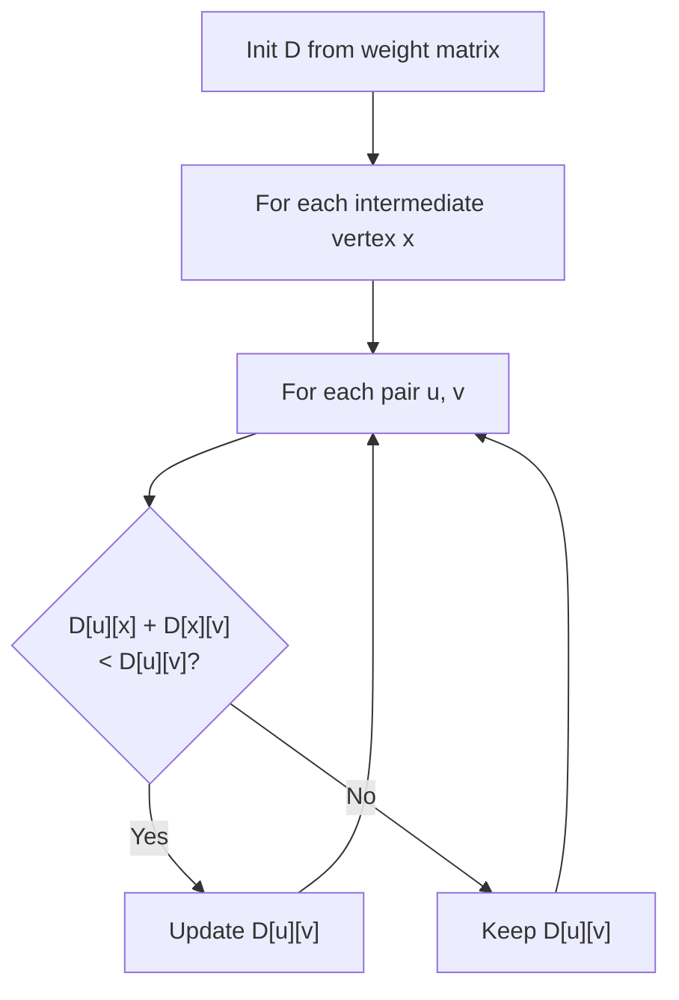

---
tags:
  - csa
  - csa/graphs
confidence: verified
freshness: stable
up: "[[Shortest Path Overview]]"
tier-coverage: [intuition, core, deep-dive, practice]
---
# Floyd-Warshall Algorithm

> **All-pairs shortest paths via dynamic programming in $\Theta(n³)$, handling negative weights.**

## 🎯 Intuition
**The Core Idea:** For each possible intermediate vertex x, check whether routing through x improves the shortest path between every pair (u, v).
**Analogy:** Floyd-Warshall is like all-pairs travel planning — computing driving distances between every pair of cities in an atlas, considering all possible stopovers one at a time.
**Why It Matters:** When you need shortest paths between all pairs of vertices (not just from one source), Floyd-Warshall is the simplest and often the best choice for moderate n, especially with negative weights.

---

## ⚙️ Core Mechanics
### Algorithm Steps
1. Initialise distance matrix D from the weight matrix: D[u][v] = w(u,v) if edge exists, 0 if u = v, ∞ otherwise.
2. For each intermediate vertex x = 1 to n:
   - For each pair (u, v): set D[u][v] = min(D[u][v], D[u][x] + D[x][v]).
3. After all n iterations, D[u][v] contains the shortest-path weight from u to v.

### DP Formulation
**State**: `shortest[u, v, x]` = length of the shortest path from u to v using only vertices {1, 2, …, x} as intermediate vertices.

**Base case**: `shortest[u, v, 0]` = w(u, v) if edge (u,v) exists; 0 if u = v; ∞ otherwise.

**Recurrence**:
```
shortest[u, v, x] = min(
  shortest[u, v, x-1],              // x is not on the optimal path
  shortest[u, x, x-1] + shortest[x, v, x-1]  // x is an intermediate
)
```

After filling for x = 1 to n, `shortest[u, v, n]` is the answer.

### Pseudocode
```
FLOYD-WARSHALL(W, n):
  D = W                         // D[u,v] = w(u,v); 0 if u=v; ∞ if no edge
  for x = 1 to n:
    for u = 1 to n:
      for v = 1 to n:
        D[u][v] = min(D[u][v], D[u][x] + D[x][v])
  return D
```

In practice, two n×n matrices (current and previous) suffice — the update is safe in-place.

### Complexity

| Measure | Value |
|---------|-------|
| Time | $\Theta(n³)$ |
| Space | $\Theta(n²)$ |

### Key Facts

**Figure:** All-pairs shortest paths — consider each vertex as intermediate



- Solves the **all-pairs** shortest paths problem (not just single-source)
- Handles negative edge weights (but not negative-weight cycles)
- Negative-cycle detection: after completion, check if any D[u][u] < 0
- Textbook 3-state DP: d[u][v][x] with bottom-up tabulation
- Best for dense graphs where m ≈ n² and moderate n (≤ 1000)

---

## 🔬 Deep Dive
### Correctness / Proof
The recurrence correctly considers two cases for each intermediate vertex x: either x is on the optimal u→v path (route through x) or it isn't (keep the previous best). After considering all n possible intermediates, D[u][v] equals the true shortest-path weight. In-place update is safe because D[u][x] and D[x][v] are not affected by updates in iteration x.

### Negative-Cycle Detection
After running the algorithm, if any diagonal entry D[u][u] < 0, a negative-weight cycle passes through u.

### Edge Cases and Pitfalls
- The algorithm assumes no negative-weight cycles; if present, results are undefined (but detectable via the diagonal check)
- For sparse graphs, running Dijkstra from each vertex may be faster: $O(n(n+m)$ lg n) vs $\Theta(n³)$
- Overflow risk: initialising ∞ as a large integer can cause overflow when adding D[u][x] + D[x][v]
- Path reconstruction requires maintaining a predecessor matrix alongside D

### Real-World Usage
- **Dense graphs** where m ≈ n² — Dijkstra × n = $O(n · (n+m)$ lg n) ≈ $O(n³ \lg n)$, worse
- When **n is moderate** (say ≤ 1000) and all-pairs is needed
- When **negative weights** are present (Dijkstra can't handle this)
- **Transitive closure**: variant computes reachability between all pairs

---

## 🏋️ Practice
### Warm-Up (5 min)
1. Why does Floyd-Warshall use three nested loops instead of two? What does each loop represent?
2. How do you detect a negative-weight cycle using the Floyd-Warshall output?

### Core Problems
1. **All-pairs shortest paths**: Given a 5×5 adjacency matrix with some negative weights, trace through the Floyd-Warshall algorithm by hand.
2. **Find the Shortest Path** (LeetCode 1334 — Find the City With the Smallest Number of Neighbors at a Threshold Distance): Apply Floyd-Warshall to find all-pairs distances, then answer queries.
3. **Transitive closure**: Modify Floyd-Warshall to compute reachability (boolean matrix) instead of shortest distances.

### Challenge
**Minimum Cost to Reach Destination** with all-pairs queries: Given a graph with negative weights, preprocess with Floyd-Warshall and answer multiple source-destination queries in $O(1)$ each.

---

*See also:* [[Dynamic Programming]], [[Edit Distance]], [[NP Completeness]], [[Dijkstra's Algorithm]], [[Bellman-Ford Algorithm]], [[Shortest Path Overview]], [[CS Data Structures/Graphs/Adjacency List and Adjacency Matrix|Adjacency Matrix]], [[CS Data Structures]]

## Supporting Chunks / References

### Supporting Chunks

- [[Graphs - Floyd-Warshall solves all-pairs shortest paths in Theta(n cubed)]]
- [[Graphs - Floyd-Warshall negative-cycle detection uses the diagonal of the distance matrix]]

### References

See [[CS Algorithms/Sources/Sources Index#Cormen 2013|Sources Index]], Chapter 6. See [[CS Algorithms/Sources/Sources Index#Erickson 2019|Sources Index]], Chapter 9. See [[Dijkstra's Algorithm]] and [[Bellman-Ford Algorithm]] for single-source variants. See [[Shortest Path Overview]] for algorithm selection guidance.

## References

- [[CS Algorithms/Sources/Sources Index]]
- [[CS Algorithms/CS Algorithms Book Reading Spine]]
