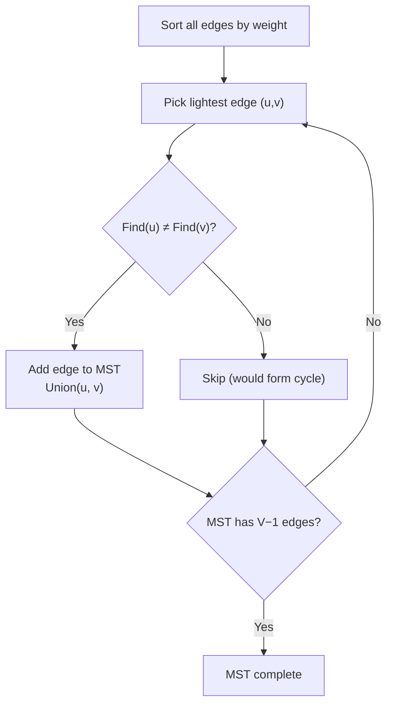

# Kruskal's Algorithm

> **One-line summary**: Kruskal's algorithm builds a Minimum Spanning Tree by sorting all edges by weight and greedily adding each edge that doesn't create a cycle, using a Union-Find structure for efficient cycle detection.

## 🎯 Intuition
**The Core Idea:** Consider edges from cheapest to most expensive; add each edge unless it would form a cycle.
**Analogy:** Building a road network on a budget — you have a sorted list of road projects by cost. Go down the list; build each road unless it connects two towns that are already reachable from each other.
**Why It Matters:** Kruskal's is often the simplest MST algorithm to implement and is highly efficient for sparse graphs where E is close to V.

---

## ⚙️ Core Mechanics
### Algorithm Steps
1. Sort all edges by weight in non-decreasing order.
2. Initialize a Union-Find (disjoint set) structure with each vertex in its own set.
3. For each edge (u, v) in sorted order:
   a. If Find(u) ≠ Find(v) (u and v are in different components):
      - Add (u, v) to the MST.
      - Union(u, v).
   b. Stop early if MST has V − 1 edges.
4. Return the MST edges.

**Figure:** Kruskal's — sort edges, add if no cycle (Union-Find)




### Pseudocode
```
function Kruskal(V, edges):
    sort edges by weight
    uf = UnionFind(V)
    mst = []
    for each (w, u, v) in edges:
        if uf.find(u) != uf.find(v):
            mst.append((u, v, w))
            uf.union(u, v)
            if len(mst) == V - 1:
                break
    return mst
```

### Complexity

| Case | Time | Space |
|------|------|-------|
| Best | $O(E \log E)$ | $O(V + E)$ |
| Average | $O(E \log E)$ | $O(V + E)$ |
| Worst | $O(E \log E)$ | $O(V + E)$ |

- Sorting takes $O(E \log E)$. Since E ≤ V², log E = $O(\log V)$, so this is also $O(E \log V)$.
- Union-Find operations: $O(E · α(V)$) ≈ $O(E)$ with path compression and union by rank.

### Key Facts
- Kruskal's is **edge-centric** — it processes edges globally, unlike Prim's which grows from a single vertex.
- The Union-Find data structure is the key enabler; without it, cycle detection would be expensive.
- Kruskal's naturally produces a **minimum spanning forest** for disconnected graphs.
- With pre-sorted edges, the algorithm is nearly linear.

---

## 🔬 Deep Dive
### Correctness Proof
Kruskal's correctness follows from the **cut property**:
- At each step, the algorithm considers the lightest remaining edge (u, v).
- If u and v are in different components, then the cut separating these components has (u, v) as its lightest crossing edge.
- By the cut property, this edge belongs to some MST.
- Therefore, adding it is safe, and by induction the final result is an MST.

### Edge Cases and Pitfalls
- **Disconnected graph:** Algorithm terminates with fewer than V − 1 edges. The result is a minimum spanning forest, not a tree. Check if `len(mst) == V - 1` to verify connectivity.
- **Duplicate edge weights:** The algorithm still works correctly; it may produce a different MST than Prim's, but with the same total weight.
- **Self-loops:** A self-loop always has Find(u) == Find(u), so it's automatically skipped.
- **Parallel edges:** Only the lightest parallel edge matters; preprocessing can remove duplicates, but the algorithm handles them naturally.

### Comparison with Alternatives
- **Prim's algorithm:** Better for dense graphs ($O(E + V \log V)$ with Fibonacci heap). Kruskal's is simpler and often preferred for sparse graphs.
- **Borůvka's algorithm:** Naturally parallelizable; each component independently picks its cheapest outgoing edge. $O(E \log V)$ time.
- **In practice:** If edges arrive pre-sorted or can be sorted externally, Kruskal's is very efficient for massive graphs.

### Real-World Usage
- **Network design** — laying out minimum-cost fiber optic networks.
- **Clustering** — remove the k−1 heaviest MST edges to form k clusters (single-linkage clustering).
- **Maze generation** — treating grid cells as vertices and walls as edges; Kruskal's variant creates a random spanning tree (random maze).
- **Approximate TSP** — MST-based 2-approximation for metric TSP starts with Kruskal's or Prim's.

---

## 🏋️ Practice
### Warm-Up (5 min)
1. Trace Kruskal's algorithm on a graph with vertices {A,B,C,D} and edges {(A-B,1), (B-C,4), (A-C,3), (C-D,2), (B-D,5)}. List edges added in order.
2. What data structure makes cycle detection efficient in Kruskal's?
3. What happens if the input graph is disconnected?

### Core Problems
1. **LeetCode 1584 — Min Cost to Connect All Points**: Given n points, connect them all with minimum total Manhattan distance. *Approach:* Build a complete graph with Manhattan distances, then apply Kruskal's (or Prim's for efficiency since E = $O(V²)$).
2. **Implement Kruskal's with Union-Find**: Write a full implementation including Union-Find with path compression and union by rank. Test on a sample graph.

### Challenge
- **Kruskal's on 10⁶ edges**: Implement Kruskal's for a graph with 10⁶ edges and benchmark it. Compare with Prim's using a binary heap. At what edge density does Prim's become faster?

---

*See also:* [[Minimum Spanning Trees]] · [[Prim's Algorithm]] · [[BFS and DFS]] | **CS Data Structures:** [[CS Data Structures/Advanced Structures/Disjoint Sets and Union-Find|Union-Find (Disjoint Sets)]] · [[CS Algorithms/Sorting/Sorting Overview|Sorting Algorithms]]

## References
-> [[CS Algorithms/Sources/Sources Index|Sources Index]]
