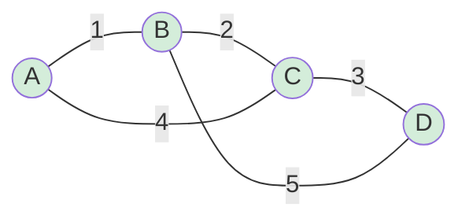

# Minimum Spanning Trees

> **One-line summary**: A Minimum Spanning Tree (MST) is a subset of edges in a weighted, connected, undirected graph that connects all vertices with the minimum total edge weight and no cycles.

## 🎯 Intuition
**The Core Idea:** Connect every node in a network using the cheapest possible set of links, without forming any loops.
**Analogy:** A city planner laying roads between towns wants to connect all towns with the least total road length — no redundant roads (cycles), just one path between any two towns.
**Why It Matters:** MSTs appear in network design, clustering, approximation algorithms for NP-hard problems (like metric TSP), and image segmentation.

---

## ⚙️ Core Mechanics
### Two Key Properties
1. **Cut Property:** For any cut of the graph, the minimum-weight edge crossing the cut belongs to some MST.
2. **Cycle Property:** For any cycle in the graph, the maximum-weight edge in the cycle does NOT belong to any MST (assuming unique weights).

### Two Classic Algorithms
- **Kruskal's:** Sort edges globally by weight, add them greedily (skip if it creates a cycle). Uses Union-Find. → [[Kruskal's Algorithm]]
- **Prim's:** Grow a tree from one vertex, always adding the cheapest edge connecting the tree to a non-tree vertex. Uses a priority queue. → [[Prim's Algorithm]]

### Generic MST Pseudocode
```
function GenericMST(G):
    A = ∅  // will become the MST edge set
    while A does not form a spanning tree:
        find a safe edge (u,v) for A
        A = A ∪ {(u,v)}
    return A
```
A "safe edge" is one whose addition to A maintains the invariant that A is a subset of some MST.

**Figure:** MST connects all vertices with minimum total weight




### Complexity

| Algorithm | Time | Space |
|-----------|------|-------|
| Kruskal's | $O(E \log E)$ | $O(V)$ for Union-Find |
| Prim's (binary heap) | $O(E \log V)$ | $O(V)$ |
| Prim's (Fibonacci heap) | $O(E + V \log V)$ | $O(V)$ |

### Key Facts
- An MST has exactly V − 1 edges.
- If all edge weights are distinct, the MST is unique.
- The MST is a subgraph of the Delaunay triangulation (useful in computational geometry).
- Borůvka's algorithm is another MST algorithm with $O(E \log V)$ time, well-suited for parallel computation.

---

## 🔬 Deep Dive
### Proof of the Cut Property
Let (S, V−S) be any cut. Let e = (u,v) be the minimum-weight edge crossing the cut. Suppose MST T does not contain e. Adding e to T creates a cycle that must cross the cut at least once more via some edge e'. Since w(e) ≤ w(e'), replacing e' with e gives a spanning tree of equal or lesser weight. Therefore e belongs to some MST.

### Edge Cases and Pitfalls
- **Disconnected graphs:** No spanning tree exists; algorithms should detect this (return a minimum spanning forest instead).
- **Equal-weight edges:** Multiple MSTs may exist; algorithms return one valid MST but not necessarily the same one.
- **Negative edge weights:** MST algorithms work fine with negative weights (unlike shortest-path algorithms which can struggle).
- **Self-loops and parallel edges:** Self-loops never belong to an MST; for parallel edges, only the lightest one between two vertices matters.

### Comparison with Alternatives
- **Shortest Path Tree (Dijkstra):** Minimizes distance from a root to all vertices — different objective from MST.
- **Steiner Tree:** Connects a subset of vertices with minimum weight — NP-hard in general.
- **Minimum Bottleneck Spanning Tree:** Minimizes the maximum-weight edge — the MST is always a valid MBST.

### Real-World Usage
- **Network infrastructure** — designing telephone, electrical, or computer networks with minimum cable length.
- **Cluster analysis** — single-linkage clustering removes the longest MST edges to form clusters.
- **Approximation algorithms** — MST provides a 2-approximation for the metric Travelling Salesman Problem.
- **Image segmentation** — Felzenszwalb's algorithm uses a variant of MST for efficient segmentation.

---

## 🏋️ Practice
### Warm-Up (5 min)
1. How many edges does an MST of a graph with 10 vertices have?
2. If all edge weights are distinct, how many MSTs does the graph have?
3. Can an MST contain the heaviest edge in the graph? Under what conditions?

### Core Problems
1. **Build an MST**: Given a weighted graph, implement both Kruskal's and Prim's algorithms and verify they produce the same total weight.
2. **LeetCode 1135 — Connecting Cities With Minimum Cost**: Classic MST problem. *Approach:* Kruskal's with Union-Find.

### Challenge
- **Second-Best MST**: Given a graph, find the MST and then the second-minimum spanning tree (differs by exactly one edge swap). Implement in $O(V² + E)$ time using path queries on the MST.

---

*See also:* [[Kruskal's Algorithm]] · [[Prim's Algorithm]] · [[BFS and DFS]] · [[Network Flow — Ford-Fulkerson]] | **CS Data Structures:** [[Union-Find (Disjoint Sets)]] · [[Priority Queues and Heaps]]

## References
-> [[Sources Index]]
