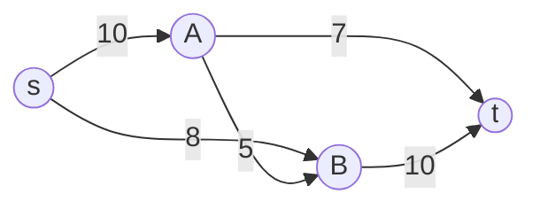

# Network Flow — Ford-Fulkerson

> **One-line summary**: The Ford-Fulkerson method computes the maximum flow in a flow network by repeatedly finding augmenting paths from source to sink in the residual graph and pushing flow along them until no more paths exist.

## 🎯 Intuition
**The Core Idea:** Keep finding routes from source to sink that can carry more flow, and push as much as possible through each route, until no more routes exist.
**Analogy:** Imagine a system of water pipes from a reservoir (source) to a city (sink). Each pipe has a capacity. You keep finding new pipe paths that have spare capacity and pumping more water through them until every possible route is saturated.
**Why It Matters:** Maximum flow models a wide range of problems: bipartite matching, edge-disjoint paths, minimum cut, project selection, airline scheduling, and network bandwidth optimization.

---

## ⚙️ Core Mechanics
### Key Definitions
- **Flow network:** Directed graph with source s, sink t, and capacity c(u,v) on each edge.
- **Flow:** Assignment f(u,v) to each edge satisfying capacity constraints (0 ≤ f ≤ c) and flow conservation (flow in = flow out at every non-source, non-sink vertex).
- **Residual graph:** For each edge (u,v) with flow f, create a forward edge with residual capacity c−f and a backward edge (v,u) with capacity f (allowing flow cancellation).
- **Augmenting path:** A path from s to t in the residual graph.

### Algorithm Steps
1. Initialize flow f(u,v) = 0 for all edges.
2. Build the residual graph.
3. While there exists an augmenting path P from s to t in the residual graph:
   a. Find the bottleneck: min residual capacity along P.
   b. Augment: increase flow along forward edges by bottleneck, decrease along backward edges.
   c. Update the residual graph.
4. Return the total flow out of s (= total flow into t).

**Figure:** Flow network with source s, sink t, and edge capacities




### Pseudocode
```
function FordFulkerson(graph, s, t):
    flow = 0
    residual = buildResidualGraph(graph)
    while path P = findAugmentingPath(residual, s, t):
        bottleneck = min(residual_capacity(e) for e in P)
        for each edge (u,v) in P:
            residual[u][v] -= bottleneck
            residual[v][u] += bottleneck
        flow += bottleneck
    return flow
```

### Complexity

| Variant | Time | Notes |
|---------|------|-------|
| Ford-Fulkerson (DFS) | $O(E × max_flow)$ | Not polynomial; depends on capacity values |
| Edmonds-Karp (BFS) | $O(V × E²)$ | Polynomial; uses BFS for shortest augmenting path |
| Dinic's | $O(V² × E)$ | Faster; uses level graphs and blocking flows |

Space: $O(V + E)$ for the residual graph.

### Key Facts
- **Max-flow Min-cut Theorem:** The maximum flow equals the minimum cut capacity (sum of capacities of edges crossing the cut).
- Ford-Fulkerson is a **method**, not a specific algorithm — the choice of how to find augmenting paths determines the variant.
- Using BFS (Edmonds-Karp) guarantees polynomial time regardless of capacity values.
- With irrational capacities, plain DFS Ford-Fulkerson may not terminate.

---

## 🔬 Deep Dive
### Max-Flow Min-Cut Theorem
**Statement:** In any flow network, the value of the maximum flow equals the capacity of the minimum s-t cut.

**Proof sketch:**
1. For any flow f and any cut (S, T), the flow value ≤ capacity of the cut.
2. When Ford-Fulkerson terminates, no augmenting path exists in the residual graph.
3. Define S = vertices reachable from s in the final residual graph, T = V − S.
4. Every edge from S to T is saturated (f = c), and every edge from T to S has zero flow.
5. Therefore flow value = capacity of cut (S, T), which is a minimum cut.

### Edge Cases and Pitfalls
- **Integer vs real capacities:** With integers, Ford-Fulkerson (DFS) terminates in $O(E × f*)$ where f* is the max flow. With real or irrational capacities, it may loop forever — always use Edmonds-Karp or Dinic's.
- **Anti-parallel edges:** If the graph has edges in both directions between u and v, add a dummy vertex to eliminate them.
- **Multiple sources/sinks:** Add a super-source connected to all sources (capacity ∞) and a super-sink connected to all sinks (capacity ∞).
- **The bottleneck trap:** A bad DFS path selection can increment flow by 1 each iteration, making the algorithm run max_flow times (exponential in the input length if capacities are large).

### Comparison with Alternatives
- **Edmonds-Karp:** Safe default — BFS guarantees $O(VE²)$, easy to implement.
- **Dinic's algorithm:** Faster in practice, $O(V²E)$; for unit-capacity graphs, $O(E√V)$.
- **Push-Relabel (Goldberg-Tarjan):** $O(V²E)$ or $O(V³)$; often fastest in practice for dense graphs.
- **Hungarian algorithm:** For bipartite matching specifically, $O(V³)$.
- **LP solvers:** Max flow is a special case of linear programming, but specialized algorithms are much faster.

### Real-World Usage
- **Bipartite matching** — job assignments, student-course matching.
- **Network routing** — maximizing data throughput between two nodes.
- **Image segmentation** — graph cuts for foreground/background separation.
- **Baseball elimination** — determining if a team is mathematically eliminated from playoff contention.
- **Airline scheduling** — assigning aircraft to flight segments with crew constraints.

---

## 🏋️ Practice
### Warm-Up (5 min)
1. Define the residual graph for a network with edge (u,v) of capacity 10 and current flow 7.
2. State the Max-Flow Min-Cut Theorem in one sentence.
3. Why does DFS-based Ford-Fulkerson fail on graphs with irrational capacities?

### Core Problems
1. **Implement Edmonds-Karp**: Build a full implementation using BFS for augmenting paths. Test on a sample network and verify the max flow equals the min cut.
2. **LeetCode — Maximum Bipartite Matching**: Model as a max-flow problem. Add source/sink, run Edmonds-Karp, and interpret the flow as a matching.

### Challenge
- **Project Selection Problem**: Given projects with profits (positive or negative) and dependency constraints, maximize profit. Model as a min-cut problem: source = do project, sink = skip project. Implement and prove the reduction.

---

*See also:* [[BFS and DFS]] · [[Minimum Spanning Trees]] · [[Dijkstra's Algorithm]] | **CS Data Structures:** [[Queues]] · [[Adjacency List vs Matrix]]

## References
-> [[Sources Index]]
