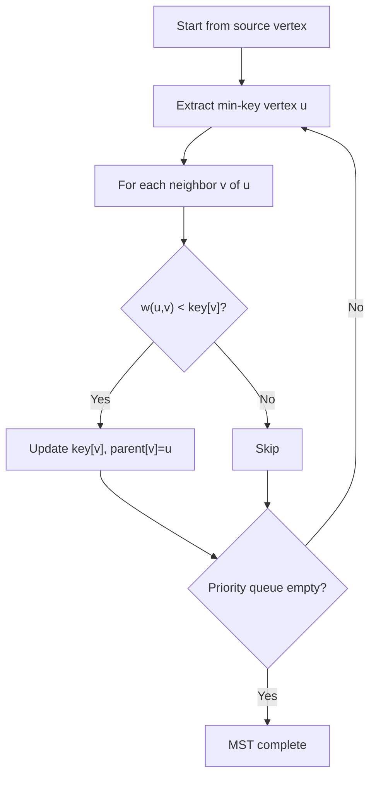

# Prim's Algorithm

> **One-line summary**: Prim's algorithm grows a Minimum Spanning Tree from a single source vertex by repeatedly adding the cheapest edge that connects the growing tree to a vertex not yet in the tree.

## 🎯 Intuition
**The Core Idea:** Start from any vertex and keep extending your tree by the cheapest available bridge to an unconnected vertex.
**Analogy:** You're building a neighborhood one house at a time. Starting from your house, you always run a power cable to the nearest un-powered neighbor — never to one that's already on the grid.
**Why It Matters:** Prim's is often faster than Kruskal's on dense graphs and is conceptually similar to Dijkstra's algorithm, making it a natural companion in graph-algorithm study.

---

## ⚙️ Core Mechanics
### Algorithm Steps
1. Initialize a priority queue (min-heap) with the source vertex (key = 0). All other vertices have key = ∞.
2. While the priority queue is not empty:
   a. Extract the vertex u with the minimum key.
   b. For each neighbor v of u with edge weight w(u,v):
      - If v is still in the queue and w(u,v) < key[v]:
        - key[v] = w(u,v)
        - parent[v] = u
        - Decrease-key in the priority queue.
3. The MST edges are {(v, parent[v]) for all v ≠ source}.

**Figure:** Prim's — grow MST by cheapest crossing edge




### Pseudocode
```
function Prim(graph, source):
    key[source] = 0
    for each v ≠ source: key[v] = ∞
    parent = {}
    pq = MinHeap(all vertices with keys)
    inMST = set()
    while pq is not empty:
        u = pq.extractMin()
        inMST.add(u)
        for each (v, w) in adj[u]:
            if v not in inMST and w < key[v]:
                key[v] = w
                parent[v] = u
                pq.decreaseKey(v, w)
    return parent
```

### Complexity

| Heap Type | Time | Space |
|-----------|------|-------|
| Binary heap | $O(E \log V)$ | $O(V)$ |
| Fibonacci heap | $O(E + V \log V)$ | $O(V)$ |
| Adjacency matrix (no heap) | $O(V²)$ | $O(V)$ |

### Key Facts
- Prim's is **vertex-centric** — it grows a single tree, unlike Kruskal's which merges forests.
- The adjacency-matrix version ($O(V²)$) is optimal for **dense graphs** where E ≈ V².
- Prim's algorithm is essentially Dijkstra's algorithm with a different key update: MST uses edge weight, Dijkstra uses path distance.
- Starting vertex doesn't matter — any vertex produces the same MST (assuming unique weights).

---

## 🔬 Deep Dive
### Correctness Proof
At each step, the algorithm maintains a cut (S, V−S) where S = vertices already in the MST. The edge added is the minimum-weight edge crossing this cut. By the **cut property**, this edge belongs to some MST. By induction, the full result is an MST.

### Edge Cases and Pitfalls
- **Disconnected graphs:** Prim's only spans the component containing the source. To get a minimum spanning forest, run Prim's from each unvisited vertex.
- **Equal-weight edges:** May produce a different MST than Kruskal's, but with the same total weight.
- **Decrease-key not supported:** If using a simple binary heap that doesn't support decrease-key, use "lazy" deletion: insert duplicates and skip already-processed vertices when extracting. This changes complexity to $O(E \log E)$ but is simpler to implement.
- **Negative edges:** Work fine — Prim's handles negative weights correctly (unlike Dijkstra for shortest paths).

### Comparison with Alternatives
- **Kruskal's:** Better for sparse graphs; doesn't need a priority queue, just sorting + Union-Find. Prim's is better for dense graphs.
- **Borůvka's:** Best for parallel implementations; each iteration halves the number of components.
- **In practice:** For most implementations using standard binary heaps, Kruskal's and Prim's have similar performance; choose based on ease of implementation and graph density.

### Real-World Usage
- **Network planning** — telephone, water, or electrical network layout.
- **Real-time MST updates** — Prim's is easier to adapt for online/incremental MST construction.
- **VLSI circuit design** — connecting circuit components with minimum wire length.
- **Cluster analysis** — Prim's can compute single-linkage clustering by building the MST and cutting.

---

## 🏋️ Practice
### Warm-Up (5 min)
1. Trace Prim's starting from vertex A on graph {A-B:4, A-C:1, B-C:2, B-D:5, C-D:3}. List edges added in order.
2. Why does the starting vertex not affect the MST result (for unique weights)?
3. How does Prim's key update differ from Dijkstra's?

### Core Problems
1. **LeetCode 1584 — Min Cost to Connect All Points**: Same problem as Kruskal's practice, but implement with Prim's using a binary heap. Compare the running time for dense inputs.
2. **Implement Prim's with lazy deletion**: Use a standard min-heap (no decrease-key). Insert (weight, vertex) pairs; when extracting, skip if the vertex is already in the MST.

### Challenge
- **Dynamic MST**: Given an MST, an edge is added to the graph. Efficiently update the MST without recomputing from scratch. *Hint:* Adding the edge creates a cycle in the MST; remove the heaviest edge in that cycle.

---

*See also:* [[Minimum Spanning Trees]] · [[Kruskal's Algorithm]] · [[BFS and DFS]] · [[Dijkstra's Algorithm]] | **CS Data Structures:** [[Priority Queues and Heaps]] · [[Adjacency List and Adjacency Matrix|Adjacency List vs Matrix]]

## References
-> [[Sources Index]]
