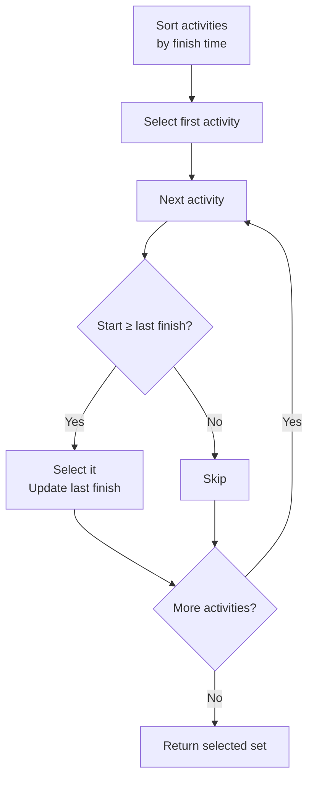

# Activity Selection Problem

> **One-line summary**: Select the maximum number of non-overlapping activities from a set with given start and finish times by always choosing the activity that finishes earliest.

## 🎯 Intuition
**The Core Idea:** Picking the activity that ends soonest leaves the most room for future activities.
**Analogy:** You have one meeting room for the day — to fit the most meetings, always book the one that wraps up first so the room opens up as early as possible.
**Why It Matters:** Activity selection is the textbook introduction to greedy correctness proofs and appears in scheduling, resource allocation, and interval-graph problems.

---

## ⚙️ Core Mechanics
### Algorithm Steps
1. Sort all activities by their finish time in non-decreasing order.
2. Select the first activity (earliest finish).
3. For each subsequent activity, if its start time ≥ the finish time of the last selected activity, select it.
4. Return the selected set.

**Figure:** Greedy activity selection — pick earliest finish, repeat




### Pseudocode
```
function ActivitySelection(activities):
    sort activities by finish time
    selected = [activities[0]]
    last_finish = activities[0].finish
    for i = 1 to n-1:
        if activities[i].start >= last_finish:
            selected.append(activities[i])
            last_finish = activities[i].finish
    return selected
```

### Complexity

| Case | Time | Space |
|------|------|-------|
| Best | $O(n \log n)$ | $O(1)$ |
| Average | $O(n \log n)$ | $O(1)$ |
| Worst | $O(n \log n)$ | $O(n)$ |

Time is dominated by sorting; the selection pass is $O(n)$. Space is $O(1)$ extra if sorting is in-place, $O(n)$ for the output list.

### Key Facts
- This is the canonical example used to introduce greedy algorithms in CLRS.
- If activities are already sorted by finish time, the algorithm runs in $O(n)$.
- The problem is equivalent to finding a maximum independent set on an interval graph.

---

## 🔬 Deep Dive
### Correctness Proof (Exchange Argument)
**Claim:** The greedy choice (earliest finish time) is always part of some optimal solution.

1. Let A = {a₁, a₂, …, aₖ} be an optimal solution sorted by finish time.
2. Let g be the greedy choice (earliest-finishing activity overall).
3. If a₁ = g, done. Otherwise, a₁.finish ≥ g.finish (since g finishes earliest).
4. Replace a₁ with g in A. Since g.finish ≤ a₁.finish, g is compatible with a₂, …, aₖ.
5. The new set A' has the same size as A and is still valid, so it is also optimal.
6. By induction on the remaining sub-problem, the greedy algorithm is optimal.

### Edge Cases and Pitfalls
- **Equal finish times:** Activities finishing at the same time need a consistent tie-breaker (e.g., by start time) to avoid selecting overlapping activities.
- **Activities with zero duration:** An activity where start = finish should still be handled; compatibility check uses ≥ (not >).
- **Sorting by start time instead of finish time does NOT work** — classic mistake. Counter-example: one long activity starting earliest can block many shorter ones.

### Comparison with Alternatives
- **Weighted Activity Selection** requires DP (each activity has a profit; maximize total profit). See [[CS Algorithms/Analysis/Dynamic Programming|Dynamic Programming Overview]].
- **Interval Scheduling Maximization** is the same problem; **Interval Partitioning** (minimum rooms) is a different problem (solved by a different greedy or priority queue approach).
- **Brute force** checks all 2ⁿ subsets — exponential.

### Real-World Usage
- **Conference room scheduling** — maximizing room utilization.
- **Television broadcast scheduling** — fitting the most shows into a time slot.
- **Job scheduling in OS** — non-preemptive scheduling to maximize throughput.
- **Bandwidth allocation** — assigning non-overlapping time slots on a shared channel.

---

## 🏋️ Practice
### Warm-Up (5 min)
1. Given activities {(1,4), (3,5), (0,6), (5,7), (3,9), (5,9), (6,10), (8,11), (8,12), (2,14), (12,16)}, which does the greedy algorithm select?
2. Why does sorting by start time fail? Construct a 3-activity counter-example.
3. What is the relationship between Activity Selection and maximum independent set on interval graphs?

### Core Problems
1. **LeetCode 435 — Non-overlapping Intervals**: Given intervals, find the minimum number of intervals to remove so the rest don't overlap. *Approach:* This is Activity Selection in disguise — max non-overlapping = n − (min removals).
2. **LeetCode 452 — Minimum Number of Arrows to Burst Balloons**: Overlapping interval merging variant. Sort by end, greedily shoot.

### Challenge
- **Weighted Job Scheduling**: Each activity has a profit. Maximize total profit of non-overlapping activities. Prove that greedy fails and implement an $O(n \log n)$ DP solution. Compare its structure to the unweighted greedy approach.

---

*See also:* [[Greedy Algorithms Overview]] · [[Fractional Knapsack]] · [[CS Algorithms/Analysis/Dynamic Programming|Dynamic Programming Overview]] | **CS Data Structures:** [[Priority Queues and Heaps]] · [[CS Data Structures/Advanced Structures/Interval Trees and Range Trees|Interval Trees]]

## References
-> [[CS Algorithms/Sources/Sources Index|Sources Index]]
