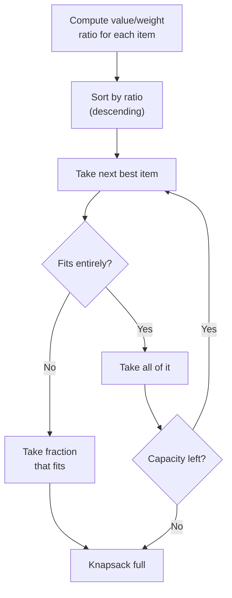

# Fractional Knapsack

> **One-line summary**: Maximize the total value in a weight-limited knapsack by greedily taking items in decreasing order of value-to-weight ratio, splitting the last item if needed.

## 🎯 Intuition
**The Core Idea:** Always grab the "best bang for the buck" first — the item with the highest value per unit weight.
**Analogy:** You're filling a truck with gold dust, silver dust, and iron dust. You start scooping gold (most valuable per kg), then silver, and only add iron if there's leftover capacity — and you can take a partial scoop.
**Why It Matters:** Fractional Knapsack demonstrates why divisibility changes the problem's nature: unlike 0/1 Knapsack (which requires DP), fractional items allow a simple greedy solution.

---

## ⚙️ Core Mechanics
### Algorithm Steps
1. Compute the value-to-weight ratio vᵢ/wᵢ for each item.
2. Sort items by ratio in decreasing order.
3. Initialize remaining capacity = W.
4. For each item (in sorted order):
   - If the item fits entirely (wᵢ ≤ remaining), take all of it. Add vᵢ to profit, subtract wᵢ from remaining.
   - Otherwise, take the fraction that fits: add (remaining / wᵢ) × vᵢ to profit, set remaining = 0, and stop.
5. Return total profit.

**Figure:** Fractional Knapsack — take items by best ratio first




### Pseudocode
```
function FractionalKnapsack(items, W):
    for each item i: i.ratio = i.value / i.weight
    sort items by ratio descending
    totalValue = 0
    remaining = W
    for each item i in sorted order:
        if remaining == 0: break
        take = min(i.weight, remaining)
        totalValue += take * i.ratio
        remaining -= take
    return totalValue
```

### Complexity

| Case | Time | Space |
|------|------|-------|
| Best | $O(n \log n)$ | $O(1)$ |
| Average | $O(n \log n)$ | $O(1)$ |
| Worst | $O(n \log n)$ | $O(n)$ |

Sorting dominates. The greedy pass is $O(n)$. Space depends on sorting algorithm.

### Key Facts
- Achieves the provably optimal solution — no DP needed.
- Only at most one item is fractionally taken.
- The algorithm naturally handles items heavier than W (just take the fraction that fits).
- If all items fit, the answer is simply the sum of all values.

---

## 🔬 Deep Dive
### Correctness Proof
**Greedy-choice property:** Let item x have the highest ratio. In any optimal solution that doesn't include as much of x as possible, we can replace some lower-ratio item fraction with x-fraction, increasing (or maintaining) total value. Therefore taking max of x first is safe.

**Optimal substructure:** After choosing how much of x to take, the remaining problem is a smaller Fractional Knapsack (fewer items or reduced capacity), which also has optimal substructure.

### Edge Cases and Pitfalls
- **Zero-weight items with positive value** — ratio is infinity; take them all first (free value). Handle division by zero.
- **All items heavier than W** — the algorithm still works; it just takes a fraction of the best-ratio item.
- **Floating-point precision** — ratios may cause rounding issues when items have similar ratios; use exact arithmetic or rational numbers in contests.
- **Confusing with 0/1 Knapsack** — the greedy approach does NOT work for 0/1 Knapsack. Classic pitfall.

### Comparison with Alternatives
- **0/1 Knapsack** — items cannot be split; requires DP in $O(nW)$ pseudo-polynomial time.
- **Bounded Knapsack** — limited copies of each item; also DP-based.
- **Linear Programming relaxation** — Fractional Knapsack is equivalent to the LP relaxation of 0/1 Knapsack, so its value is an upper bound for 0/1.

### Real-World Usage
- **Resource allocation** — distributing limited bandwidth among tasks proportionally.
- **Portfolio optimization** — investing budget fractions across assets by return/risk ratio.
- **Cargo loading** — filling shipping containers with divisible goods (bulk materials).
- **LP relaxation bounds** — used inside branch-and-bound solvers for the 0/1 Knapsack.

---

## 🏋️ Practice
### Warm-Up (5 min)
1. Items: {(60,10), (100,20), (120,30)}, W=50. Compute the greedy solution step by step.
2. Why can't you use this greedy approach for 0/1 Knapsack? Give a counter-example.
3. What is the maximum number of items that can be fractionally taken?

### Core Problems
1. **Classic Fractional Knapsack** — Implement the algorithm and test on the example above. Verify output = 240.
2. **GFG — Fractional Knapsack** — Standard judge problem. *Approach:* sort by ratio, iterate greedily.

### Challenge
- **LP Relaxation Bound:** Given a 0/1 Knapsack instance, solve the Fractional version and show that its value upper-bounds the 0/1 optimal. Use this bound inside a branch-and-bound solver to prune the search space.

---

*See also:* [[Greedy Algorithms Overview]] · [[Activity Selection Problem]] · [[Dynamic Programming Overview]] | **CS Data Structures:** [[Arrays]] · [[Sorted Arrays]]

## References
-> [[Sources Index]]
