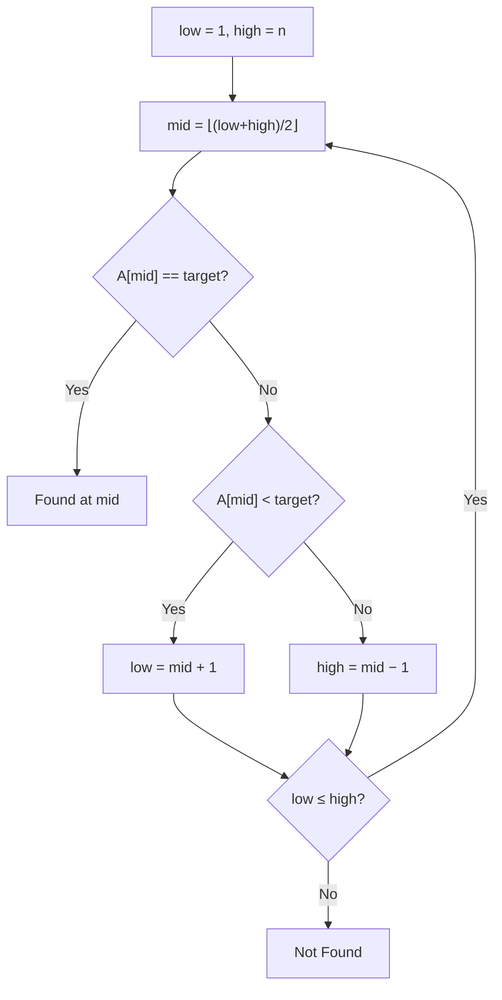

---
tags:
  - csa
  - csa/searching
confidence: verified
up: '[[Sorting Overview]]'
tier-coverage: [intuition, core, deep-dive, practice]
---
# Binary Search

> **One-line summary**: Binary search finds a target value in a sorted array by repeatedly halving the search space, running in $O(\lg n)$ worst case.

## 🎯 Intuition
**The Core Idea:** Eliminate half the remaining candidates with each comparison.
**Analogy:** A number-guessing game with "higher/lower" feedback — each answer cuts the possibilities in half, so you find any number from 1 to 1,000,000 in at most 20 guesses.
**Why It Matters:** Binary search is the foundation of efficient lookup in sorted data, database indexing, and the simplest divide-and-conquer algorithm — understanding it unlocks the pattern behind merge sort, quicksort, and binary search trees.

---

## ⚙️ Core Mechanics
### How It Works / Formal Definition

```
BINARY-SEARCH(A, n, target):
  low = 1
  high = n

  while low ≤ high:
    mid = floor((low + high) / 2)
    if A[mid] == target:
      return mid          // found
    else if A[mid] < target:
      low = mid + 1       // target in right half
    else:
      high = mid - 1      // target in left half

  return NOT-FOUND
```

### Key Properties

| Property | Detail |
|----------|--------|
| **Prerequisite** | Array must be sorted |
| **Strategy** | Divide-and-conquer; halve search space each step |
| **Recurrence** | T(n) = T(n/2) + $\Theta(1)$ |
| **Comparison count** | At most ⌈lg(n+1)⌉ |

### Key Facts

| Case | Complexity |
|------|-----------|
| Best | $\Theta(1)$ — target at first midpoint |
| Worst | $O(\lg n)$ — target absent or at a leaf |
| Space | $O(1)$ |

**Figure:** Binary search — halve the search space each step




**Comparison: Linear vs Binary Search**

| Algorithm | Time | Space | Requirement |
|-----------|------|-------|-------------|
| Linear search | $\Theta(n)$ | $O(1)$ | Unsorted array |
| Binary search | $O(\lg n)$ | $O(1)$ | Sorted array |

For n = 10⁶, linear search averages 500,000 comparisons; binary search takes at most 20.

---

## 🔬 Deep Dive
### Proofs / Formal Arguments
**Correctness via Loop Invariant:**

**Invariant**: If target is in A, it lies within A[low..high].

- **Initialization**: A[1..n] — the full array.
- **Maintenance**: After each comparison, the half that cannot contain target is eliminated. If A[mid] < target, target must be in A[mid+1..high]; if A[mid] > target, in A[low..mid𢄡].
- **Termination**: Loop exits when low > high (target absent) or target is found. Invariant at termination guarantees correctness. □

**Lower bound**: By an information-theoretic argument (decision tree), any comparison-based search on a sorted array of n elements requires $\Omega(\lg n)$ comparisons in the worst case. Binary search matches this bound and is therefore optimal.

### Edge Cases and Pitfalls
- **Integer overflow**: `(low + high) / 2` can overflow in languages with fixed-width integers; use `low + (high - low) / 2` instead
- **Off-by-one errors**: the most common implementation bug — careful with `low ≤ high` vs `low < high` and `mid ± 1` updates
- **Unsorted input**: binary search on an unsorted array silently produces wrong results
- **Duplicate elements**: standard binary search finds *some* occurrence — use `lower_bound`/`upper_bound` variants for first/last occurrence

### Real-World Implications
- **Database indexing**: B-trees use binary search within nodes
- **Standard libraries**: `std::lower_bound` (C++), `Arrays.binarySearch` (Java), `bisect` (Python)
- **System design**: binary search on answer space (parametric search) solves many optimisation problems
- **Debugging**: `git bisect` uses binary search to find the commit that introduced a bug

---

## 🏋️ Practice
### Warm-Up (5 min)
1. Why does binary search require a sorted array? What happens if the array is unsorted?
2. How many comparisons does binary search need for an array of 1 billion elements?
3. What is the loop invariant for binary search, and why does it guarantee correctness?

### Core Problems
1. Implement a `lower_bound` function that returns the index of the first element ≥ target in a sorted array. Prove correctness with a loop invariant.
2. Given a sorted rotated array (e.g., [4,5,6,7,0,1,2]), find a target element in $O(\lg n)$.

### Challenge
1. You have a sorted array of n distinct integers. Find an index i such that A[i] = i (a "fixed point"), or report that none exists, in $O(\lg n)$ time. Prove your solution is correct.

---

*See also:* [[Sorting Overview]], [[Recurrence Relations]], [[Master Theorem]], [[Loop Invariant]], [[Comparison Sort Lower Bound]]

## Supporting Chunks

- [[Sorting - Binary search halves the search space each step for O(lg n) worst case]]
- [[Searching - Binary search requires Omega(lg n) comparisons in the worst case by an information-theoretic argument]]
- [[Analysis - Decision trees unify comparison lower bounds for sorting and for searching]]

## References

See [[CS Algorithms/Sources/Sources Index#Cormen 2013|Cormen 2013]], Chapter 3. See [[CS Algorithms/Sources/Sources Index#MIT OpenCourseWare 6.006|MIT OCW 6.006]], Lecture 3. See [[Sorting Overview]] for preparing sorted arrays. See [[Comparison Sort Lower Bound]] for the related decision-tree argument that unifies sorting and searching lower bounds.
