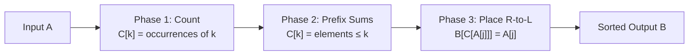

---
tags:
  - csa
  - csa/sorting
confidence: verified
freshness: stable
up: "[[Sorting Overview]]"
tier-coverage: [intuition, core, deep-dive, practice]
---
# Counting Sort

> **Non-comparison integer sort that achieves Θ(m+n) time by counting key occurrences and computing prefix sums.**

## 🎯 Intuition
**The Core Idea:** Count how many times each key value appears, then use cumulative counts to place every element directly into its final position.
**Analogy:** Pigeonhole-sorting mail — toss each letter into the bin labelled with its zip code, then collect the bins in order.
**Why It Matters:** When keys are integers in a small bounded range, counting sort beats the Ω(n lg n) comparison-sort lower bound and achieves linear time.

---

## ⚙️ Core Mechanics
### Algorithm Steps
1. Allocate a counting array C of size m (one slot per possible key value 0..m−1).
2. **Phase 1 — Count:** scan input A left-to-right, incrementing C[A[j]] for each element.
3. **Phase 2 — Prefix sums:** convert C so C[i] = number of elements ≤ i. Now C[i] gives the final index of the last element with key i.
4. **Phase 3 — Place:** scan A **right-to-left**, placing A[j] into output B at position C[A[j]], then decrement C[A[j]]. The right-to-left scan preserves stability.

**Figure:** Counting Sort — three phases




### Pseudocode
```
COUNTING-SORT(A, B, n, m):
  // A = input (length n), keys in [0..m-1]
  // B = output array
  // C = counting array (length m)

  initialise C[0..m-1] = 0

  // Phase 1: count occurrences
  for j = 1 to n:
    C[A[j]] = C[A[j]] + 1

  // Phase 2: prefix sums → final positions
  for i = 1 to m-1:
    C[i] = C[i] + C[i-1]

  // Phase 3: place elements (right-to-left for stability)
  for j = n downto 1:
    B[C[A[j]]] = A[j]
    C[A[j]] = C[A[j]] - 1
```

### Complexity Analysis

| Case | Time | Space |
|------|------|-------|
| All cases | Θ(m + n) | Θ(m + n) |
| When m = O(n) | Θ(n) | Θ(n) |

### Key Facts
- Not a comparison sort — bypasses the Ω(n lg n) lower bound by exploiting integer keys.
- Requires integer keys in a known bounded range 0..m−1.
- When m ≫ n (sparse keys), Θ(m + n) can be worse than Θ(n lg n).

---

## 🔬 Deep Dive
### Correctness Proof
**Stability argument:** Phase 3 scans right-to-left: the last occurrence of a key value in A is placed first at the rightmost available slot for that value, then the second-to-last occurrence fills the next-rightmost slot, and so on. Equal keys end up in the same left-to-right order as in the input — the definition of stability.

### Stability and Adaptivity
- **Stable:** Yes — the right-to-left placement pass preserves input order of equal keys.
- **Adaptive:** Not applicable — counting sort does not exploit pre-existing order; it always performs the same Θ(m + n) work.
- **In-place:** No — requires separate output array B and counting array C.

### Comparison with Other Sorts
| When to prefer counting sort | When to prefer alternatives |
|---|---|
| Keys are integers in a small range m = O(n) | Keys are not bounded integers → use comparison sort |
| Need guaranteed linear time | m ≫ n (sparse range) → Θ(m + n) exceeds Θ(n lg n) |
| Need a stable linear sort as a subroutine (e.g., for radix sort) | Need in-place sorting → use quicksort or heapsort |

### Real-World Usage
- **Radix sort subroutine:** [[Radix Sort]] calls counting sort once per digit. Radix sort's correctness depends entirely on counting sort's stability.
- **Histogram-based algorithms:** frequency-counting phase is identical to Phase 1 of counting sort (e.g., [[Huffman Coding]] counts symbol frequencies).
- **Suffix array construction:** some linear-time suffix-array algorithms use counting sort internally.

---

## 🏋️ Practice
### Warm-Up (5 min)
1. Trace COUNTING-SORT on A = [4, 1, 3, 4, 3] with m = 5. Show C after each phase and the final output B.
2. What happens if you scan left-to-right in Phase 3 instead of right-to-left? Which property breaks?
3. If keys range from 100 to 110, how would you adapt the algorithm?

### Core Problems
1. **Sort Colors (LeetCode 75):** Given an array with values 0, 1, 2 only, sort in-place. Implement using a counting-sort approach.
2. **Relative Sort Array (LeetCode 1122):** Sort one array according to the order defined by another array. Use counting sort for the known elements.

### Challenge
1. **Maximum Gap (LeetCode 164):** Given an unsorted array, find the maximum difference between successive elements in sorted form. Requires a pigeonhole / bucket argument related to counting sort's key-range reasoning. Target: O(n) time.

---

*See also:* [[Comparison Sort Lower Bound]] — counting sort bypasses Ω(n lg n) | [[Asymptotic Notation]] — Θ(m+n) multi-parameter analysis | [[Huffman Coding]] — shared frequency-counting step | **CS Data Structures:** [[Arrays and Dynamic Arrays]], [[Binary Heaps]]

## Supporting Chunks
- [[Sorting - Counting sort achieves linear time by exploiting bounded integer keys]]
- [[Sorting - Counting sort right-to-left pass preserves input order of equal keys ensuring stability]]

## References
See [[CS Algorithms/Sources/Sources Index#Cormen 2013|Sources Index]], Chapter 4. See [[CS Algorithms/Sources/Sources Index#CP Algorithms - Online Reference|Sources Index]], Counting Sort article. See [[Comparison Sort Lower Bound]] for why this bypasses Ω(n lg n).n)$.
