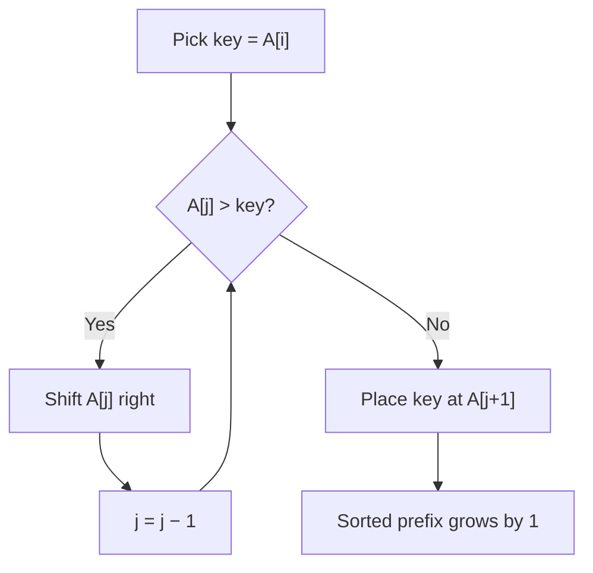

---
tags:
  - csa
  - csa/sorting
confidence: verified
up: "[[Sorting Overview]]"
tier-coverage: [intuition, core, deep-dive, practice]
---
# Insertion Sort

> **Builds a sorted prefix incrementally by shifting each element leftward into its correct position — optimal for small or nearly-sorted arrays.**

## 🎯 Intuition
**The Core Idea:** Pick up each element and slide it into the right spot among the already-sorted elements to its left.
**Analogy:** Sorting playing cards in your hand — you pick up a new card and insert it between the cards already arranged in order.
**Why It Matters:** Insertion sort is the go-to algorithm when arrays are small or nearly sorted, and is the base case in every production hybrid sort (Timsort, introsort).

---

## ⚙️ Core Mechanics
### Algorithm Steps
1. Start with the first element as a trivially sorted prefix of length 1.
2. For each subsequent element (index i = 2 to n):
   a. Save A[i] as the key.
   b. Scan leftward through the sorted prefix, shifting every element larger than key one position right.
   c. Place key into the vacated slot.
3. After processing element i, A[1..i] is sorted.

**Figure:** Insertion Sort — shifting key into sorted prefix




### Pseudocode
```
for i = 2 to n:
    key = A[i]
    j = i - 1
    while j > 0 and A[j] > key:
        A[j+1] = A[j]
        j = j - 1
    A[j+1] = key
```

### Complexity Analysis

| Case | Time | Explanation |
|------|------|-------------|
| Best | $\Theta(n)$ | Already sorted — inner loop never executes |
| Average | $\Theta(n²)$ | Expected inversions ≈ n(n−1)/4 |
| Worst | $\Theta(n²)$ | Reverse sorted — each element shifts past entire prefix |
| Space | $O(1)$ | In-place |

### Key Facts
- Running time = $\Theta(inversions + n)$. See [[Inversions]] for the formal treatment.
- A **k-sorted** array (each element ≤ k positions from final spot) has ≤ kn inversions → insertion sort runs in $O(kn)$.
- Exactly one element shift per inversion — no inversions are created, only resolved.

---

## 🔬 Deep Dive
### Correctness Proof
**Loop invariant:** At the start of iteration i, the subarray A[1..i−1] contains the original elements of A[1..i−1] in sorted order.
- **Initialisation:** Before i = 2, A[1..1] is trivially sorted. ✓
- **Maintenance:** The inner while-loop shifts elements right until the correct position for key is found. Placing key there extends the sorted prefix by one element. ✓
- **Termination:** When i = n + 1, the invariant states A[1..n] is sorted. ✓

### Stability and Adaptivity
- **Stable:** Yes — the inner loop uses strict comparison (A[j] > key, not ≥), so equal elements are never swapped past each other.
- **Adaptive:** Yes — fewer inversions → fewer comparisons and shifts. This is quantified exactly: total shifts = total inversions.
- **In-place:** Yes — $O(1)$ extra space.

### Comparison with Other Sorts

| Property | Insertion Sort | Selection Sort |
|---|---|---|
| Comparisons (sorted input) | $\Theta(n)$ | $\Theta(n²)$ |
| Comparisons (worst case) | $\Theta(n²)$ | $\Theta(n²)$ |
| Swaps (worst case) | $\Theta(n²)$ | n−1 |
| Stable | Yes | No |
| Adaptive | Yes | No |

### Real-World Usage
- **Timsort** (Python, Java): merges natural runs found via insertion sort on small subarrays (~32–64 elements).
- **Introsort** (C++ `std::sort`): switches from quicksort to insertion sort once subarrays fall below ~16 elements.
- **Binary insertion sort:** uses binary search to find the insertion point (reduces comparisons to $O(n \lg n)$ but shifts remain $O(n²)$).

---

## 🏋️ Practice
### Warm-Up (5 min)
1. Trace insertion sort on A = [5, 2, 4, 6, 1, 3]. Show the array state after each iteration of the outer loop.
2. How many inversions does [5, 2, 4, 6, 1, 3] have? Verify this equals the total number of shifts.
3. On a sorted array of 1000 elements, how many comparisons does insertion sort make?

### Core Problems
1. **Insertion Sort List (LeetCode 147):** Sort a singly linked list using insertion sort.
2. **Sort an Almost Sorted Array:** Given an array where each element is at most k positions from its sorted position, sort it in $O(nk)$ time using insertion sort (or $O(n \log k)$ with a heap).

### Challenge
1. **Count of Smaller Numbers After Self (LeetCode 315):** For each element, count how many smaller elements appear to its right. This is a generalised inversion-counting problem. Target: $O(n \log n)$ using merge sort or BIT.

---

*See also:* [[Inversions]] — formal inversion analysis | [[Selection Sort]] — non-adaptive alternative | [[Sorting and Searching - Review Drill]] | [[Foundations and Analysis - Review Drill]] | **CS Data Structures:** [[Arrays and Dynamic Arrays]], [[Binary Heaps]]

## Supporting Chunks
- [[Sorting - Insertion sort is optimal for small or nearly-sorted arrays]]
- [[Sorting - Insertion sort performs exactly one element shift per inversion in the input array]]
- [[Sorting - Insertion sort running time is bounded by the inversion count plus array size giving O(kn) for k-displaced arrays]]

## References
See [[CS Algorithms/Sources/Sources Index#Cormen 2013|Cormen 2013]]. Chapter 3. See [[CS Algorithms/Sources/Sources Index#Princeton Algorithms 4e|Princeton Algorithms 4e]]. Section 2.1. See [[Inversions]] for the formal inversion analysis. See [[Sorting Overview]] for the full comparison table. See [[Selection Sort]] for the non-adaptive alternative.
