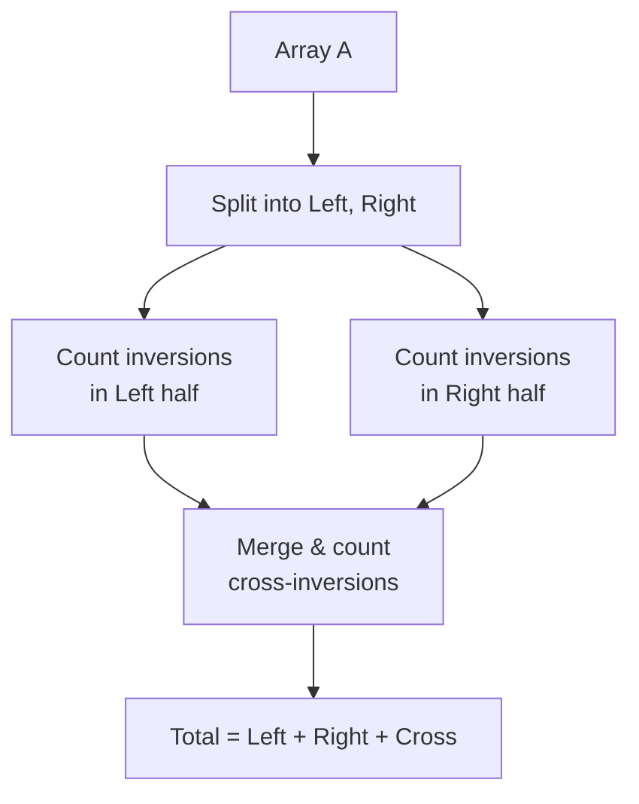

---
tags:
  - csa
  - csa/sorting
confidence: verified
freshness: stable
up: "[[Sorting Overview]]"
tier-coverage: [intuition, core, deep-dive, practice]
---
# Inversions

> **The canonical measure of how unsorted an array is — the count of out-of-order pairs directly determines insertion sort's running time.**

## 🎯 Intuition
**The Core Idea:** An inversion is a pair of elements that appear in the wrong order; the total count tells you exactly how far the array is from being sorted.
**Analogy:** People standing in a queue by height — every pair where a taller person stands in front of a shorter one is an inversion. Sorting means resolving every such pair.
**Why It Matters:** Inversion count is the bridge between "how sorted is this data?" and "how fast will insertion sort run?" — and it underpins the $\Omega(n + I)$ lower bound for adjacent-exchange algorithms.

---

## ⚙️ Core Mechanics
### Algorithm Steps
**Definition:** Given array A[1..n], an inversion is a pair (i, j) with i < j and A[i] > A[j].
```
inversions(A) = |{ (i, j) : i < j  and  A[i] > A[j] }|
```

**Counting inversions via merge sort ($\Theta(n \lg n)$):**
1. Recursively split the array in half.
2. Count inversions within the left half (recursive call).
3. Count inversions within the right half (recursive call).
4. Count **cross-inversions** during the merge step: when an element from the right half is placed before remaining elements in the left half, it forms inversions with all of those remaining left elements.
5. Total inversions = left + right + cross.

**Figure:** Counting inversions via modified merge sort




### Pseudocode
```
COUNT-INVERSIONS(A, p, r):
  if p >= r: return 0
  q = floor((p + r) / 2)
  left_inv  = COUNT-INVERSIONS(A, p, q)
  right_inv = COUNT-INVERSIONS(A, q+1, r)
  cross_inv = MERGE-AND-COUNT(A, p, q, r)
  return left_inv + right_inv + cross_inv

MERGE-AND-COUNT(A, p, q, r):
  // Standard merge, but each time an element from
  // the right half is chosen over remaining left elements,
  // add (number of remaining elements in L) to count.
  count = 0
  ... standard merge with:
    if R[j] < L[i]:
      count += (number of remaining elements in L)
  return count
```

### Complexity Analysis

| Method | Time | Space |
|--------|------|-------|
| Naive (check all pairs) | $O(n²)$ | $O(1)$ |
| Merge-sort based | $\Theta(n \lg n)$ | $O(n)$ |

### Key Facts

| Array state | Inversion count |
|-------------|----------------|
| Fully sorted | 0 |
| Reverse sorted | n(n−1)/2 (maximum possible) |
| Random permutation (expected) | n(n−1)/4 |
| k-sorted (each element ≤ k positions displaced) | ≤ kn |

---

## 🔬 Deep Dive
### Correctness Proof
**Merge-and-count correctness:** During the merge of two sorted halves L and R, whenever an element R[j] < L[i], R[j] is smaller than L[i] and all elements after L[i] (since L is sorted). Thus R[j] forms an inversion with each of those remaining left elements. Counting them all at once gives the exact cross-inversion count. By induction on recursion depth, the total count is correct.

### Stability and Adaptivity
- **Inversions as a sortedness metric:** 0 inversions ↔ completely sorted; n(n−1)/2 ↔ completely reversed.
- **Connection to insertion sort:** Insertion sort performs **exactly** `inversions(A)` element shifts. Each shift resolves exactly one inversion (the pair formed by the key and the element it passes). No inversions are created. Total shifts = total inversions. Therefore insertion sort runs in **$\Theta(n + inversions)$**.

### Comparison with Other Sorts
**Lower bound for adjacent-exchange algorithms:** Each adjacent swap changes the inversion count by exactly ±1. Therefore any algorithm that sorts solely by adjacent exchanges must perform ≥ I swaps on input with I inversions. Adding $\Omega(n)$ scanning overhead: **adjacent-exchange algorithms require $\Omega(n + I)$ time.** Insertion sort matches this bound exactly, making it **optimally adaptive** among adjacent-exchange sorts.

> **Scope note:** This $\Omega(n + I)$ bound applies only to adjacent-exchange algorithms. General comparison sorts (merge sort, quicksort, heapsort) can resolve many inversions with a single comparison. The general comparison-sort lower bound is the separate $\Omega(n \lg n)$ decision-tree argument. See [[Comparison Sort Lower Bound]].

### Real-World Usage
- **Kendall tau distance** in statistics measures rank correlation by counting inversions between two rankings.
- **Collaborative filtering:** inversion count quantifies disagreement between user preference orderings.
- **Genomics:** counting inversions in permutations detects chromosomal rearrangements.

---

## 🏋️ Practice
### Warm-Up (5 min)
1. List all inversions in A = [2, 4, 1, 3, 5]. Verify the count.
2. What is the maximum number of inversions in a 6-element array?
3. If an array has 3 inversions, what is the minimum number of adjacent swaps needed to sort it?

### Core Problems
1. **Count Inversions (CSES / classic):** Implement the merge-sort-based $\Theta(n \lg n)$ inversion-counting algorithm.
2. **Global and Local Inversions (LeetCode 775):** Determine whether every local inversion is also a global inversion.

### Challenge
1. **Count of Smaller Numbers After Self (LeetCode 315):** For each element, count smaller elements to its right. This is per-element inversion counting. Solve in $O(n \log n)$ using merge sort, BIT, or segment tree.

---

*See also:* [[Insertion Sort]] — performance directly governed by inversions | [[Comparison Sort Lower Bound]] — information-theoretic bound | [[Sorting and Searching - Review Drill]] | **CS Data Structures:** [[Arrays and Dynamic Arrays]], [[Binary Heaps]]

## Supporting Chunks
- [[Sorting - Insertion sort performs exactly one element shift per inversion in the input array]]
- [[Sorting - Insertion sort running time is bounded by the inversion count plus array size giving O(kn) for k-displaced arrays]]

## References
See [[CS Algorithms/Sources/Sources Index#Princeton Algorithms 4e|Princeton Algorithms 4e]]. Section 2.1. See [[Insertion Sort]] for the full algorithm and performance table. See [[Comparison Sort Lower Bound]] for the information-theoretic lower bound on comparison sorts. See [[Sorting Overview]] for the broader context.
