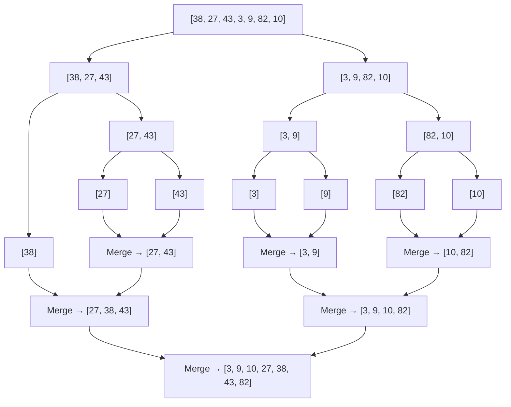

---
tags:
  - csa
  - csa/sorting
confidence: verified
up: "[[Sorting Overview]]"
tier-coverage: [intuition, core, deep-dive, practice]
---
# Merge Sort

> **Divide-and-conquer comparison sort guaranteeing $\Theta(n \lg n)$ time in every case — the benchmark for worst-case-optimal sorting.**

## 🎯 Intuition
**The Core Idea:** Split the array in half, recursively sort each half, then merge the two sorted halves back together.
**Analogy:** Splitting a deck of cards into two piles, sorting each pile, then merging them by repeatedly picking the smaller top card from either pile.
**Why It Matters:** Merge sort is the only common comparison sort with a guaranteed $\Theta(n \lg n)$ worst case, making it the default when predictable performance matters (real-time systems, adversarial inputs, linked lists).

---

## ⚙️ Core Mechanics
### Algorithm Steps
1. **Base case:** A subarray of length ≤ 1 is already sorted.
2. **Divide:** Split A[p..r] at midpoint q = ⌊(p + r) / 2⌋.
3. **Conquer:** Recursively sort A[p..q] and A[q+1..r].
4. **Combine (Merge):** Scan both sorted halves left-to-right, always picking the smaller front element into a temporary output array. Copy the merged result back. Uses sentinels (∞) to avoid boundary checks.

**Figure:** Merge Sort recursion tree — divide, sort, merge




### Pseudocode
```
MERGE-SORT(A, p, r):
  if p < r:
    q = floor((p + r) / 2)
    MERGE-SORT(A, p, q)
    MERGE-SORT(A, q+1, r)
    MERGE(A, p, q, r)
```

**MERGE(A, p, q, r):** merge two sorted subarrays A[p..q] and A[q+1..r] into sorted A[p..r] using $\Theta(n)$ auxiliary space and $\Theta(n)$ time.

### Complexity Analysis

| Case | Time | Space |
|------|------|-------|
| Best | $\Theta(n \lg n)$ | $O(n)$ auxiliary |
| Average | $\Theta(n \lg n)$ | $O(n)$ auxiliary |
| Worst | $\Theta(n \lg n)$ | $O(n)$ auxiliary |

Recurrence: T(n) = 2T(n/2) + $\Theta(n)$ → $\Theta(n \lg n)$ by [[Master Theorem]] (Case 2).

### Key Facts
- Guaranteed $\Theta(n \lg n)$ — no bad inputs exist.
- Meets the $\Omega(n \lg n)$ comparison-sort lower bound, so merge sort is asymptotically optimal.
- The merge step is the core — everything else is structural recursion.

---

## 🔬 Deep Dive
### Correctness Proof
**By strong induction on subarray length n:**
- **Base case (n = 1):** A single element is sorted. ✓
- **Inductive step:** Assume MERGE-SORT correctly sorts any subarray of length < n. MERGE-SORT(A, p, r) splits into two subarrays each of length < n, sorts them correctly (by inductive hypothesis), then MERGE combines two sorted subarrays into one sorted array. ✓
- **MERGE correctness:** At each step, the smaller of the two front elements is chosen. Since both halves are sorted, this produces a sorted output. Sentinels ensure we never run off the end of either half.

### Stability and Adaptivity
- **Stable:** Yes — when equal elements appear in both halves, the element from the left half is placed first, preserving original order.
- **Adaptive:** No — merge sort always performs $\Theta(n \lg n)$ comparisons regardless of input order.
- **In-place:** No — requires $O(n)$ auxiliary space for the merge step. (In-place merge algorithms exist but are complex and rarely used in practice.)

### Comparison with Other Sorts

| Property | Merge Sort | Quicksort | Insertion Sort |
|---|---|---|---|
| Worst-case time | $\Theta(n \lg n)$ ✓ | $\Theta(n²)$ | $\Theta(n²)$ |
| Average time | $\Theta(n \lg n)$ | $\Theta(n \lg n)$ | $\Theta(n²)$ |
| Space | $O(n)$ | $O(\lg n)$ | $O(1)$ |
| Stable | Yes | No | Yes |
| In-place | No | Yes | Yes |
| Best for | Guarantees, linked lists | Random access, speed | Small / nearly-sorted |

### Real-World Usage
- **Timsort** (Python `sorted()`, Java `Arrays.sort()` for objects): a hybrid of merge sort and insertion sort. Finds natural runs, extends them with insertion sort, then merges with optimized merge.
- **External sorting:** merge sort's sequential access pattern makes it ideal for disk-based sorting where random access is expensive.
- **Linked list sorting:** merge sort is preferred because it requires no random access and the merge step is naturally pointer-based with $O(1)$ extra space.

---

## 🏋️ Practice
### Warm-Up (5 min)
1. Trace MERGE-SORT on A = [38, 27, 43, 3, 9, 82, 10]. Draw the recursion tree and show the merge steps.
2. How many levels does the recursion tree have for an array of size 16?
3. What is the total work done across all merge operations at a single level of the recursion tree?

### Core Problems
1. **Sort an Array (LeetCode 912):** Implement merge sort from scratch. Verify it passes all test cases.
2. **Sort List (LeetCode 148):** Sort a linked list in $O(n \log n)$ time and $O(1)$ space using bottom-up merge sort.

### Challenge
1. **Count of Range Sum (LeetCode 327):** Given an array, count the number of range sums that lie in [lower, upper]. Solve using a modified merge sort that counts valid ranges during the merge step. Target: $O(n \log n)$.

---

*See also:* [[Recurrence Relations]] — canonical divide-and-conquer recurrence | [[Master Theorem]] — Case 2 solves T(n) = 2T(n/2) + $\Theta(n)$ | [[Comparison Sort Lower Bound]] — merge sort is optimally tight | [[Binary Search]] — shared divide-and-conquer structure | **CS Data Structures:** [[Arrays and Dynamic Arrays]], [[Binary Heaps]]

## Supporting Chunks
- [[Sorting - Merge sort guarantees Theta(n lg n) with O(n) auxiliary space]]
- [[Analysis - Divide-and-conquer running time is expressed as a recurrence relation]]

## References
See [[CS Algorithms/Sources/Sources Index#Cormen 2013|Sources Index]]. Chapter 3. See [[Sorting Overview]] for the comparison table.
