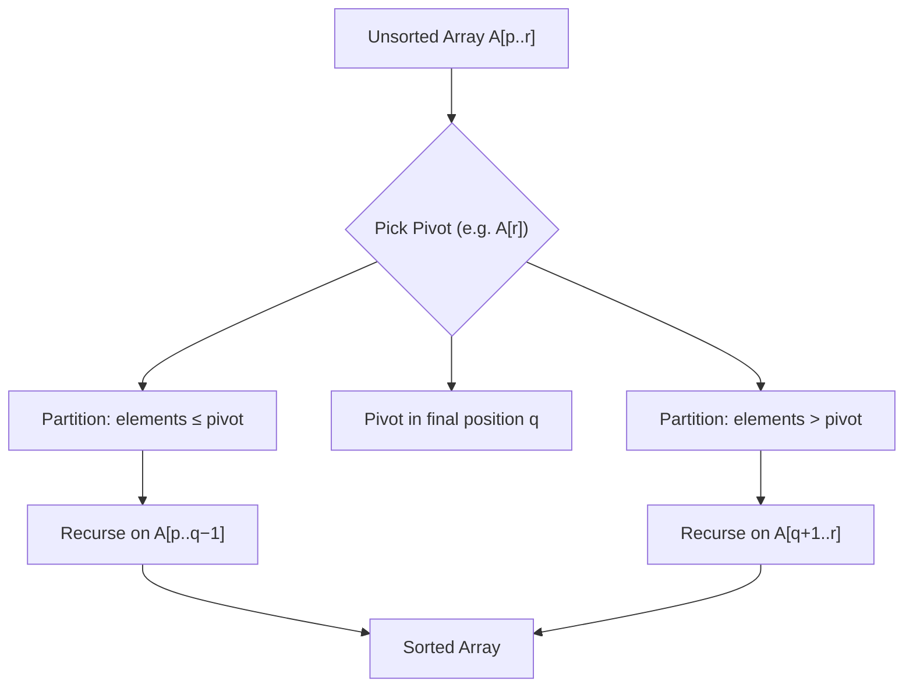

---
tags:
  - csa
  - csa/sorting
confidence: verified
freshness: stable
up: "[[Sorting Overview]]"
tier-coverage: [intuition, core, deep-dive, practice]
---
# Quicksort

> **The fastest comparison sort in practice — partitions around a pivot to achieve expected $\Theta(n \lg n)$ with minimal overhead.**

## 🎯 Intuition
**The Core Idea:** Pick a pivot element, rearrange the array so everything ≤ pivot is on the left and everything > pivot is on the right, then recursively sort both sides.
**Analogy:** Dividing students by height — pick one student as the reference, everyone shorter goes left, everyone taller goes right. Repeat within each group.
**Why It Matters:** Quicksort's small constant factors, cache-friendliness, and in-place operation make it the default choice for general-purpose sorting in practice (C++ `std::sort`, many system libraries).

---

## ⚙️ Core Mechanics
### Algorithm Steps
1. **Base case:** Subarray of length ≤ 1 is already sorted.
2. **Partition:** Choose a pivot (e.g., last element). Rearrange A[p..r] so that:
   - A[p..q−1] ≤ pivot
   - A[q] = pivot (in its final sorted position)
   - A[q+1..r] > pivot
3. **Recurse:** Sort A[p..q−1] and A[q+1..r].

**Figure:** Quicksort partition-and-recurse flow




### Pseudocode
```
QUICKSORT(A, p, r):
  if p < r:
    q = PARTITION(A, p, r)
    QUICKSORT(A, p, q-1)
    QUICKSORT(A, q+1, r)

PARTITION(A, p, r):
  pivot = A[r]          // choose last element as pivot
  i = p - 1
  for j = p to r-1:
    if A[j] ≤ pivot:
      i = i + 1
      swap A[i] and A[j]
  swap A[i+1] and A[r]
  return i + 1          // pivot's final position
```

**Randomised variant:**
```
RANDOMISED-PARTITION(A, p, r):
  i = random integer in [p, r]
  swap A[i] and A[r]
  return PARTITION(A, p, r)
```

### Complexity Analysis

| Case | Time | Space | Trigger |
|------|------|-------|---------|
| Best | $\Theta(n \lg n)$ | $O(\lg n)$ | Balanced partitions every time |
| Average | $\Theta(n \lg n)$ | $O(\lg n)$ | Random input or randomised pivot |
| Worst | $\Theta(n²)$ | $O(n)$ | Sorted / reverse-sorted with fixed pivot |

### Key Facts
- Pivot ends up in its **final sorted position** after each partition.
- Randomised quicksort has expected $\Theta(n \lg n)$ time regardless of input order.
- In-place: $O(1)$ extra space beyond the recursion stack.
- **Adversarial warning:** Unrandomised quicksort on sorted input with a fixed last-element pivot degenerates to $\Theta(n²)$. This is a known attack vector (algorithmic complexity attacks).

---

## 🔬 Deep Dive
### Correctness Proof
**By induction on subarray size:**
- **Base case:** Subarray of length 0 or 1 is sorted. ✓
- **Inductive step:** PARTITION places the pivot in its correct final position q. All elements in A[p..q−1] are ≤ A[q] and all in A[q+1..r] are > A[q]. By inductive hypothesis, the recursive calls correctly sort both subarrays. The pivot is already in place, so A[p..r] is fully sorted. ✓

**Partition loop invariant:** At the start of each iteration of the for-loop:
- A[p..i] contains elements ≤ pivot.
- A[i+1..j−1] contains elements > pivot.
- A[j..r−1] is unexamined. A[r] = pivot.

### Stability and Adaptivity
- **Stable:** No — the swap operations in PARTITION can reorder equal elements.
- **Adaptive:** Partially — randomised quicksort is $\Theta(n \lg n)$ regardless of input order, so it doesn't benefit from nearly-sorted data the way insertion sort does.
- **In-place:** Yes — $O(1)$ extra space beyond recursion stack ($O(\lg n)$ average, $O(n)$ worst).

### Comparison with Other Sorts

| Property | Quicksort | Merge Sort | Heapsort |
|---|---|---|---|
| Average time | $\Theta(n \lg n)$ | $\Theta(n \lg n)$ | $\Theta(n \lg n)$ |
| Worst time | $\Theta(n²)$ | $\Theta(n \lg n)$ ✓ | $\Theta(n \lg n)$ ✓ |
| Space | $O(\lg n)$ ✓ | $O(n)$ | $O(1)$ ✓ |
| Stable | No | Yes | No |
| Cache-friendly | Yes ✓ | Moderate | Poor |
| Practical speed | Fastest ✓ | Good | Slower constants |

### Real-World Usage
- **Introsort** (C++ `std::sort`): starts with quicksort, switches to **heapsort** if recursion depth exceeds 2⌊lg n⌋ (avoids $\Theta(n²)$ worst case), and falls back to **insertion sort** for small subarrays.
- **Dual-pivot quicksort** (Java `Arrays.sort()` for primitives): uses two pivots to create three partitions, reducing comparisons in practice.
- **`qsort()` in C standard library:** historically quicksort-based (hence the name).

---

## 🏋️ Practice
### Warm-Up (5 min)
1. Trace PARTITION on A = [2, 8, 7, 1, 3, 5, 6, 4] with pivot = 4. Show the array after each swap and the final pivot position.
2. What input to QUICKSORT (with last-element pivot) produces the worst-case $\Theta(n²)$ behavior? Why?
3. Why does randomising the pivot make the worst case "go away" probabilistically?

### Core Problems
1. **Sort an Array (LeetCode 912):** Implement randomised quicksort. Verify it handles sorted and reverse-sorted inputs efficiently.
2. **Kth Largest Element (LeetCode 215):** Use quickselect (partition-based selection) to find the k-th largest in expected $O(n)$ time.

### Challenge
1. **Wiggle Sort II (LeetCode 324):** Rearrange the array so that nums[0] < nums[1] > nums[2] < nums[3]... Requires a partition step (find median via quickselect) plus careful placement. Target: $O(n)$ time, $O(1)$ space.

---

*See also:* [[Recurrence Relations]] — expected and worst-case recurrences | [[Master Theorem]] — balanced-partition case | [[Comparison Sort Lower Bound]] — $\Omega(n \lg n)$ applies | [[Random Number Generation]] — randomised pivot | **CS Data Structures:** [[Arrays and Dynamic Arrays]], [[Binary Heaps]]

## Supporting Chunks
- [[Sorting - Quicksort is fastest in practice but has Theta(n squared) worst case]]
- [[Sorting - Quicksort expected Theta(n lg n) follows from pairwise comparison probability analysis]]

## References
See [[CS Algorithms/Sources/Sources Index#Cormen 2013|Sources Index]], Chapter 3. See [[CS Algorithms/Sources/Sources Index#MIT OpenCourseWare 6.006|Sources Index]], Lecture 7. See [[Sorting Overview]] for the comparison table.
