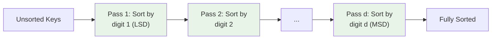

---
tags:
  - csa
  - csa/sorting
confidence: verified
freshness: stable
up: "[[Sorting Overview]]"
tier-coverage: [intuition, core, deep-dive, practice]
---
# Radix Sort

> **Non-comparison sort that processes keys digit-by-digit from least to most significant, achieving $\Theta(d(m+n)$) via stable counting sort passes.**

## 🎯 Intuition
**The Core Idea:** Sort by the least-significant digit first, then the next digit, and so on — because each pass uses a stable sort, the order from previous digits is preserved.
**Analogy:** Sorting mail by zip code digit by digit — first sort all letters by the last digit of the zip, then by the second-to-last, and so on. After processing all digits, the mail is in full zip-code order.
**Why It Matters:** When keys have a fixed number of digits d in a small base m, radix sort achieves linear time $\Theta(n)$, beating comparison-sort limits.

---

## ⚙️ Core Mechanics
### Algorithm Steps
1. Determine d (number of digits) and m (base/radix) for the keys.
2. For each digit position i = 1 (least significant) to d (most significant):
   a. Run a **stable sort** (counting sort) on the array, keyed on digit i only.
3. After all d passes, the array is fully sorted.

**Figure:** Radix Sort — LSD-first digit-by-digit passes




### Pseudocode
```
RADIX-SORT(A, n, d, m):
  // A = input array of n keys
  // d = number of digits per key
  // m = base (keys are d-digit numbers in base m)

  for i = 1 to d:
    stable-sort A on digit i   // use COUNTING-SORT on digit i
```

### Complexity Analysis

| Measure | Value |
|---------|-------|
| Time | $\Theta(d(m + n)$) |
| Space | $\Theta(m + n)$ |
| When d, m are constants | $\Theta(n)$ |

### Key Facts
- Each pass is one call to [[Counting Sort]] on a single digit → $\Theta(m + n)$ per pass.
- Total: d passes × $\Theta(m + n)$ each = $\Theta(d(m + n)$).
- Not a comparison sort — bypasses the $\Omega(n \lg n)$ lower bound.
- **LSD-first** (least-significant digit first) is the standard approach for fixed-width keys.

---

## 🔬 Deep Dive
### Correctness Proof
**By induction on the number of digit passes processed:**
- **Base case (after pass 1):** Array is sorted by digit 1 (least significant).
- **Inductive step:** Assume after pass i−1, elements are correctly sorted by their last i−1 digits. Pass i sorts by digit i using a stable sort. For elements with the same digit i, stability preserves their prior ordering by digits 1..i−1. For elements with different digit i, digit i is the most significant processed so far, so ordering by digit i is correct. Therefore after pass i, elements are sorted by their last i digits. ✓
- **Termination:** After pass d, elements are sorted by all d digits — fully sorted. ✓

### Stability and Adaptivity
- **Stable:** Yes — radix sort inherits stability from its subroutine (counting sort is stable).
- **Adaptive:** No — performs the same d passes regardless of input order.
- **In-place:** No — requires the auxiliary space of counting sort: $\Theta(m + n)$.

### Comparison with Other Sorts

| When to prefer radix sort | When to prefer alternatives |
|---|---|
| Fixed-width integer or string keys | Variable-length keys → comparison sort may be simpler |
| d and m small relative to n → linear time | Large d or m → $\Theta(d(m+n)$) exceeds $\Theta(n \lg n)$ |
| Need stable linear-time sort | Need in-place → quicksort or heapsort |
| Sorting millions of fixed-width records | Small n → overhead of counting sort setup not worthwhile |

**Why not MSD-first?** Most-significant digit first requires recursive sub-sorting within each bucket — more complex, no asymptotic advantage for fixed-width keys. LSD-first with a global stable sort is simpler and equally efficient.

### Real-World Usage
- **Database indexing:** sorting records by fixed-width composite keys (e.g., date + ID).
- **Suffix array construction:** some linear-time algorithms use radix sort on character tuples.
- **Network packet routing:** sorting packets by IP address or port fields.
- **Airline codes example:** 6 alphanumeric characters, base 36. Radix sort in 6 passes of counting sort (base 36) sorts n codes in $\Theta(n)$.

---

## 🏋️ Practice
### Warm-Up (5 min)
1. Trace RADIX-SORT on A = [329, 457, 657, 839, 436, 720, 355] with d = 3, m = 10. Show the array after each digit pass.
2. If you sort by the most-significant digit first (without recursive bucketing), does the result end up correct? Why not?
3. How many passes does radix sort need for 32-bit integers if using base 256?

### Core Problems
1. **Maximum Gap (LeetCode 164):** Use radix sort to sort n integers in $O(n)$ time, then find the maximum gap between consecutive elements.
2. **Sort an Array (LeetCode 912):** Implement radix sort (LSD, base 256) and compare performance against quicksort on large random inputs.

### Challenge
1. **Suffix Array (CSES):** Build a suffix array in $O(n \log n)$ or $O(n)$ time using radix sort as a subroutine for sorting character pairs/triples.

---

*See also:* [[Counting Sort]] — the stable subroutine | [[Comparison Sort Lower Bound]] — non-comparison sort achieving linear time | [[Asymptotic Notation]] — $\Theta(d(m+n)$) multi-parameter analysis | [[String Matching - KMP]] — sequential character processing | **CS Data Structures:** [[Arrays and Dynamic Arrays]], [[Binary Heaps]]

## Supporting Chunks
- [[Sorting - Radix sort applies stable counting sort digit-by-digit]]
- [[Sorting - Counting sort right-to-left pass preserves input order of equal keys ensuring stability]]
- [[Sorting - Radix sort LSD-first correctness relies on the stability of each digit-sort pass]]

## References
See [[CS Algorithms/Sources/Sources Index#Cormen 2013|Sources Index]], Chapter 4. See [[CS Algorithms/Sources/Sources Index#CP Algorithms - Online Reference|Sources Index]], Radix Sort article. See [[Counting Sort]] for the stable subroutine.
