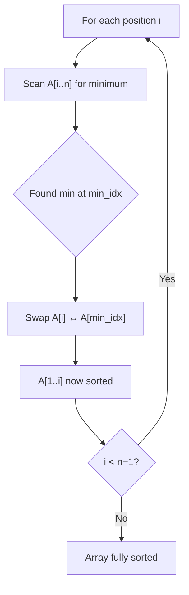

---
tags:
  - csa
  - csa/sorting
confidence: verified
up: "[[Sorting Overview]]"
tier-coverage: [intuition, core, deep-dive, practice]
---
# Selection Sort

> **Simple in-place sort that repeatedly selects the minimum from the unsorted suffix — unconditionally $\Theta(n²)$ but guarantees the fewest writes of any sort.**

## 🎯 Intuition
**The Core Idea:** Find the smallest element in the unsorted portion, swap it into the next position, and repeat.
**Analogy:** Finding the shortest person in a line-up and moving them to the front, then finding the next shortest from the remaining people, and so on.
**Why It Matters:** Selection sort's guaranteed n−1 swaps makes it the right choice when writes are orders of magnitude more expensive than reads (flash memory, EEPROM, write-audited systems).

---

## ⚙️ Core Mechanics
### Algorithm Steps
1. For each position i from 1 to n−1:
   a. Scan the unsorted suffix A[i..n] to find the index of the minimum element.
   b. Swap A[i] with A[min_idx].
2. After pass i, A[1..i] contains the i smallest elements in sorted order.

**Figure:** Selection Sort — find minimum, swap into position




### Pseudocode
```
for i = 1 to n-1:
    min_idx = i
    for j = i+1 to n:
        if A[j] < A[min_idx]:
            min_idx = j
    swap A[i] with A[min_idx]
```

### Complexity Analysis

| Case | Time | Swaps |
|------|------|-------|
| Best | $\Theta(n²)$ | n−1 |
| Average | $\Theta(n²)$ | n−1 |
| Worst | $\Theta(n²)$ | n−1 |
| Space | $O(1)$ | — |

Comparisons: always n(n−1)/2 — pass i makes n−i comparisons.

### Key Facts
- Comparison count is **unconditionally $\Theta(n²)$** — selection sort cannot short-circuit on sorted input.
- Swap count is **always exactly n−1** — one swap per pass, regardless of input order.
- The inner loop has no early exit — it must inspect every remaining element to confirm the minimum.

---

## 🔬 Deep Dive
### Correctness Proof
**Loop invariant:** At the start of pass i, A[1..i−1] contains the i−1 smallest elements of the original array in sorted order.
- **Initialisation:** Before pass 1, A[1..0] is empty — trivially sorted and contains the 0 smallest elements. ✓
- **Maintenance:** Pass i scans A[i..n] and finds the minimum. After swapping it into position i, A[1..i] contains the i smallest elements in sorted order. ✓
- **Termination:** After pass n−1, A[1..n−1] contains the n−1 smallest elements in order, so A[n] must be the largest. The entire array is sorted. ✓

### Stability and Adaptivity
- **Stable:** No — a swap can move an equal element past another. Example: A = [3a, 3b, 1]. Pass 1 swaps 3a with 1 → [1, 3b, 3a]. The two 3s are now reversed.
- **Adaptive:** No — performs the same $\Theta(n²)$ comparisons on any input, including already-sorted arrays.
- **In-place:** Yes — $O(1)$ extra space.

### Comparison with Other Sorts

| Property | Selection Sort | Insertion Sort |
|---|---|---|
| Comparisons (sorted input) | $\Theta(n²)$ | $\Theta(n)$ |
| Comparisons (worst case) | $\Theta(n²)$ | $\Theta(n²)$ |
| Swaps (worst case) | n−1 ✓ | $\Theta(n²)$ |
| Swaps (best case) | n−1 | 0 |
| Stable | No | Yes |
| Adaptive | No | Yes |

| Algorithm | Swaps / writes (worst case) | Swaps / writes (best case) |
|-----------|----------------------------|---------------------------|
| **Selection sort** | **n−1** | **n−1** |
| Insertion sort | $\Theta(n²)$ | 0 |
| Quicksort | $\Theta(n²)$ | $\Omega(n \lg n)$ |
| Merge sort | N/A (copies) | N/A |

### Real-World Usage
- **Write-expensive hardware:** Flash memory with limited write-cycle lifetimes, EEPROM, tape storage, or systems with write-auditing overhead — selection sort's guaranteed n−1 writes may outweigh its poor comparison count.
- **Education:** The invariant ("A[1..i] contains the i smallest elements sorted") is the simplest possible, making correctness proofs trivial — ideal for introducing loop invariants and proof by induction.
- **In practice:** Rarely used in production software. Dominated by insertion sort (which adapts to order) and by merge sort / quicksort at any significant scale.

---

## 🏋️ Practice
### Warm-Up (5 min)
1. Trace selection sort on A = [64, 25, 12, 22, 11]. Show the array after each swap.
2. On a sorted array of 100 elements, how many comparisons does selection sort make? How does this compare to insertion sort?
3. Give an example showing selection sort is not stable.

### Core Problems
1. **Sort Colors (LeetCode 75):** Sort an array of 0s, 1s, and 2s. While this is often solved with a Dutch National Flag partition, try a selection-sort approach first to understand the trade-offs.
2. **Pancake Sorting (LeetCode 969):** Sort by only reversing prefixes — conceptually related to selection sort's "find min, move to front" pattern.

### Challenge
1. **Minimum Number of Swaps to Sort (GFG / CSES):** Given a permutation, find the minimum number of swaps to sort it. This is n minus the number of cycles in the permutation — connects to selection sort's swap-minimality.

---

*See also:* [[Insertion Sort]] — the adaptive alternative | [[Sorting and Searching - Review Drill]] — drill questions on non-adaptivity and write-count optimality | **CS Data Structures:** [[Arrays and Dynamic Arrays]], [[Binary Heaps]]

## Supporting Chunks
- [[Sorting - Selection sort scans for the minimum n-1 times giving unconditional Theta(n squared)]]
- [[Sorting - Selection sort minimizes the number of writes by guaranteeing exactly n-1 swaps regardless of input order]]
- [[Sorting - Selection sort is non-adaptive and performs identical comparison work on sorted or random inputs]]

## References
See [[CS Algorithms/Sources/Sources Index#Cormen 2013|Cormen 2013]]. Chapter 3. See [[CS Algorithms/Sources/Sources Index#Princeton Algorithms 4e|Princeton Algorithms 4e]]. Section 2.1. See [[Sorting Overview]] for the full comparison table. See [[Insertion Sort]] for the adaptive alternative.
