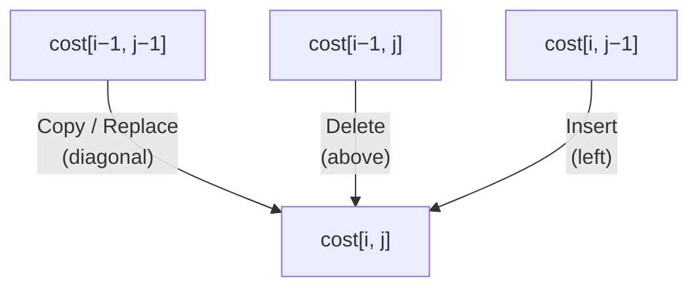

---
tags:
  - csa
  - csa/strings
confidence: verified
freshness: stable
up: "[[Strings Overview]]"
tier-coverage: [intuition, core, deep-dive, practice]
---
# Edit Distance

> **Minimum-cost transformation between two strings via insert, delete, and replace operations, solved by DP in $\Theta(mn)$.**

## 🎯 Intuition
**The Core Idea:** Build a 2D table where each cell cost[i][j] stores the cheapest way to transform the first i characters of X into the first j characters of Y.
**Analogy:** Edit distance is like autocorrect scoring — your phone's keyboard measures how many letter swaps, inserts, and deletes it takes to turn a typo into a real word, then picks the word with the lowest score.
**Why It Matters:** Powers spell checkers, DNA sequence alignment, diff tools, and fuzzy string matching across NLP applications.

---

## ⚙️ Core Mechanics
### Algorithm Steps
1. Create an (m+1)×(n+1) table where m = |X|, n = |Y|.
2. Base cases: cost[i][0] = i (delete all of X), cost[0][j] = j (insert all of Y).
3. Fill row by row: for each cell, take the minimum of copy/replace (diagonal), delete (above), and insert (left).
4. The answer is cost[m][n].

**Figure:** Edit Distance DP — cell dependencies




### Operations (Cormen's formulation)

| Operation | Description | Typical Cost |
|-----------|-------------|-------------|
| Copy | Copy a character from X unchanged (advance both pointers) | 0 |
| Replace | Replace a character in X with a different character | 1 |
| Delete | Delete a character from X | 1 |
| Insert | Insert a character into X (from Y) | 1 |
| Twiddle | Swap two adjacent characters | 1 |
| Kill | Delete the remainder of X (suffix) | 1 |

*Note: Cormen omits twiddle and kill in the worked solution to preserve CLRS exercise integrity.*

### Pseudocode
```
cost[i, j] = min(
  cost[i-1, j-1] + (0 if X[i]=Y[j] else replace_cost),  // copy or replace
  cost[i-1, j]   + delete_cost,                           // delete X[i]
  cost[i, j-1]   + insert_cost                            // insert Y[j]
)
```

### Complexity

| Measure | Value |
|---------|-------|
| Time | $\Theta(mn)$ |
| Space | $O(mn)$ — reducible to $O(min(m,n)$) with rolling array |

### Key Facts
- Classic 2D DP problem with optimal substructure and overlapping subproblems
- Relation to LCS: edit distance (insert/delete only) = m + n − 2·LCS(X, Y)
- Space can be reduced to $O(min(m,n)$) if only the distance (not the alignment) is needed
- With replace as a single operation, edit distance may differ from the LCS-based formula
- The DP table can be backtracked to reconstruct the actual edit sequence

---

## 🔬 Deep Dive
### Correctness / Proof
The cost[i,j] recurrence has optimal substructure: an optimal alignment of X[1..i] to Y[1..j] contains an optimal alignment of a sub-prefix pair. The naive recursive decomposition recomputes the same prefix pairs many times — the (m+1)×(n+1) table eliminates this redundancy. See [[Dynamic Programming]] for the general framework.

### Edge Cases and Pitfalls
- Empty strings: cost("", Y) = |Y| (all inserts), cost(X, "") = |X| (all deletes)
- Identical strings: cost = 0
- Single character difference: minimum cost is 1 (one replace, or one delete + one insert = 2 depending on cost model)
- Different cost models (e.g., replace costs 2 instead of 1) change the optimal alignment
- Twiddle and kill operations add complexity to the recurrence but are rarely tested

### Real-World Usage
- **Spell checking** — find dictionary words closest to a misspelled word
- **DNA sequence alignment** — minimum mutations between sequences
- **Diff and patch** — edit scripts for version control
- **Natural language processing** — fuzzy string matching

---

## 🏋️ Practice
### Warm-Up (5 min)
1. What is the edit distance between "kitten" and "sitting"? Trace through the DP table.
2. If replace costs 2 instead of 1, how does the optimal edit sequence change?

### Core Problems
1. **Edit Distance** (LeetCode 72): Classic implementation — compute minimum edit distance between two strings.
2. **One Edit Distance** (LeetCode 161): Determine if two strings are exactly one edit apart.
3. **Minimum ASCII Delete Sum** (LeetCode 712): Variant where deletion cost is the ASCII value of the character.

### Challenge
**Regular Expression Matching** (LeetCode 10): Extend the DP approach to handle '.' and '*' wildcards — a generalisation of the edit distance framework.

---

*See also:* [[Dynamic Programming]], [[Floyd-Warshall Algorithm]], [[Asymptotic Notation]], [[Bellman-Ford Algorithm]], [[LCS - Longest Common Subsequence]], [[String Matching - KMP]], [[CS Data Structures/Linear Structures/Arrays and Dynamic Arrays|Array]], [[CS Data Structures]]

## Supporting Chunks / References

### Supporting Chunks

- [[Strings - Edit Distance recurrence computes minimum-cost alignment via DP over prefixes]]
- [[Strings - Edit Distance DP table fills in Theta(mn) time and O(mn) space]]
- [[Analysis - Dynamic programming solves problems with overlapping subproblems by memoising a table]]

### References

See [[CS Algorithms/Sources/Sources Index#Cormen 2013|Sources Index]]. Chapter 7. See also [[String Matching - KMP]] for exact pattern matching.

## References

- [[CS Algorithms/Sources/Sources Index]]
- [[CS Algorithms/CS Algorithms Book Reading Spine]]
