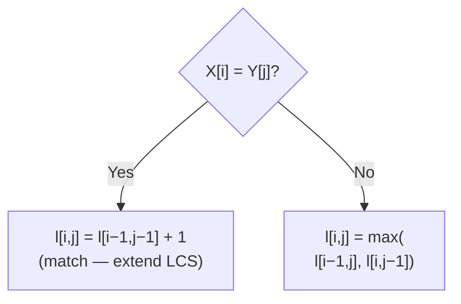

---
tags:
  - csa
  - csa/strings
confidence: verified
freshness: stable
up: "[[Strings Overview]]"
tier-coverage: [intuition, core, deep-dive, practice]
---
# LCS — Longest Common Subsequence

> **Find the longest subsequence common to two strings using DP in $\Theta(mn)$, with $O(m+n)$ backtracking for reconstruction.**

## 🎯 Intuition
**The Core Idea:** Build a 2D table where l[i][j] stores the LCS length of the first i characters of X and the first j characters of Y; matching characters extend the LCS, mismatches take the better of skipping either character.
**Analogy:** LCS is like finding the longest shared thread between two stories — highlight all sentences that appear in both drafts of an essay, in order, and you've found their longest common subsequence.
**Why It Matters:** Underpins diff tools, DNA sequence comparison, plagiarism detection, and is a building block for edit distance and sequence alignment algorithms.

---

## ⚙️ Core Mechanics
### Algorithm Steps
1. Create an (m+1)×(n+1) table. Base cases: l[i][0] = l[0][j] = 0.
2. Fill row by row: if X[i] = Y[j], set l[i][j] = l[i-1][j-1] + 1; otherwise, set l[i][j] = max(l[i-1][j], l[i][j-1]).
3. The answer is l[m][n].

**Figure:** LCS DP recurrence — match extends, mismatch takes max



4. To reconstruct the actual LCS, backtrack from l[m][n].

### Pseudocode
```
l[i, j] = 0                       if i = 0 or j = 0
l[i, j] = l[i-1, j-1] + 1        if X[i] = Y[j]
l[i, j] = max(l[i-1,j], l[i,j-1]) if X[i] ≠ Y[j]
```

### LCS Reconstruction
Backtrack through the table from l[m, n]:
- If X[i] = Y[j]: record this character, go to l[i−1, j−1]
- Else if l[i−1, j] > l[i, j−1]: go to l[i−1, j]
- Else: go to l[i, j−1]

Produces the actual LCS in $O(m+n)$ time.

### Complexity

| Measure | Value |
|---------|-------|
| Time | $\Theta(mn)$ |
| Space | $O(mn)$ — reducible to $O(min(m,n)$) with rolling array |
| Reconstruction | $O(m+n)$ backtracking |

### Key Facts
- A **subsequence** preserves relative order but need not be contiguous
- Naïve approach (enumerate all 2ᵐ subsequences) is exponential — DP makes it polynomial
- Space-optimised: only two rows needed for the length, but reconstruction requires the full table
- Relation to edit distance: edit distance (insert/delete only) = m + n − 2·LCS(X, Y)
- LCS table-fill follows a DAG of subproblem dependencies processed in order

---

## 🔬 Deep Dive
### Correctness / Proof
The recurrence is correct because: if X[i] = Y[j], the optimal LCS must include this match (extending the LCS of shorter prefixes); if X[i] ≠ Y[j], at least one of X[i] or Y[j] is not in the LCS, so we take the better of the two sub-cases. Overlapping subproblems are handled by tabulation.

### Edge Cases and Pitfalls
- Empty strings: LCS("", Y) = 0
- Identical strings: LCS = the string itself
- No common characters: LCS length = 0
- Multiple valid LCS of the same length may exist — backtracking finds one, not all
- Confusing subsequence (non-contiguous) with substring (contiguous) — LCS is for subsequences

### Real-World Usage
- **DNA/RNA sequence comparison** — LCS length measures similarity; long LCS = evolutionarily close sequences
- **Diff tools** — output is based on LCS of line sequences
- **Plagiarism detection** — long common subsequences indicate similarity

---

## 🏋️ Practice
### Warm-Up (5 min)
1. What is the LCS of "ABCBDAB" and "BDCAB"? Trace through the DP table.
2. Is "ACE" a subsequence of "ABCDE"? Is "AEC"?

### Core Problems
1. **Longest Common Subsequence** (LeetCode 1143): Classic implementation of the LCS DP.
2. **Shortest Common Supersequence** (LeetCode 1092): Use LCS to find the shortest string containing both input strings as subsequences.
3. **Longest Palindromic Subsequence** (LeetCode 516): LCS of a string with its reverse.

### Challenge
**Edit Distance** (LeetCode 72): Extend the LCS framework to compute minimum edit distance — understand the relationship between LCS length and edit distance.

---

*See also:* [[Dynamic Programming]], [[Floyd-Warshall Algorithm]], [[Asymptotic Notation]], [[DAG and Topological Sort]], [[Edit Distance]], [[String Matching - KMP]], [[CS Data Structures/Linear Structures/Arrays and Dynamic Arrays|Array]], [[CS Data Structures]]

## Supporting Chunks / References

### Supporting Chunks

- [[Strings - LCS dynamic programming fills an m by n table in Theta(mn)]]
- [[Analysis - Dynamic programming solves problems with overlapping subproblems by memoising a table]]

### References

See [[CS Algorithms/Sources/Sources Index#Cormen 2013|Sources Index]]. Chapter 7. See [[Edit Distance]] for the related string transformation problem.

## References

- [[CS Algorithms/Sources/Sources Index]]
- [[CS Algorithms/CS Algorithms Book Reading Spine]]
