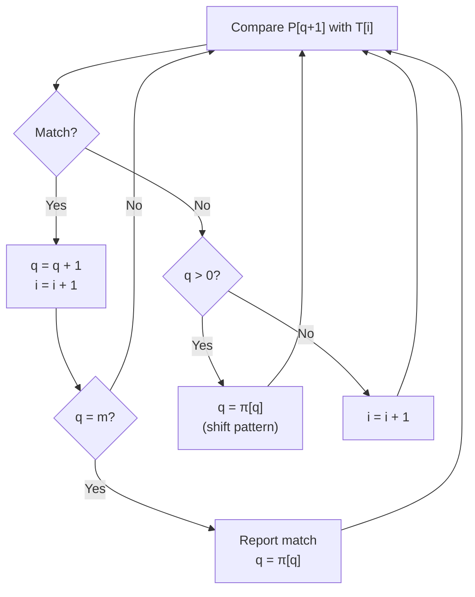

---
tags:
  - csa
  - csa/strings
confidence: verified
freshness: stable
up: "[[Strings Overview]]"
tier-coverage: [intuition, core, deep-dive, practice]
---
# String Matching — KMP

> **Find all occurrences of pattern P in text T in $\Theta(n+m)$ by precomputing a failure function that avoids redundant comparisons.**

## 🎯 Intuition
**The Core Idea:** Precompute how much of the pattern you can reuse after a mismatch, so the text pointer never moves backward.
**Analogy:** KMP is like a smart bookmark in pattern matching — instead of starting over when a mismatch occurs, you jump back to the last useful position, like a bookmark that remembers how much of the pattern you've already verified.
**Why It Matters:** Eliminates the $O(nm)$ worst case of naïve string matching, making it essential for text editors, search engines, and any system that searches large texts for patterns.

---

## ⚙️ Core Mechanics
### Algorithm Steps
1. **Build the failure function** π for pattern P: π[k] = length of the longest proper prefix of P[1..k] that is also a suffix.
2. **Match**: scan text T left to right. On a match, advance both pointers. On a mismatch at position q+1 in P, set q = π[q] (shift to the longest valid partial match) instead of restarting.
3. When q = m, report a match and continue via q = π[q].

**Figure:** KMP matching — on mismatch, shift using failure function




### Failure Function (Prefix Function)
The **failure function** π[k] = length of the longest **proper prefix** of P[1..k] that is also a **suffix** of P[1..k].

Example: P = "ababc"
```
k:    1  2  3  4  5
P:    a  b  a  b  c
π:    0  0  1  2  0
```
π[4] = 2: "ab" is both the longest proper prefix and a suffix of "abab".

### Pseudocode
**Compute π** in $\Theta(m)$:
```
COMPUTE-FAILURE-FUNCTION(P, m):
  π[1] = 0
  k = 0
  for q = 2 to m:
    while k > 0 and P[k+1] ≠ P[q]:
      k = π[k]
    if P[k+1] = P[q]:
      k = k + 1
    π[q] = k
  return π
```

**Matching** in $\Theta(n)$:
```
KMP-MATCHER(T, P, n, m):
  π = COMPUTE-FAILURE-FUNCTION(P, m)
  q = 0     // characters of P matched

  for i = 1 to n:
    while q > 0 and P[q+1] ≠ T[i]:
      q = π[q]           // shift: reuse partial match
    if P[q+1] = T[i]:
      q = q + 1
    if q = m:
      report match at position i - m + 1
      q = π[q]           // continue searching
```

### Complexity

| Phase | Time |
|-------|------|
| Failure function | $\Theta(m)$ |
| Matching | $\Theta(n)$ |
| **Total** | **$\Theta(n+m)$** |

### Key Facts
- The text pointer **never moves backward** — each text character is examined at most once
- The failure function is computed on the pattern alone and is independent of the text
- Naïve matching is $\Theta(nm)$ in the worst case (e.g., T = "aaa…a", P = "aaa…b"); KMP guarantees $\Theta(n+m)$
- KMP can be extended to multiple pattern matching (Aho-Corasick)
- The failure function itself uses the same "shift" logic as the matcher (self-application)

---

## 🔬 Deep Dive
### Correctness / Proof
When a mismatch occurs at position q+1 in P, instead of resetting q to 0 (naïve: discard all partial match info), set q = π[q]. This shifts P to the longest valid partial match, avoiding re-examining text characters already passed. The amortised analysis shows the total number of comparisons is $O(n)$ because q increases at most n times and decreases at most n times (each decrease via π[q] is bounded by prior increases).

### Edge Cases and Pitfalls
- Empty pattern: matches at every position (or return immediately depending on convention)
- Pattern longer than text: no match possible
- Pattern equals text: one match at position 1
- All characters identical (T = "aaaa", P = "aa"): correctly finds overlapping matches
- The failure function handles overlapping patterns correctly via q = π[q] after a full match

### Real-World Usage
- **Text editors**: find/replace functionality
- **Search engines**: pattern matching in document indexing
- **Bioinformatics**: searching DNA/RNA sequences for specific motifs
- **Network intrusion detection**: matching packet payloads against known attack signatures

---

## 🏋️ Practice
### Warm-Up (5 min)
1. Compute the failure function for P = "aabaaab". 
2. Why can't the text pointer ever move backward in KMP?

### Core Problems
1. **Implement strStr()** (LeetCode 28): Find the first occurrence of a pattern in a string — implement KMP.
2. **Repeated Substring Pattern** (LeetCode 459): Determine if a string can be constructed by repeating a substring — use the failure function.
3. **KMP failure function computation**: Given a pattern, compute and verify the failure function by hand.

### Challenge
**Shortest Palindrome** (LeetCode 214): Use the KMP failure function on s + "#" + reverse(s) to find the longest palindromic prefix, then prepend the minimum characters to make the whole string a palindrome.

---

*See also:* [[LCS - Longest Common Subsequence]], [[Edit Distance]], [[Asymptotic Notation]], [[CS Data Structures/Linear Structures/Arrays and Dynamic Arrays|Array]], [[CS Data Structures]]

## Supporting Chunks / References

### Supporting Chunks

- [[Strings - KMP failure function enables Theta(n+m) string matching]]
- [[Strings - KMP failure function is computed on the pattern alone and is independent of the text]]

### References

See [[CS Algorithms/Sources/Sources Index#Cormen 2013|Sources Index]], Chapter 7. See [[CS Algorithms/Sources/Sources Index#CP Algorithms - Online Reference|Sources Index]], KMP article. See [[LCS - Longest Common Subsequence]] and [[Edit Distance]] for other string algorithms.

## References

- [[CS Algorithms/Sources/Sources Index]]
- [[CS Algorithms/CS Algorithms Book Reading Spine]]
