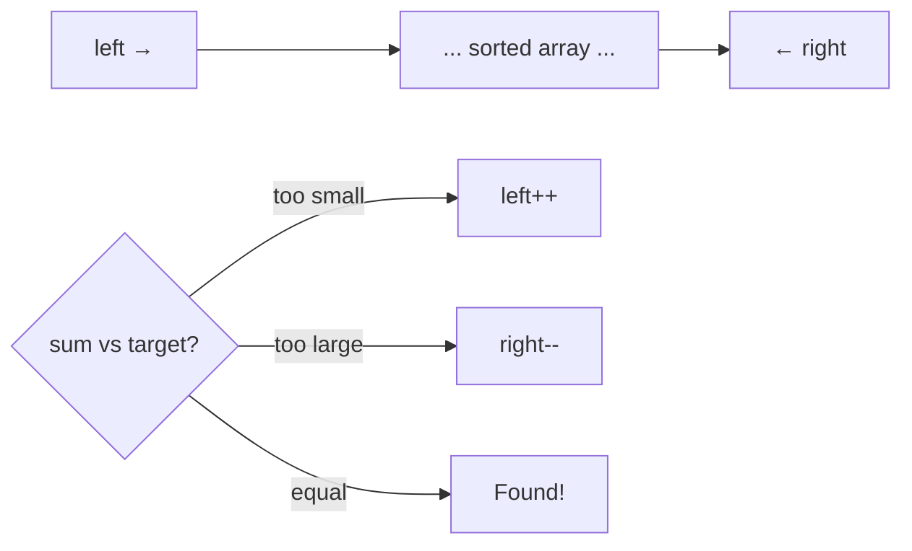

# Two Pointers and Sliding Window

> **One-line summary**: Two Pointers uses a pair of indices moving inward (or in tandem) to solve problems on sorted arrays or sequences in $O(n)$, while Sliding Window maintains a dynamic window over a contiguous subarray to optimize range-based queries.

## 🎯 Intuition
**The Core Idea:** Instead of checking all pairs or subarrays ($O(n²)$), strategically advance one or both endpoints to skip redundant work.
**Analogy:** Two Pointers is like two people walking toward each other from opposite ends of a bridge, checking conditions as they converge. Sliding Window is like a magnifying glass sliding across a page — you adjust the width as needed but never jump backward.
**Why It Matters:** These techniques turn brute-force $O(n²)$ or $O(n³)$ solutions into $O(n)$, making them essential for array, string, and sequence problems in interviews and competitive programming.

---

## ⚙️ Core Mechanics
### Two Pointers — Opposite Direction
Used when the array is sorted and you need to find pairs satisfying a condition.

**Algorithm Steps (Two-Sum on sorted array):**
1. Set left = 0, right = n − 1.
2. Compute sum = arr[left] + arr[right].
3. If sum == target, return the pair.
4. If sum < target, move left rightward (need a larger value).
5. If sum > target, move right leftward (need a smaller value).
6. Repeat until left ≥ right.

**Figure:** Two Pointers (opposite direction) — converge toward center




### Pseudocode — Two Pointers
```
function twoSumSorted(arr, target):
    left = 0
    right = len(arr) - 1
    while left < right:
        s = arr[left] + arr[right]
        if s == target: return (left, right)
        elif s < target: left += 1
        else: right -= 1
    return None
```

### Sliding Window — Variable Width
Used for finding optimal contiguous subarrays (min/max length with a constraint).

**Algorithm Steps (Minimum window containing sum ≥ target):**
1. Set left = 0, current_sum = 0, min_len = ∞.
2. For right = 0 to n − 1:
   a. Add arr[right] to current_sum.
   b. While current_sum ≥ target:
      - Update min_len = min(min_len, right − left + 1).
      - Subtract arr[left] from current_sum.
      - Move left rightward.
3. Return min_len.

### Pseudocode — Sliding Window
```
function minSubarrayLen(arr, target):
    left = 0
    current_sum = 0
    min_len = infinity
    for right = 0 to len(arr) - 1:
        current_sum += arr[right]
        while current_sum >= target:
            min_len = min(min_len, right - left + 1)
            current_sum -= arr[left]
            left += 1
    return min_len if min_len != infinity else 0
```

### Complexity

| Technique | Time | Space |
|-----------|------|-------|
| Two Pointers (opposite) | $O(n)$ | $O(1)$ |
| Two Pointers (same direction) | $O(n)$ | $O(1)$ |
| Sliding Window (fixed size) | $O(n)$ | $O(1)$ |
| Sliding Window (variable) | $O(n)$ | $O(1)$ or $O(k)$ with hash map |

### Key Facts
- Both techniques exploit **monotonicity** — some invariant that guarantees we never need to move a pointer backward.
- Sliding Window is a special case of Two Pointers where both move in the same direction.
- For fixed-size windows, the window length is constant; for variable-size, the left pointer advances based on constraint satisfaction.
- Combining Sliding Window with a hash map yields $O(n)$ solutions for character-frequency problems.

---

## 🔬 Deep Dive
### Correctness Argument for Two Pointers
**Invariant (Two-Sum sorted):** If arr[left] + arr[right] < target, then arr[left] + arr[j] < target for all j ≤ right, so increasing left is the only productive move. Similarly, if the sum is too large, decreasing right is correct. This ensures no valid pair is skipped.

### Correctness Argument for Sliding Window
**Invariant:** For a minimization window, once the constraint is satisfied, shrinking from the left can only break or maintain the constraint — it never helps to expand left. Since right moves only forward and left moves only forward, total work is $O(n)$.

### Edge Cases and Pitfalls
- **Empty arrays or arrays with one element** — boundary checks needed.
- **All elements satisfy/violate the constraint** — ensure the code handles these extremes.
- **Negative numbers in sliding window** — variable-width sliding window for sums only works with non-negative values. With negatives, the monotonicity breaks; use prefix sums + deque or binary search instead.
- **Off-by-one in window boundaries** — the window [left, right] is inclusive; be consistent.
- **Hash map sliding window** — when tracking character frequencies, decrement counts to zero (don't delete keys prematurely).

### Comparison with Alternatives
- **Binary search on sorted arrays:** Can solve Two-Sum in $O(n \log n)$ — two pointers is faster at $O(n)$.
- **Prefix sums:** Handle range-sum queries in $O(1)$ per query after $O(n)$ preprocessing. Sliding window is better when you need to find optimal window lengths dynamically.
- **Deque-based sliding window maximum:** For max/min in sliding windows of fixed size, use a monotonic deque for $O(n)$ total.
- **Brute force $O(n²)$:** Always correct but too slow for large inputs. Two pointers/sliding window are the standard optimizations.

### Real-World Usage
- **Network traffic analysis** — sliding window for throughput measurement over rolling time intervals.
- **DNA sequence analysis** — finding motifs or k-mer frequencies using sliding windows.
- **Rate limiting** — sliding window counters for API request throttling.
- **Audio signal processing** — moving-average filters are sliding window computations.

---

## 🏋️ Practice
### Warm-Up (5 min)
1. Why does Two Pointers require the array to be sorted for the two-sum problem?
2. Can sliding window (variable size) handle arrays with negative numbers for sum constraints? Why or why not?
3. What is the total number of pointer movements in a sliding window pass over an array of size n?

### Core Problems
1. **LeetCode 167 — Two Sum II (sorted):** Find two numbers that add to a target. *Approach:* opposite-direction two pointers.
2. **LeetCode 209 — Minimum Size Subarray Sum:** Find the shortest subarray with sum ≥ target. *Approach:* variable-width sliding window.
3. **LeetCode 3 — Longest Substring Without Repeating Characters:** Find the longest substring with all unique characters. *Approach:* sliding window with hash set.

### Challenge
- **LeetCode 76 — Minimum Window Substring:** Find the smallest window in string s that contains all characters of string t (with frequencies). Implement using sliding window + frequency hash map. Analyze why the two-pointer approach is $O(n)$ despite the nested while loop.

---

*See also:* [[Amortized Analysis for Algorithms]] · [[BFS and DFS]] · [[Greedy Algorithms Overview]] | **CS Data Structures:** [[Arrays and Dynamic Arrays|Arrays]] · [[Hash Tables and Hash Functions|Hash Tables]] · [[Queues and Deques|Deques]]

## References
-> [[Sources Index]]
