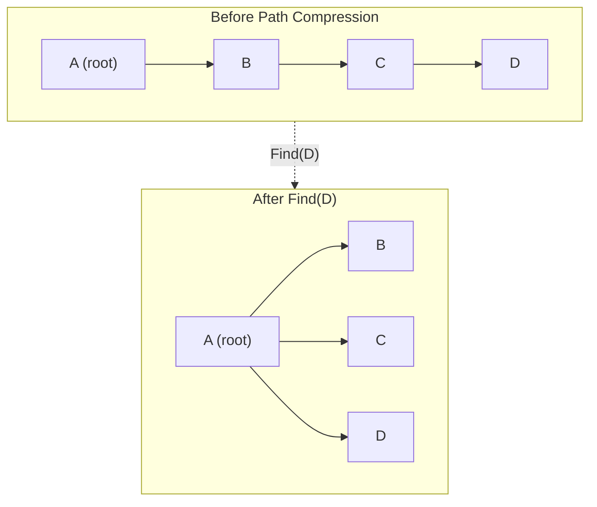

# Disjoint Sets and Union-Find

> **One-line summary**: The Union-Find (disjoint set) structure maintains a partition of elements into disjoint sets, supporting near-constant-time union and find operations through path compression and union by rank, with $O(alpha(n)$) amortized cost per operation.

## 🎯 Intuition
**The Core Idea:** Represent each set by a tree with a leader at the root, then make merges and membership checks fast by keeping trees shallow and flattening paths during lookup.
**Analogy:** Like friend groups merging at a party — when two people from different groups become friends, their entire groups merge into one. Finding who's in whose group is nearly instant because everyone eventually points to the same group leader.
**Why It Matters:** Union-Find is one of the most practically efficient data structures ever devised. Its amortized $O(alpha(n)$) bound means that a sequence of m operations on n elements runs in $O(m alpha(n)$) ~ $O(m)$ time, so in applications like Kruskal's MST the sorting dominates, not the set maintenance. It is also a cornerstone example in amortized analysis because Tarjan's 1975 result is both theoretically deep and practically decisive.

---

## ⚙️ Core Mechanics
### How It Works
A **disjoint-set data structure** (also called **Union-Find**) manages a collection of non-overlapping sets, each identified by a representative element. It supports three operations: **MakeSet(x)** creates a singleton set {x}, **Find(x)** returns the representative of the set containing x, and **Union(x, y)** merges the sets containing x and y. The canonical implementation represents each set as a rooted tree: each element points to its parent, and the root is the representative.

Without optimizations, trees can degenerate into linked lists, making Find $O(n)$. Two techniques fix this. **Union by rank** (or union by size) always attaches the shorter tree under the taller one, ensuring tree height is $O(\log n)$. **Path compression** flattens the tree during Find by making every visited node point directly to the root. Applied together, the amortized cost per operation drops to **$O(alpha(n)$)**, where alpha is the inverse Ackermann function -- a function that grows so slowly it is effectively constant (at most 4 for any n up to 10^80). This result, proved by Tarjan in 1975, is one of the most celebrated in amortized analysis.

**Figure:** Union-Find forest — path compression flattens trees so Find reaches the root directly

Union-Find is the enabling data structure for **Kruskal's minimum spanning tree algorithm** (process edges in weight order, union endpoints, skip if already connected), **dynamic connectivity** queries on undirected graphs, **equivalence class maintenance** (compilers, type inference), and **image segmentation** (merging adjacent pixels of similar color). Its near-constant per-operation cost makes it extraordinarily efficient in practice.

### Key Operations

| Operation   | Naive (no opt.) | Union by Rank | Path Compression | Both (amortized) |
|-------------|----------------|---------------|------------------|------------------|
| MakeSet(x)  | $O(1)$           | $O(1)$          | $O(1)$             | $O(1)$             |
| Find(x)     | $O(n)$           | $O(\log n)$      | $O(\log n)$ amort.  | $O(alpha(n)$)      |
| Union(x, y) | $O(n)$           | $O(\log n)$      | $O(\log n)$ amort.  | $O(alpha(n)$)      |
| Space       | $O(n)$           | $O(n)$          | $O(n)$             | $O(n)$             |

### Key Facts
- MakeSet, Find, and Union are the three canonical operations; all run in $O(alpha(n)$) amortized with both optimizations.
- Union by rank alone: $O(\log n)$ per Find. Path compression alone: $O(\log n)$ amortized per Find.
- Combined union by rank + path compression: $O(alpha(n)$) amortized -- effectively $O(1)$ in practice.
- alpha(n) <= 4 for n < 10^80; for all practical purposes, the inverse Ackermann function is constant.
- Kruskal's MST uses Union-Find to check and merge components in $O(E \log E + E alpha(V))$ total time.
- Space: $O(n)$ -- one parent pointer and one rank value per element.
- Path splitting and path halving are simpler alternatives to full path compression with the same amortized bound.
- Union-Find does not efficiently support split (separating an element from its set) without more complex structures.

---

## 🔬 Deep Dive
### Formal Properties
- The structure maintains a partition of the universe into **equivalence classes**, with each element belonging to exactly one class and each class represented by a root.
- With naive trees, **Find** can degrade to $O(n)$; with **union by rank** alone, tree height is $O(\log n)$; with **path compression** alone, Find is $O(\log n)$ amortized; together they yield Tarjan's 1975 **$O(alpha(n))$ amortized** bound.
- The inverse Ackermann function grows so slowly that **alpha(n) <= 4 for n < 10^80**, which is why Union-Find is treated as effectively constant-time in practice.
- **Path splitting** and **path halving** are alternative path-shortening strategies that keep the same asymptotic amortized guarantee while being simpler to implement in some settings.

| Aspect               | Union-Find               | BFS/DFS Connectivity     | Balanced BST             |
|----------------------|--------------------------|--------------------------|--------------------------|
| Query type           | "Same set?"              | "Path exists?"           | Ordered key lookup       |
| Amortized per op     | $O(alpha(n))$ ~ $O(1)$      | $O(V + E)$ per query       | $O(\log n)$                 |
| Dynamic unions       | Yes -- core operation    | Requires full traversal  | Not applicable           |
| Split / undo         | Not supported (basic)    | N/A                      | N/A                      |
| Typical use          | MST, components, equiv.  | Single reachability query| General dictionary       |

### Edge Cases and Pitfalls
- Forgetting to initialize every element with **MakeSet** leads to invalid parent pointers and undefined representatives.
- Using recursive **Find** without care can risk stack issues in intentionally adversarial or uncompressed trees; iterative implementations are often safer.
- Basic Union-Find handles merges well but does **not** support deletions, splits, or rollback unless you move to more specialized variants.
- Confusing **connectivity** with **path retrieval** is a common mistake: Union-Find can tell whether two vertices are in the same component, but it cannot reconstruct an actual path between them.

### Real-World Usage
Union-Find is the canonical data structure behind **Kruskal's MST**, where edges are processed in sorted order and component membership must be checked constantly. It also supports **dynamic connectivity** in undirected graphs, **equivalence class maintenance** in compilers and type inference, and **image segmentation** pipelines that merge nearby pixels or regions when they satisfy similarity constraints.

---

## 🏋️ Practice
### Warm-Up (5 min)
- Why does combining union by rank with path compression beat either optimization alone?
- What information does **Find(x)** return, and why is that enough for connectivity queries?

### Core Problems
- **Redundant Connection** — process edges online and detect the first edge that joins two nodes already in the same component.
- **Accounts Merge** — treat emails as elements in equivalence classes and union accounts that share identifiers.
- **Number of Provinces / Connected Components** — compare DFS/BFS traversal with Union-Find for repeated merge-and-query workloads.

### Challenge
- Design a **dynamic connectivity** solution that supports offline deletions or rollback queries, and explain why plain Union-Find is insufficient without augmentation.

---

*See also:* [[Skip Lists]], [[Segment Trees]], [[Fenwick Trees]], [[k-d Trees and Spatial Data Structures]] | Cross-wiki links

## Supporting Chunks / References
### Supporting Chunks
*Pending chunk extraction.*

### References
-> Sources Index
