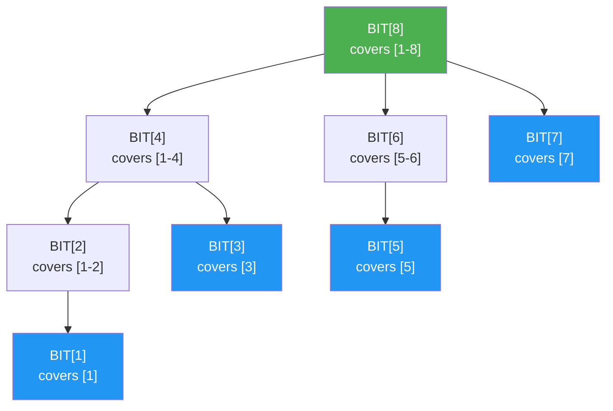

# Fenwick Trees

> **One-line summary**: A Fenwick tree (Binary Indexed Tree) is a compact array-based structure that supports $O(\log n)$ prefix-sum queries and point updates using elegant bit manipulation, offering a simpler and faster practical alternative to segment trees for commutative operations.

## 🎯 Intuition
**The Core Idea:** Store partial sums in carefully chosen array slots so binary-index jumps can assemble a prefix or propagate an update in logarithmic time.
**Analogy:** Like a tournament bracket for running totals — each cell is responsible for summing a range of elements determined by its binary representation. To get a prefix sum, you hop through the bracket; to update, you propagate up through it.
**Why It Matters:** Fenwick trees are a compact example of how binary representation can encode hierarchical ranges without explicit tree nodes. They are usually the first choice when prefix sums and point updates are enough because they are smaller, simpler, and faster in practice than segment trees. They also show up in inversion counting, arithmetic coding, and lightweight order-statistic tracking.

---

## ⚙️ Core Mechanics
### How It Works
A **Fenwick tree**, also called a **Binary Indexed Tree (BIT)**, maintains an array of n elements and answers prefix-sum queries (sum of elements from index 1 to i) and point updates (add a value to element at index i) in $O(\log n)$ time each. It achieves this with a single array of n integers and no additional pointers or tree nodes, making it extremely space-efficient and cache-friendly.

**Figure:** Fenwick tree (BIT) — each cell covers a range determined by its lowest set bit

The key insight is a mapping between array indices and the ranges they are responsible for, governed by the **lowest set bit** of the index. For index i, the lowest set bit is `i & (-i)` (isolating the rightmost 1 in the binary representation). During a **prefix query**, the algorithm accumulates values at index i, then subtracts the lowest set bit to move to the next responsible index: `i -= (i & -i)`. During an **update**, it adds the value at index i, then adds the lowest set bit to propagate the change to all affected positions: `i += (i & -i)`. Each operation touches $O(\log n)$ indices because each step flips at least one bit.

Range sums are computed as `prefix(r) - prefix(l - 1)`. This elegance has a cost: Fenwick trees natively support only prefix-decomposable operations -- the operation must be **commutative** and have an **inverse** (e.g., addition/subtraction). Non-commutative operations (like range minimum) require more complex variants or are better served by segment trees. Invented by Peter Fenwick in 1994 for arithmetic coding applications, BITs have become a staple of competitive programming and are used in practice wherever lightweight prefix-sum maintenance is needed.

### Key Operations

| Operation         | Time      | Notes                                       |
|-------------------|-----------|---------------------------------------------|
| Point update      | $O(\log n)$  | Add value at index i                        |
| Prefix sum        | $O(\log n)$  | Sum of [1..i]                               |
| Range sum         | $O(\log n)$  | prefix(r) - prefix(l-1)                     |
| Build             | $O(n)$      | Bottom-up propagation                        |
| k-th smallest     | $O(\log^2 n)$| Binary search on prefix sums                |
| Space             | $O(n)$      | Single array                                 |

### Key Facts
- Point update: $O(\log n)$ -- propagate up via `i += (i & -i)`.
- Prefix sum query: $O(\log n)$ -- accumulate down via `i -= (i & -i)`.
- Range sum [l, r]: `prefix(r) - prefix(l - 1)` -- two $O(\log n)$ queries.
- Space: $O(n)$ -- a single array of n elements, no pointers.
- Build from scratch: $O(n)$ using bottom-up propagation (not n individual updates).
- Simpler and 2-5x faster in practice than segment trees for supported operations, due to minimal memory and no recursion.
- Supports range updates with point queries via a difference array trick; range update + range query requires two BITs.
- 2D Fenwick trees handle 2D prefix sums with $O(\log^2 n)$ per operation.
- Not suitable for non-commutative operations (e.g., matrix product) or operations without an inverse (e.g., min/max without tricks).

---

## 🔬 Deep Dive
### Formal Properties
- A BIT stores partial aggregates over ranges whose lengths are determined by the **lowest set bit**: index `i` covers a suffix of length `i & -i` ending at `i`.
- Prefix queries and point updates both run in **$O(\log n)$** because repeatedly subtracting or adding the lowest set bit clears or sets progress-making bits in the index.
- Range queries are derived algebraically as `prefix(r) - prefix(l - 1)`, which is why the underlying operation must be **commutative** and admit an **inverse**.
- A BIT can be built in **$O(n)$** by bottom-up propagation, supports the **difference array trick** for range updates with point queries, and generalizes to **2D BITs** with **$O(\log^2 n)$** operations.

| Aspect              | Fenwick Tree (BIT)       | Segment Tree             |
|---------------------|--------------------------|--------------------------|
| Operations supported| Commutative + invertible | Any associative          |
| Implementation      | ~10 lines                | ~40-60 lines             |
| Space               | n integers               | 4n integers              |
| Constant factor     | Very small               | Moderate                 |
| Range update        | With difference trick    | Lazy propagation (native)|
| Non-commutative ops | Not supported             | Supported                |
| Persistence         | Not practical             | Supported (path copy)    |

### Edge Cases and Pitfalls
- BIT implementations are usually **1-indexed**; mixing 0-based external arrays with 1-based internal storage is the most common source of off-by-one bugs.
- Forgetting that range queries rely on an **inverse** leads to incorrect attempts to use BITs for minimum, maximum, or non-commutative operations.
- Rebuilding with repeated point updates works but wastes time; the linear-time **$O(n)$** build is easy to miss.
- For large coordinate domains, you often need **coordinate compression** before using a BIT for inversion counts or order-statistic style problems.

### Real-World Usage
Fenwick trees were introduced by **Peter Fenwick in 1994** for arithmetic coding, where fast cumulative frequency updates are essential. In practice they are used for **range sums**, **inversion counting**, **frequency tables**, **order-statistic queries via prefix sums**, the **difference-array trick** for batched range increments, and **2D prefix aggregation** in grid problems.

---

## 🏋️ Practice
### Warm-Up (5 min)
- What range does BIT cell `i` summarize, and how does `i & -i` reveal it?
- Why can a range sum be answered with two prefix queries?

### Core Problems
- **Range Sum Query - Mutable** — implement point updates and range sums with a BIT instead of a segment tree.
- **Count of Smaller Numbers After Self** — use coordinate compression plus a BIT to accumulate suffix frequencies.
- **Inversion Count** — process elements in order and use prefix frequencies to count how many larger elements appeared earlier.

### Challenge
- Implement **range update + range query** using **two BITs**, and explain why one BIT is not enough for both capabilities at once.

---

*See also:* [[Segment Trees]], [[Interval Trees and Range Trees]], [[Skip Lists]], [[Disjoint Sets and Union-Find]] | Cross-wiki links

## Supporting Chunks / References
### Supporting Chunks
*Pending chunk extraction.*

### References
-> Sources Index
