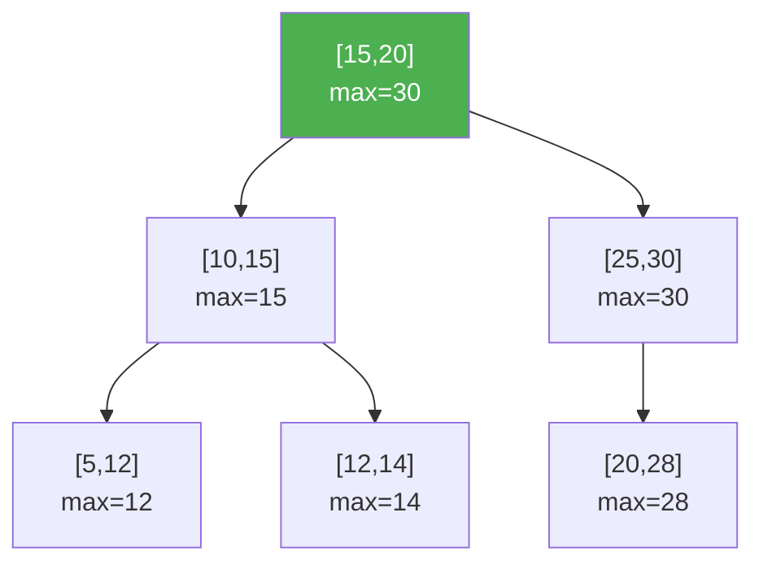

# Interval Trees and Range Trees

> **One-line summary**: Interval trees find all stored intervals overlapping a query point or interval in $O(\log n + k)$ time, while range trees answer orthogonal range queries in multi-dimensional space -- together they cover the core geometric query structures.

## 🎯 Intuition
**The Core Idea:** Augment search trees so they can prune huge parts of the search space while still reporting every interval or point that satisfies a geometric query.
**Analogy:** An interval tree is like a meeting-room scheduler — given a time, it instantly finds all overlapping meetings. A range tree is like a 2D map search — "show me all restaurants within this rectangle" — using layered indexes for each dimension.
**Why It Matters:** Interval and range queries show up constantly in scheduling, databases, GIS, and bioinformatics. Interval trees solve overlap queries on 1D spans, while range trees extend exact reporting to multi-dimensional points. Together they illustrate two central geometry ideas: subtree augmentation and layered indexing with fractional cascading.

---

## ⚙️ Core Mechanics
### How It Works
An **interval tree** stores a set of intervals [lo, hi] and answers the query "which intervals overlap a given point (or interval)?" It is implemented as an augmented balanced BST: each node stores an interval, and the subtree rooted at each node is augmented with the **maximum hi value** in that subtree. To query for a point p, the algorithm walks the tree: at each node, it checks whether the node's interval contains p, then uses the augmented max value to decide whether to recurse into the left subtree (if left.max >= p) or the right. A single overlapping interval is found in $O(\log n)$; all k overlapping intervals in $O(\log n + k)$ using output-sensitive traversal. Interval trees are the standard structure for scheduling conflicts, genomic region overlap, and window-based event processing.

**Figure:** Interval tree — each node stores an interval; subtree max-hi enables pruning during stabbing queries

A **range tree** answers **orthogonal range queries**: given a set of points in d-dimensional space, report all points within a query hyperrectangle [x1, x2] x [y1, y2] x ... In one dimension, a range tree is simply a balanced BST with $O(\log n + k)$ range reporting. In two dimensions, each node of the primary BST (on x-coordinates) stores a secondary BST (on y-coordinates) of all points in its subtree. A 2D query decomposes into $O(\log n)$ x-ranges, each queried in $O(\log n)$ on y, yielding $O(\log^2 n + k)$ total time with $O(n \log n)$ space. **Fractional cascading** reduces the query time by one log factor to $O(\log n + k)$ by threading sorted lists between consecutive secondary structures, enabling binary search at each level to be inherited from the parent rather than restarted.

Both structures extend naturally to higher dimensions. Interval trees handle 1D intervals; for d-dimensional boxes, one can nest interval trees or combine with range trees. Range trees in d dimensions achieve $O(\log^d n + k)$ query time, reducible by fractional cascading to $O(\log^(d-1)$ n + k).

### Key Operations

| Structure / Operation       | Time              | Space          | Notes                        |
|-----------------------------|-------------------|----------------|------------------------------|
| Interval tree -- build      | $O(n \log n)$        | $O(n)$           | Augmented BST                |
| Interval tree -- stab query | $O(\log n + k)$      | --             | k = overlapping intervals    |
| Range tree 1D -- query      | $O(\log n + k)$      | $O(n)$           | Balanced BST                 |
| Range tree 2D -- query      | $O(\log^2 n + k)$    | $O(n \log n)$     | BST of BSTs                  |
| Range tree 2D + FC -- query | $O(\log n + k)$      | $O(n \log n)$     | Fractional cascading         |
| Range tree dD -- query      | $O(\log^d n + k)$    | $O(n \log^(d-1)$ n)| Recursive decomposition     |

### Key Facts
- Interval tree: augmented BST where each node stores max-hi of its subtree; query $O(\log n + k)$.
- Interval tree space: $O(n)$; construction $O(n \log n)$.
- Interval stabbing query (find all intervals containing point p): $O(\log n + k)$.
- Interval overlap query (find all intervals overlapping [a, b]): $O(\log n + k)$ with modifications.
- Range tree 1D: balanced BST, $O(\log n + k)$ range reporting, $O(n)$ space.
- Range tree 2D: $O(\log^2 n + k)$ query, $O(n \log n)$ space; $O(\log n + k)$ with fractional cascading.
- Fractional cascading: precompute pointers between sorted lists at adjacent levels to avoid redundant binary searches.
- Range trees are static; dynamic insertions require rebalancing both primary and secondary structures.

---

## 🔬 Deep Dive
### Formal Properties
- An **interval tree** is an augmented balanced BST over intervals in which each node stores the maximum high endpoint in its subtree; that augmentation is what makes **stabbing queries** and interval-overlap pruning efficient.
- An interval stabbing query reports all intervals containing point `p` in **$O(\log n + k)$** time, while interval-overlap queries for `[a, b]` can be handled with corresponding pruning logic in the same output-sensitive form.
- A **2D range tree** is a **BST of BSTs** with **$O(n \log n)$** space and **$O(\log^2 n + k)$** query time; in **d dimensions**, the bound becomes **$O(\log^d n + k)$** with **$O(n \log^(d-1)$ n)** space.
- **Fractional cascading** reduces one logarithmic factor by linking adjacent secondary search structures, giving **$O(\log n + k)$** in 2D and **$O(\log^(d-1)$ n + k)** in higher dimensions.

| Aspect            | Interval Tree            | Range Tree (2D)           | Segment Tree              |
|-------------------|--------------------------|---------------------------|---------------------------|
| Query type        | Interval overlap / stab  | Orthogonal range search   | Range aggregate (sum/min) |
| Stored objects    | Intervals [lo, hi]       | Points in dD              | Array elements            |
| Query time        | $O(\log n + k)$             | $O(\log^2 n + k)$            | $O(\log n)$                  |
| Dynamic updates   | $O(\log n)$ insert/delete   | Complex rebalancing        | $O(\log n)$ point update     |
| Primary use       | Scheduling, genomics     | Spatial search, GIS        | Array range queries       |

### Edge Cases and Pitfalls
- In interval trees, failing to update the subtree **max-hi** augmentation after rotations or insertions breaks pruning correctness immediately.
- Endpoint conventions matter: whether intervals are **closed**, **open**, or **half-open** changes what counts as an overlap at boundaries.
- Range trees are powerful but often too heavy for fully dynamic workloads because insertions and deletions can require expensive maintenance of secondary structures.
- It is easy to confuse a **segment tree** with an **interval tree**; one stores aggregates over array ranges, the other stores intervals and reports overlaps.

### Real-World Usage
Interval trees are standard for **meeting conflict detection**, **genomic region overlap**, and any **window-based event processing** problem where intervals must be reported against a query point or span. Range trees support **orthogonal search** in **databases**, **GIS**, and other spatial systems that need to report all points inside axis-aligned rectangles or higher-dimensional boxes, especially in mostly static datasets where preprocessing cost is acceptable.

---

## 🏋️ Practice
### Warm-Up (5 min)
- What subtree augmentation allows an interval tree to skip an entire left branch during a stabbing query?
- Why does a 2D range tree need more than linear space?

### Core Problems
- **Meeting Rooms / Calendar Conflict Search** — store time intervals and report every overlap with a new meeting request.
- **Rectangle Query Reporting** — given 2D points, report all points inside an axis-aligned rectangle.
- **My Calendar III (conceptual comparison)** — contrast sweep-line and interval-tree style reasoning for overlap-heavy schedules.

### Challenge
- Explain how **fractional cascading** turns a 2D range-tree query from **$O(\log^2 n + k)$** into **$O(\log n + k)$**, and identify the preprocessing trade-off.

---

*See also:* [[Segment Trees]], [[Fenwick Trees]], [[k-d Trees and Spatial Data Structures]], [[Skip Lists]] | Cross-wiki links

## Supporting Chunks

- [[CS Data Structures/_chunks/chunk-ds-031 Interval trees find overlapping intervals in Ologn plus k|Interval trees find overlapping intervals in O(log n + k)]]
- [[CS Data Structures/_chunks/chunk-ds-048 Range trees answer 2D queries in Olog2n plus k|Range trees answer 2D orthogonal queries in O(log^2 n + k)]]
- [[CS Data Structures/_chunks/chunk-ds-116 Augmentation theorem rotations preserve derivable metadata|Augmentation theorem: rotations preserve derivable metadata]]

## References

→ [[CS Data Structures/Sources/Sources Index|Sources Index]]
