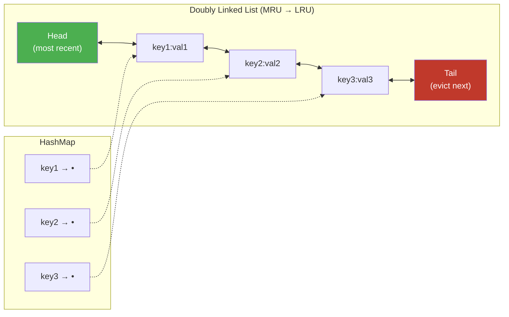

# LRU and LFU Caches

> **One-line summary**: Eviction-policy data structures that maintain a bounded-size cache — LRU evicts the least recently used item, LFU evicts the least frequently used item — both achievable in $O(1)$ time per operation.

## 🎯 Intuition
**The Core Idea:** When your cache is full and a new item arrives, you must decide what to discard. LRU bets that items not touched recently won't be needed soon (temporal locality). LFU bets that items accessed rarely overall are the least valuable (frequency locality).
**Analogy:** LRU is like a bookshelf with limited space — when it's full, you remove the book you haven't picked up in the longest time. LFU is like a library deciding which books to archive: the ones checked out the fewest times overall go to storage first.
**Why It Matters:** Every high-performance system — CPU caches, databases, CDNs, operating systems, web servers — relies on cache eviction policies. Choosing LRU vs. LFU vs. hybrids directly impacts hit rates and system performance.

---

## ⚙️ Core Mechanics
### How It Works

**LRU Cache (Hash Map + Doubly Linked List):**
- Maintain a doubly linked list ordered by access time (most recent at head, least recent at tail).
- Maintain a hash map from key → node pointer for $O(1)$ lookup.
- **Get(key):** Look up node in hash map. If found, move it to the head of the list and return value. If not found, return −1.
- **Put(key, value):** If key exists, update value and move to head. If key doesn't exist and cache is full, remove the tail node (least recently used) and delete from hash map. Insert new node at head.

**Figure:** LRU cache — HashMap provides $O(1)$ lookup, doubly linked list tracks access order

**LFU Cache ($O(1)$ LFU — "LFU with Frequency Buckets"):**
- Maintain a hash map from key → (value, frequency, pointer to node in frequency list).
- Maintain a hash map from frequency → doubly linked list of nodes with that frequency.
- Track `min_frequency` — the current minimum frequency among all cached items.
- **Get(key):** Look up key. If found, increment its frequency, move it from freq list `f` to `f+1`. If the old frequency list is now empty and was `min_frequency`, increment `min_frequency`.
- **Put(key, value):** If key exists, update and treat as `Get`. If new and cache is full, evict the LRU item from the `min_frequency` list. Insert new item with frequency 1, set `min_frequency = 1`.

### Key Operations

| Operation | LRU Time | LFU Time | Space | Notes |
|-----------|----------|----------|-------|-------|
| Get | $O(1)$ | $O(1)$ | — | Hash lookup + list manipulation |
| Put | $O(1)$ | $O(1)$ | — | Hash insert + list manipulation |
| Evict | $O(1)$ | $O(1)$ | — | Remove tail (LRU) or min-freq LRU (LFU) |
| Total space | — | — | $O(capacity)$ | Hash map + linked list nodes |

### Key Facts
- **LRU** is simpler to implement and is the default choice for most caching scenarios.
- **LFU** outperforms LRU when access patterns have strong frequency skew (some items are "hot" for long periods).
- $O(1)$ LFU was first described by Shah, Mitra, and Matani (2010) — before that, heap-based LFU was $O(\log n)$.
- Python's `functools.lru_cache` and `collections.OrderedDict` can implement LRU directly.
- Java's `LinkedHashMap` with `accessOrder=true` is a built-in LRU.

---

## 🔬 Deep Dive
### Formal Properties
**LRU competitive ratio:** LRU is `k`-competitive against the optimal offline algorithm (Bélády's MIN), where `k` is the cache size. This means LRU causes at most `k` times as many misses as the best possible algorithm that knows the future.

**LFU starvation problem:** An item accessed 1000 times in the past but never again still occupies the cache because its count remains high. Solutions:
- **Aging/decay**: periodically halve all frequencies (LFU with Dynamic Aging — LFU-DA).
- **Window-based LFU**: only count accesses within a recent time window.

**ARC (Adaptive Replacement Cache):** IBM's algorithm that dynamically balances between LRU and LFU behavior by maintaining ghost lists to learn which policy performs better for the current workload.

**W-TinyLFU (Caffeine):** Used by Java's Caffeine cache library. Combines a small LRU "window" admission filter with an LFU-based main cache, using a Count-Min Sketch for frequency estimation. Achieves near-optimal hit rates across diverse workloads.

### Edge Cases and Pitfalls
- **Scan pollution (LRU)**: a single sequential scan of N items (where N > cache size) evicts the entire working set. Solutions: segmented LRU (SLRU), 2Q algorithm.
- **Cache stampede**: when a hot item is evicted and many concurrent requests all miss simultaneously, overwhelming the backend. Mitigate with "dogpile" locks or probabilistic early expiration.
- **Frequency count overflow (LFU)**: unbounded frequency counts waste bits and prevent new items from ever competing. Always use aging/decay.
- **Thread safety**: naive LRU/LFU are not thread-safe. Production implementations need fine-grained locking or lock-free techniques (e.g., Caffeine uses a concurrent write buffer).
- **Variable-size entries**: when cache items have different sizes, evicting by count isn't optimal. Use cost-aware policies like Greedy-Dual-Size-Frequency.

### Real-World Usage
- **Operating systems**: page replacement (Linux uses a variant of 2Q/CLOCK, approximating LRU).
- **Databases**: PostgreSQL buffer pool uses CLOCK (LRU approximation); MySQL InnoDB uses a segmented LRU.
- **CDNs**: Cloudflare and Akamai use hybrid LRU/LFU policies (often W-TinyLFU or ARC variants).
- **Application caches**: Redis supports `allkeys-lru` and `allkeys-lfu` eviction policies. Caffeine (Java) uses W-TinyLFU.
- **CPU hardware**: L1/L2/L3 caches use pseudo-LRU (tree-PLRU or bit-PLRU) due to the cost of true LRU in hardware.

---

## 🏋️ Practice
### Warm-Up (5 min)
1. In an LRU cache of size 3, process accesses [A, B, C, D, A, B, E]. What's in the cache after each step?
2. Why is $O(1)$ LFU harder to implement than $O(1)$ LRU?
3. What problem does LFU have with one-time popular items that become cold?

### Core Problems
1. **LeetCode 146 — LRU Cache**: Implement `get(key)` and `put(key, value)` in $O(1)$ time. Use a doubly linked list + hash map.
2. **LeetCode 460 — LFU Cache**: Implement `get(key)` and `put(key, value)` in $O(1)$ time. Use frequency buckets with doubly linked lists.

### Challenge
Design an **adaptive cache** that dynamically switches between LRU and LFU behavior based on the observed workload. Implement a simplified version of ARC (Adaptive Replacement Cache) with ghost lists. Measure hit rate on both scan-heavy and frequency-heavy workloads.

### Bonus Exploration
- Implement W-TinyLFU: combine a small LRU window with a Segmented LFU main cache, using a 4-bit Count-Min Sketch as the frequency filter. Compare hit rate against pure LRU and pure LFU on the YCSB benchmark traces.
- Profile the real-world cache behavior of your operating system's page cache under mixed sequential/random workloads.

---

*See also:* [[Hash Tables]] · [[Doubly Linked Lists]] · [[Cache-Oblivious Structures]] | **CS Algorithms:** [[Online Algorithms]] · [[Competitive Analysis]]

## References
-> [[Sources Index]]
