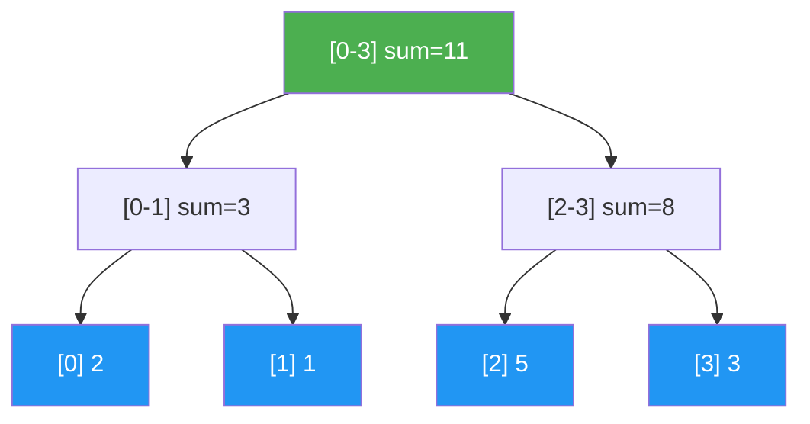

# Segment Trees

> **One-line summary**: A segment tree is a binary tree that stores aggregate values over array ranges, answering range queries and supporting point or range updates in $O(\log n)$ time -- the foundational structure for dynamic range-query problems.

## 🎯 Intuition
**The Core Idea:** Precompute aggregates over recursively nested subranges so any query interval can be rebuilt from only logarithmically many stored pieces.
**Analogy:** Like a tournament bracket — each match result (node) summarizes the outcome of its sub-bracket. To find the "winner" (min/max/sum) of any range, you combine just the relevant bracket results instead of replaying every game.
**Why It Matters:** Segment trees are the standard answer to dynamic range queries because they work for any associative combine operation, not just sums. They support both point updates and, with lazy propagation, range updates in logarithmic time. Once mastered, they open the door to persistent, multidimensional, and order-statistic style tree variants.

---

## ⚙️ Core Mechanics
### How It Works
A **segment tree** for an array of n elements is a full binary tree where each leaf stores one array element and each internal node stores the aggregate (sum, minimum, maximum, GCD, etc.) of its children's ranges. The root covers the entire array [0, n); its children cover [0, n/2) and [n/2, n); and so on recursively until each leaf covers a single index. This hierarchical decomposition means any contiguous range [l, r) can be expressed as the union of $O(\log n)$ tree nodes, enabling **range queries in $O(\log n)$** by combining at most 2 log n node values.

**Figure:** Segment tree for array [2, 1, 5, 3] — each node stores the sum of its range

**Point updates** -- changing a single element -- propagate up from the affected leaf to the root, updating $O(\log n)$ ancestors. **Range updates** (e.g., adding a value to every element in [l, r)) are handled efficiently via **lazy propagation**: the update is recorded at the highest applicable nodes and pushed down to children only when those children are actually queried. This keeps both range updates and range queries at $O(\log n)$.

Segment trees are typically implemented as **arrays of size 4n** (to accommodate the full binary tree layout with 1-based indexing), making them cache-friendly and avoiding pointer overhead. Advanced variants include **persistent segment trees** (preserving all historical versions using path copying, $O(\log n)$ space per update), **2D segment trees** (tree of trees for rectangle queries), and **dynamic segment trees** (nodes allocated on demand for huge coordinate ranges). Segment trees are ubiquitous in competitive programming and serve as the backbone for range queries in databases and computational geometry.

### Key Operations

| Operation         | Time      | Notes                                      |
|-------------------|-----------|--------------------------------------------|
| Build             | $O(n)$      | Bottom-up from leaves                       |
| Point update      | $O(\log n)$  | Update leaf, propagate to root              |
| Range query       | $O(\log n)$  | Combine <= 2 log n nodes                    |
| Range update      | $O(\log n)$  | With lazy propagation                       |
| Persistent update | $O(\log n)$  | Path copying; $O(\log n)$ new nodes per version|
| Space             | $O(n)$      | 4n array in practice; $O(n \log n)$ persistent |

### Key Facts
- Each node covers a contiguous subrange; any query range decomposes into $O(\log n)$ nodes.
- Build time: $O(n)$ -- bottom-up aggregation.
- Point update: $O(\log n)$ -- update leaf and propagate.
- Range query: $O(\log n)$ -- combine $O(\log n)$ node aggregates.
- Lazy propagation enables $O(\log n)$ range updates (add to range, set range, etc.).
- Array-based implementation uses indices 2i (left child) and 2i+1 (right child); size 4n suffices.
- Persistent segment trees support versioned queries with $O(\log n)$ extra space per update.
- Merge sort trees (segment tree where each node stores a sorted list) answer order-statistic range queries.

---

## 🔬 Deep Dive
### Formal Properties
- A segment tree stores aggregates over a **hierarchical decomposition** of an array into contiguous segments, and any query interval decomposes into **$O(\log n)$** canonical nodes.
- **Build** is **$O(n)$**, while **point update**, **range query**, and lazy-propagated **range update** are all **$O(\log n)$**.
- The standard array implementation uses the implicit binary-tree relationships `2i` and `2i+1`, and an array of size **4n** is sufficient in practice.
- **Persistent segment trees** use **path copying**, requiring **$O(\log n)$** new nodes per update, while **2D segment trees** and **merge sort trees** extend the same recursive structure to rectangle and order-statistic queries.

| Aspect            | Segment Tree           | Fenwick Tree (BIT)      | Sparse Table            |
|-------------------|------------------------|-------------------------|-------------------------|
| Query types       | Any associative op     | Prefix sums (commutative)| Idempotent ops (min/max)|
| Point update      | $O(\log n)$               | $O(\log n)$                | Not supported           |
| Range update      | $O(\log n)$ w/ lazy       | $O(\log n)$ w/ trick       | Not supported           |
| Build time        | $O(n)$                   | $O(n)$                    | $O(n \log n)$              |
| Space             | $O(n)$ (4n array)        | $O(n)$ (1 array)          | $O(n \log n)$              |
| Implementation    | Moderate               | Simple                  | Simple                  |

### Edge Cases and Pitfalls
- Choosing the wrong **identity element** for empty/no-overlap cases breaks query correctness for min, max, GCD, and other custom monoids.
- Lazy propagation is easy to get subtly wrong: forgetting to push or compose pending tags causes stale answers.
- Range endpoints must be handled consistently as **[l, r]** or **[l, r)**; mixing conventions leads to off-by-one bugs.
- Persistent and 2D variants multiply memory usage quickly, so the asymptotics can hide very large constants.

### Real-World Usage
Segment trees are ubiquitous in **competitive programming** because they handle dynamic range sums, minima, maxima, GCDs, and similar associative aggregates uniformly. With **lazy propagation**, they support interval modifications efficiently; with **path copying**, they support time-travel queries through **persistent segment trees**; and with **2D** or **merge sort tree** variants, they extend into computational geometry and range-order statistics.

---

## 🏋️ Practice
### Warm-Up (5 min)
- Why can any query interval be expressed as only $O(\log n)$ segment-tree nodes?
- When do you need lazy propagation instead of a plain segment tree?

### Core Problems
- **Range Sum Query - Mutable** — implement point updates and range queries over an array.
- **Range Minimum Query with Updates** — change values online and report minima over subranges.
- **Range Addition / Range Sum** — use lazy propagation to support interval increments and interval queries together.

### Challenge
- Design a **persistent segment tree** that answers “k-th smallest number in subarray [l, r]” queries, and explain why path copying makes versioned queries efficient.

---

*See also:* [[Fenwick Trees]], [[Interval Trees and Range Trees]], [[Skip Lists]], [[Disjoint Sets and Union-Find]] | Cross-wiki links

## Supporting Chunks / References
### Supporting Chunks
*Pending chunk extraction.*

### References
-> Sources Index
